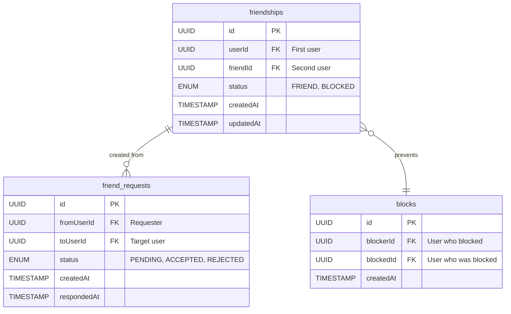
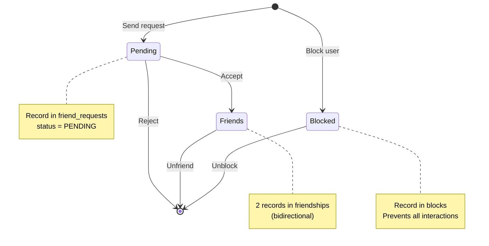
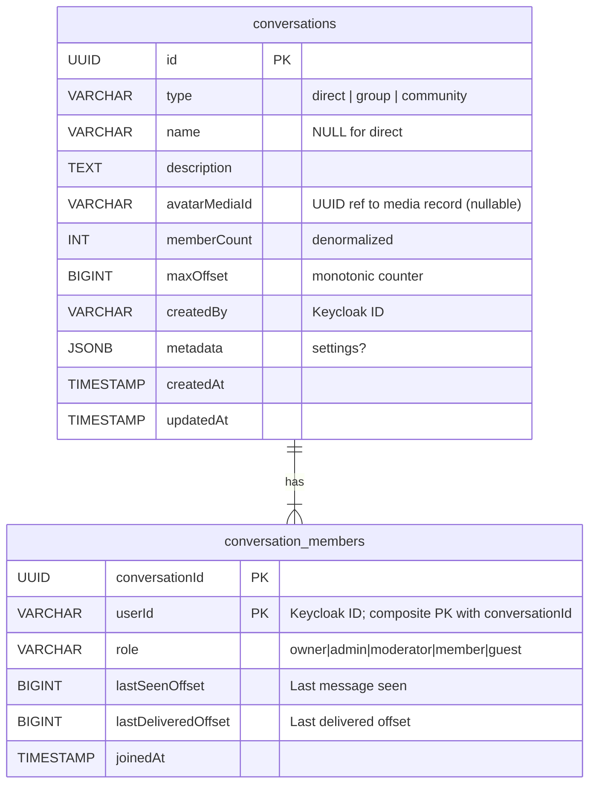
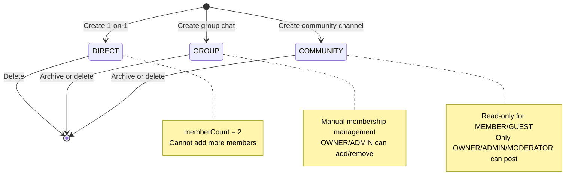
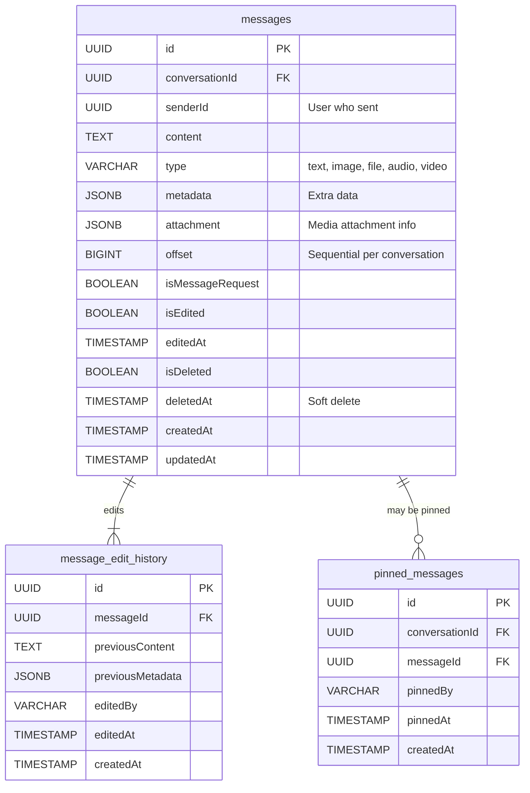
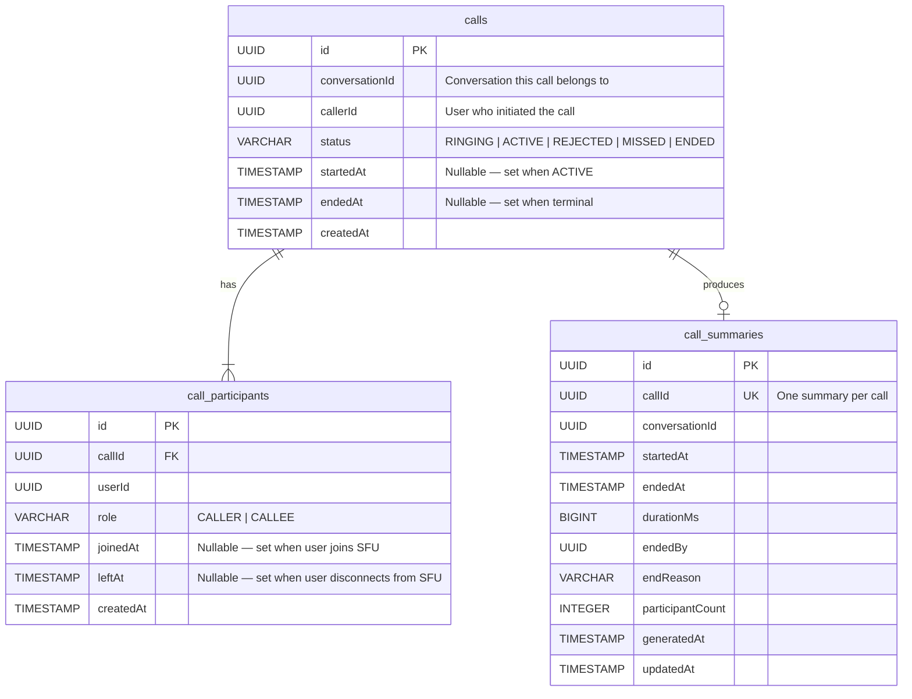

# Database Relations

## Overview

This document describes the database architecture, ownership model, and table relationships for the NestJS chat system. The system uses **2 PostgreSQL containers** (`users-db` host port 5434 and `chat-db` host port 5433) plus Keycloak's own PostgreSQL container. Services share containers but own separate logical schemas.

## Database Ownership Model

### Core Principle: No Cross-Service Database Access

```mermaid
graph TB
    subgraph "Service Layer"
        Users[Users Service]
        Friendship[Friendship Service]
        Conversation[Conversation Service]
        MsgStore[Message Store]
        ChatCore[Chat Core]
        CallSvc[Call Service]
    end

    subgraph "Database Layer"
        UsersDB[(users-db<br/>host: 5434<br/>users + friendship tables)]
        ChatDB[(chat-db<br/>host: 5433<br/>conversations + messages + calls)]
    end

    Users -->|OWNS| UsersDB
    Friendship -->|OWNS| UsersDB
    Conversation -->|OWNS| ChatDB
    MsgStore -->|OWNS| ChatDB
    ChatCore -->|READ-ONLY| ChatDB
    CallSvc -->|OWNS| ChatDB

    classDef service fill:#4CAF50,stroke:#2E7D32,color:#fff
    classDef database fill:#2196F3,stroke:#1565C0,color:#fff

    class Users,Friendship,Conversation,MsgStore,ChatCore,CallSvc service
    class UsersDB,ChatDB database
| **chat-db** | Conversation Service + Message Store + Chat Core (no tables) + Call Service | 5433 (host) | Conversation lifecycle, messages, calls | conversations, conversation_members, messages, message_edit_history, pinned_messages, outbox_events, calls, call_participants, call_summaries |

**Note**: Users Service and Friendship Service share the `users-db` container (host port 5434). Conversation Service, Message Store, and Call Service share the `chat-db` container (host port 5433). Chat Core does **not** own any database tables — all validation data is fetched at runtime via TCP. In production, each service should have its own dedicated PostgreSQL instance.

---

## Database Schemas

### 1. users-db (Users Service + Friendship Service)

Host port: **5434** → container 5432

#### Entity-Relationship Diagram

```mermaid
erDiagram
    users {
        VARCHAR id PK "Keycloak ID from JWT sub"
        VARCHAR email UK "User email (unique)"
      VARCHAR username "Display username (non-unique)"
        VARCHAR firstName "nullable"
        VARCHAR lastName "nullable"
        VARCHAR phone "nullable"
        VARCHAR cccdNumber "nullable (9 or 12 digits)"
        VARCHAR avatarUrl "nullable (legacy, deprecated)"
        VARCHAR avatarMediaId "nullable (Media Service UUID ref)"
        JSONB settings "User preferences (statusMessage, theme, messageDensity, enterToSend, notifications)"
        BOOLEAN isActive "default true"
        TIMESTAMP createdAt
        TIMESTAMP updatedAt
    }
```

#### Table Details

**users**
- **Purpose**: User profile information; `id` is the Keycloak sub claim (primary source of identity)
- **Primary Key**: `id` (VARCHAR 255)
- **Unique Constraints**: `email`
- **Indexes**:
  - `idx_users_email` on `email`
  - `idx_users_is_active` on `is_active`
- **Notable columns**:
  - `avatar_url`: legacy column (still in schema, deprecated — use `avatar_media_id`)
  - `avatar_media_id`: UUID reference to Media Service record; presigned URL resolved at Gateway
  - `settings`: JSONB storing `{ statusMessage, theme, messageDensity, enterToSend, notifications }` — no separate `user_settings` table
  - `is_active`: BOOLEAN account gate (`true` = active, `false` = banned)

#### No Cross-Database Joins

**Wrong** :
```sql
-- Users Service trying to query friendships directly
SELECT u.*, f.status
FROM users u
JOIN friendships f ON u.id = f.user_id;
-- Wrong: friendship tables are in users-db but owned by Friendship Service; always call it via TCP
```

**Correct** :
```typescript
// Users Service calls Friendship Service via TCP
const friends = await this.friendshipClient.send(
  FRIENDSHIP_PATTERNS.GET_FRIENDS,
  { userId }
).toPromise();

// Combine data in application layer
const users = await this.usersRepository.findByIds(friends.map(f => f.friendId));
```

---

### 2. friendship tables (in users-db)

#### Entity-Relationship Diagram



#### Table Details

**friendships**
- **Purpose**: Bidirectional friendship relationships
- **Primary Key**: `id` (UUID)
- **Unique Constraint**: `(userId, friendId)` - prevents duplicate friendships
- **Indexes**:
  - `idx_friendships_user_id` on `userId` (get all friends for user)
  - `idx_friendships_friend_id` on `friendId` (reverse lookup)
  - `idx_friendships_status` on `status` (filter by status)

**friend_requests**
- **Purpose**: Pending friend requests
- **Primary Key**: `id` (UUID)
- **Unique Constraint**: `(fromUserId, toUserId)` where `status = PENDING`
- **Indexes**:
  - `idx_friend_requests_to_user_id` on `toUserId` where `status = PENDING` (get incoming requests)
  - `idx_friend_requests_from_user_id` on `fromUserId` (get outgoing requests)

**blocks**
- **Purpose**: User blocking (prevents messaging, friend requests)
- **Primary Key**: `id` (UUID)
- **Unique Constraint**: `(blockerId, blockedId)`
- **Indexes**:
  - `idx_blocks_blocker_id` on `blockerId` (check if user blocked someone)
  - `idx_blocks_blocked_id` on `blockedId` (check if user is blocked)

#### Friendship Lifecycle



#### Data Consistency

**Accepting Friend Request**:
```typescript
// Transaction ensures atomicity
await this.dataSource.transaction(async (manager) => {
  // 1. Delete friend request
  await manager.delete(FriendRequest, { id: requestId });
  
  // 2. Create bidirectional friendship
  await manager.insert(Friendship, [
    { userId: userA, friendId: userB, status: FriendshipStatus.FRIEND },
    { userId: userB, friendId: userA, status: FriendshipStatus.FRIEND }
  ]);
});
```

**Why Bidirectional?**
- Fast lookup: "Get all friends of User A" → single query on `userId`
- No complex joins needed
- Trade-off: 2x storage for 10x query performance

---

### 3. chat-db (Conversation Service + Message Store + Chat Core)

Host port: **5433** → container 5432

#### Entity-Relationship Diagram



#### Table Details

**conversations**
- **Purpose**: Conversation metadata and state
- **Primary Key**: `id` (UUID)
- **Indexes**:
  - `idx_conversations_type` on `type` (filter by conversation type)
  - `idx_conversations_created_by` on `createdBy` (find user's created conversations)

**Fields Explained**:
- `type`: `direct` (2 members), `group` (manual membership), `community` (OWNER/ADMIN/MODERATOR post, MEMBER/GUEST react)
- `avatarMediaId`: UUID reference to the media record in Media Service (nullable). Raw URL is never stored — presigned URLs are resolved at the Gateway layer on every list/detail request.
- `memberCount`: Denormalized counter for performance (no COUNT query)
- `maxOffset`: Atomic counter for message ordering (incremented per message)
- Conversations are user-scoped — no tenant-level isolation at the DB level

**conversation_members**
- **Purpose**: Membership roster and read status
- **Primary Key**: composite `(conversation_id, user_id)` — no separate UUID id column
- **Foreign Key**: `conversation_id` → `conversations(id)` ON DELETE CASCADE
- **Indexes**:
  - `idx_conversation_members_user_id` on `user_id` (get user’s conversations)
  - `idx_conversation_members_conversation_id` on `conversation_id` (get all members)
  - `idx_conversation_members_role` on `(conversation_id, role)` (permission checks)

**Fields Explained**:
- `role`: CHECK IN (`owner`, `admin`, `moderator`, `member`, `guest`) — lowercase; no `readonly`
- `lastSeenOffset`: Highest message offset user has seen (for unread count)
- `lastDeliveredOffset`: Highest message offset delivered to user’s device
- `joinedAt`: When user joined; no `leftAt` column (members are removed from the table on leave)

#### Offset-Based Message Ordering

**Why Offsets Instead of Timestamps?**

```
 Timestamp-based (problematic):
Message A: 2025-01-01 12:00:00.123
Message B: 2025-01-01 12:00:00.123  ← Same millisecond!
Message C: 2025-01-01 12:00:00.124

 Offset-based (guaranteed order):
Message A: offset 1
Message B: offset 2
Message C: offset 3
```

**Atomic Increment**:
```typescript
// Conversation Service
async incrementMaxOffset(conversationId: string): Promise<number> {
  const result = await this.repository.query(
    `UPDATE conversations 
     SET maxOffset = maxOffset + 1 
     WHERE id = $1 
     RETURNING maxOffset`,
    [conversationId]
  );
  
  return result[0].maxOffset;
}
```

**Unread Count Calculation**:
```typescript
// Conversation Service
async getUnreadCount(conversationId: string, userId: string): Promise<number> {
  const member = await this.membersRepository.findOne({
    where: { conversationId, userId }
  });
  
  const conversation = await this.repository.findOne({
    where: { id: conversationId }
  });
  
  // Unread = maxOffset - lastSeenOffset
  return conversation.maxOffset - member.lastSeenOffset;
}
```

#### Conversation Type Transitions



### 4. message tables (in chat-db)

#### Entity-Relationship Diagram



#### Table Details

**messages**
- **Purpose**: Store all chat messages
- **Primary Key**: `id` (UUID)
- **Foreign Key**: None (conversationId references conversation_db, but no FK constraint)
- **Unique Constraint**: `(conversationId, offset)` - ensures sequential ordering
- **Indexes**:
  - `idx_messages_conversation_id_offset` on `(conversationId, offset)` (fetch conversation history)
  - `idx_messages_sender_id` on `senderId` (find messages by user)
  - `idx_messages_created_at` on `createdAt` (time-based queries)

**Fields Explained**:
- `offset`: Sequential number per conversation (1, 2, 3, ...)
- `type`: `text`, `image`, `file`, `audio`, `video`
- `metadata`: JSON for extra data (thumbnails, alt-text, etc.)
- `attachment`: JSONB with `{ mediaId, url, mimeType, size, ... }` for media messages
- `isMessageRequest`: `true` for DIRECT messages from strangers not yet replied to
- `isEdited` / `editedAt`: Set when message is edited within 1-hour window
- `isDeleted` / `deletedAt`: Soft delete — content hidden but row retained

**message_edit_history**
- **Purpose**: Audit trail for message edits
- **Primary Key**: `id` (UUID)
- **Indexes**: `idx_message_edit_history_message_id_edited_at` on `(messageId, editedAt)`

**Edit Lifecycle**:
```
1. User edits within 1 hour window
2. MessageStore saves previousContent + previousMetadata to message_edit_history
3. Messages row: isEdited = true, editedAt = NOW()
4. Edit history is immutable (audit trail)
```

**pinned_messages**
- **Purpose**: Track pinned messages per conversation (max 3, enforced by Chat Core)
- **Primary Key**: `id` (UUID)
- **Unique Constraint**: `(conversationId, messageId)` — same message pinned once only

**Read Tracking** (cursor-based, in `conversation_members`):
```
No message_receipts table. Read status is tracked via cursors:
- lastDeliveredOffset: user's device received message (set on delivery)
- lastSeenOffset:      user opened conversation and read (set on join/mark-read)
- Unread count = conversations.maxOffset - conversation_members.lastSeenOffset
```

#### Optimized Queries

**Fetch Conversation Messages with Pagination**:
```sql
-- Get 50 messages after offset 100
SELECT * FROM messages
WHERE conversation_id = $1
  AND offset > 100
  AND is_deleted = false
ORDER BY offset ASC
LIMIT 50;
```

**Get Unread Message Count**:
```sql
-- Uses cursor from conversation_members (no receipts table)
SELECT (c.max_offset - cm.last_seen_offset) AS unread_count
FROM conversations c
JOIN conversation_members cm
  ON cm.conversation_id = c.id
  AND cm.user_id = $2
WHERE c.id = $1;
```

**Mark Conversation as Read** (update cursor):
```sql
UPDATE conversation_members
SET last_seen_offset = $3
WHERE conversation_id = $1
  AND user_id = $2
  AND last_seen_offset < $3;
```

#### Partitioning Strategy (Future)

**Problem**: `messages` table grows unbounded (billions of rows)

**Solution**: Partition by `createdAt` (monthly partitions)

```sql
-- Create partitioned table
CREATE TABLE messages (
  id UUID,
  conversationId UUID,
  content TEXT,
  offset BIGINT,
  createdAt TIMESTAMP,
  PRIMARY KEY (id, createdAt)
) PARTITION BY RANGE (createdAt);

-- Create monthly partitions
CREATE TABLE messages_2025_01 PARTITION OF messages
FOR VALUES FROM ('2025-01-01') TO ('2025-02-01');

CREATE TABLE messages_2025_02 PARTITION OF messages
FOR VALUES FROM ('2025-02-01') TO ('2025-03-01');
```

**Benefits**:
- Drop old partitions (GDPR compliance: delete data after 7 years)
- Query performance (only scan relevant partitions)
- Easier maintenance (vacuum per partition)

---

### 5. call tables (in chat-db)

Owned by **Call Service**. All three tables live in the same `chat-db` PostgreSQL container that Conversation Service and Message Store use.

#### Entity-Relationship Diagram



#### Table Details

**calls**
- **Purpose**: Core call record — one row per call attempt
- **Primary Key**: `id` (UUID)
- **Indexes**:
  - `idx_calls_conversation_id_status` on `(conversationId, status)` — find active/ringing call for a conversation
  - `idx_calls_caller_id` on `callerId`
  - `idx_calls_created_at` on `createdAt`
- **Status lifecycle**: `RINGING` → `ACTIVE` (on accept) | `REJECTED` (on decline) | `MISSED` (ringing timeout) | `ENDED` (explicit end or cleanup)

**call_participants**
- **Purpose**: Tracks each participant's join/leave time and role
- **Primary Key**: `id` (UUID)
- **Foreign Key**: `callId` → `calls.id`
- **Indexes**:
  - `idx_call_participants_call_id` on `callId`
  - `idx_call_participants_user_id` on `userId` — find live call for a user
- **Notable columns**:
  - `role`: `CALLER` or `CALLEE`
  - `joinedAt`: set when the participant connects to the LiveKit SFU room
  - `leftAt`: set when the participant disconnects from LiveKit

**call_summaries**
- **Purpose**: Immutable post-call aggregate written atomically on every terminal transition (`REJECTED`, `MISSED`, `ENDED`). Used for call history display and analytics.
- **Primary Key**: `id` (UUID)
- **Unique Constraint**: `callId` — one summary per call
- **Notable columns**:
  - `durationMs`: `0` for declined/missed calls; calculated from `startedAt` → `endedAt` for answered calls
  - `endReason`: one of `user_ended`, `declined`, `caller_cancelled`, `ringing_timeout`, `ghost_call_cleanup`, `membership_revoked`
  - `participantCount`: number of rows in `call_participants` for this call

#### Transactional Outbox Integration

All call state transitions also insert a row into `outbox_events` (owned by Conversation Service / shared table) within the **same database transaction**:

```sql
-- Example: accept call
BEGIN;
  UPDATE calls SET status = 'ACTIVE', started_at = NOW() WHERE id = $1;
  INSERT INTO outbox_events (aggregate_type, aggregate_id, event_type, payload)
    VALUES ('call', $1, 'call.event.accepted', $payload);
COMMIT;
```

The `OutboxProcessor` polls `outbox_events WHERE aggregate_type = 'call'` and publishes to Kafka topics (`call.event.ringing`, `call.event.accepted`, `call.event.declined`, `call.event.ended`).

---

## No Cross-Database Joins Rule

### Why No Joins?

1. **Service Autonomy**: Each service owns its data and can evolve independently
2. **Scalability**: Services can use different database instances, regions, or even technologies
3. **Fault Isolation**: If friendship_db is down, users_db remains accessible
4. **Clear Boundaries**: Enforces microservices principles

### Alternative Patterns

#### Pattern 1: Service-to-Service Communication (TCP)

```typescript
//  BAD: Direct database query across services
const query = `
  SELECT u.username, m.content
  FROM users_db.users u
  JOIN chat_db.messages m ON u.id = m.senderId
  WHERE m.conversationId = $1
`;

//  GOOD: Service calls
// Message Store fetches messages
const messages = await this.messageRepository.find({ conversationId });

// Message Store calls Users Service to get sender details
const senderIds = messages.map(m => m.senderId);
const users = await this.usersClient.send(
  USERS_PATTERNS.FIND_BY_IDS,
  { ids: senderIds }
).toPromise();

// Combine in application layer
const messagesWithUsers = messages.map(msg => ({
  ...msg,
  sender: users.find(u => u.id === msg.senderId)
}));
```

#### Pattern 2: Event-Driven Denormalization

```typescript
// Friendship Service publishes event
await this.kafkaProducer.send({
  topic: 'friendship.request.accepted',
  value: {
    userId: userA,
    friendId: userB,
    timestamp: new Date()
  }
});

// Conversation Service consumes event
@EventPattern('friendship.request.accepted')
async onFriendshipAccepted(event: FriendshipAcceptedEvent) {
  // Auto-create DIRECT conversation
  await this.conversationRepository.create({
    type: ConversationType.DIRECT,
    memberIds: [event.userId, event.friendId],
    memberCount: 2
  });
}
```

#### Pattern 3: Data Replication (Read-Heavy Scenarios)

```typescript
// Users Service caches friend lists in Redis
// Friendship Service updates cache on friendship changes
await this.cacheService.set(
  `friends:${userId}`,
  JSON.stringify(friendIds),
  3600 // 1 hour TTL
);

// Friendship Service invalidates cache on change
@EventPattern('friendship.removed')
async onFriendshipRemoved(event: FriendshipRemovedEvent) {
  await this.cacheService.delete(`friends:${event.userId}`);
  await this.cacheService.delete(`friends:${event.friendId}`);
}
```

---

## Database Performance Considerations

### Connection Pooling

**Configuration** (per service):
```typescript
TypeOrmModule.forRoot({
  type: 'postgres',
  host: process.env.DB_HOST,
  port: 5432,
  database: 'users_db',
  entities: [User, UserSettings],
  
  // Connection pool settings
  poolSize: 20,           // Max connections
  extra: {
    max: 20,             // Pool size
    min: 5,              // Min idle connections
    idleTimeoutMillis: 30000,  // Close idle after 30s
    connectionTimeoutMillis: 2000,  // Wait 2s for connection
  }
});
```

**Why Pool?**
- Reuse connections (avoid TCP handshake overhead)
- Limit concurrent queries (prevent database overload)
- Faster query execution (~5ms with pool vs ~50ms without)

### Indexing Strategy

**Primary Indexes** (created automatically):
- Primary keys: Clustered index
- Unique constraints: Unique index
- Foreign keys: Index on child table

**Secondary Indexes** (create manually):
```sql
-- Users: Lookup by Keycloak ID (most common)
-- Removed: idx_users_keycloak_id (keycloakId is now primary key)

-- Friendships: Get all friends for user
CREATE INDEX idx_friendships_user_id ON friendships(userId) WHERE status = 'FRIEND';

-- Messages: Fetch conversation history
CREATE INDEX idx_messages_conversation_offset ON messages(conversationId, offset);

-- Conversation Members: Active conversations for user
CREATE INDEX idx_members_user_active ON conversation_members(userId) 
WHERE leftAt IS NULL;
```

### Query Performance Monitoring

**Slow Query Log** (PostgreSQL):
```sql
-- Enable slow query log (queries > 100ms)
ALTER DATABASE users_db SET log_min_duration_statement = 100;

-- View slow queries
SELECT query, calls, total_time, mean_time
FROM pg_stat_statements
ORDER BY mean_time DESC
LIMIT 10;
```

---

## Backup & Recovery Strategy

### Backup Strategy

**PostgreSQL Continuous Archiving (WAL)**:
```bash
# Base backup (once per day)
pg_basebackup -h localhost -U postgres -D /backup/base

# WAL archiving (continuous)
archive_command = 'cp %p /backup/wal/%f'
```

**Per-Database Logical Backup**:
```bash
# Backup users_db
pg_dump -h localhost -U postgres users_db > users_db_backup.sql

# Backup with compression
pg_dump -h localhost -U postgres -Fc users_db > users_db_backup.dump
```

**Automated Schedule**:
- Full backup: Daily at 2 AM
- WAL archiving: Continuous
- Retention: 30 days

### Recovery Scenarios

**Scenario 1: Accidental DELETE**

```sql
-- User accidentally deletes messages
DELETE FROM messages WHERE conversationId = 'conv-123';

-- Recovery from backup (5 minutes ago)
pg_restore -h localhost -U postgres -d chat_db \
  --table=messages chat_db_backup.dump

-- Only lost 5 minutes of data
```

**Scenario 2: Database Corruption**

```bash
# Stop PostgreSQL
systemctl stop postgresql

# Restore from base backup
rm -rf /var/lib/postgresql/data
cp -r /backup/base /var/lib/postgresql/data

# Replay WAL logs
recovery_target_time = '2025-01-01 12:00:00'
restore_command = 'cp /backup/wal/%f %p'

# Start PostgreSQL (applies WAL)
systemctl start postgresql
```

---

## Migration Strategy

### TypeORM Migrations

**Generate Migration**:
```bash
# Make schema changes in entities
# Generate migration
npm run migration:generate -- -n AddUserAvatar

# Creates migration file:
# src/migrations/1672531200000-AddUserAvatar.ts
```

**Migration File**:
```typescript
export class AddUserAvatar1672531200000 implements MigrationInterface {
  public async up(queryRunner: QueryRunner): Promise<void> {
    await queryRunner.addColumn('users', new TableColumn({
      name: 'avatarUrl',
      type: 'varchar',
      isNullable: true
    }));
  }

  public async down(queryRunner: QueryRunner): Promise<void> {
    await queryRunner.dropColumn('users', 'avatarUrl');
  }
}
```

**Run Migration**:
```bash
# Apply pending migrations
npm run migration:run

# Revert last migration
npm run migration:revert
```

### Zero-Downtime Migrations

**Example**: Add required column

** Bad** (causes downtime):
```sql
-- Application breaks during migration
ALTER TABLE users ADD COLUMN phoneNumber VARCHAR NOT NULL;
```

** Good** (zero downtime):
```sql
-- Step 1: Add nullable column
ALTER TABLE users ADD COLUMN phoneNumber VARCHAR;

-- Step 2: Deploy code that populates phoneNumber
-- (Application handles NULL values)

-- Step 3: Backfill existing rows
UPDATE users SET phoneNumber = '+1234567890' WHERE phoneNumber IS NULL;

-- Step 4: Add NOT NULL constraint
ALTER TABLE users ALTER COLUMN phoneNumber SET NOT NULL;
```

---

## References

- [system-architecture.md](./system-architecture.md) - Overall system architecture
- [SERVICE_COMMUNICATION.md](../integration/SERVICE_COMMUNICATION.md) - How services communicate instead of database joins
- [TypeORM Documentation](https://typeorm.io/) - Entity management and migrations
- [PostgreSQL Documentation](https://www.postgresql.org/docs/) - Database best practices
