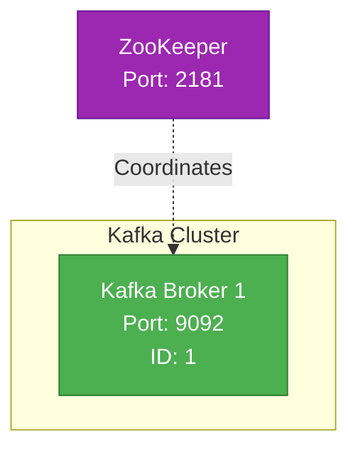
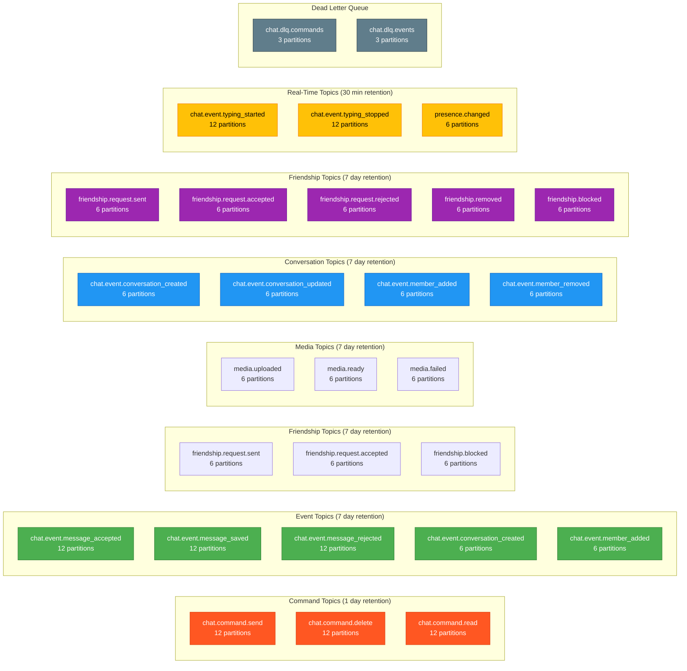
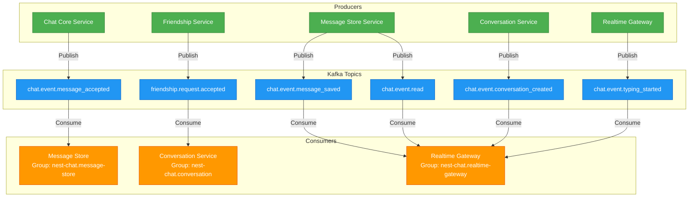
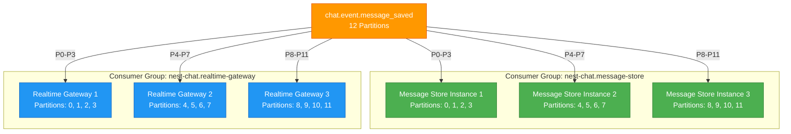

# Kafka Topology

## Overview

This document describes the Kafka cluster architecture, topic configuration, producer/consumer topology, and partitioning strategies used in the chat system.

## Kafka Cluster Architecture

### Cluster Configuration

**Current deployment**: 1 broker (`kafka-1`, port 9092) with ZooKeeper for coordination. The `kafka-2` and `kafka-3` broker definitions exist in docker-compose.yml but are commented out.



### Cluster Specifications

| Configuration | Value | Notes |
|--------------|-------|-------|
| **Brokers** | 1 (active) | Only kafka-1 running; kafka-2 and kafka-3 commented out in docker-compose |
| **Replication Factor** | 1 | Single broker; no replication |
| **Min In-Sync Replicas** | 1 | Not applicable with single broker |
| **ZooKeeper** | 1 | Coordination service |
| **Log Retention** | 7 days | Configurable per topic |
| **Log Segment Size** | 1 GB | Default |

### High Availability

With a single broker, there is no fault tolerance or replication. If `kafka-1` goes down, all Kafka-dependent features (message publishing, event streaming) are unavailable until it recovers. For production deployments, a minimum of 3 brokers with replication factor 3 and min ISR 2 is recommended.

### Topic Inventory



### Topic Configuration Details

#### Message Topics

| Topic | Partitions | Replication | Retention | Min ISR | Purpose |
|-------|------------|-------------|-----------|---------|---------|
| `chat.command.send` | 12 | 3 | 1 day | 2 | Command to send message |
| `chat.event.message_accepted` | 12 | 3 | 7 days | 2 | Message validated by Chat Core |
| `chat.event.message_saved` | 12 | 3 | 7 days | 2 | Message persisted in DB |
| `chat.event.message_rejected` | 12 | 3 | 7 days | 2 | Message validation failed |
| `chat.event.read` | 12 | 3 | 7 days | 2 | Read receipt updated |
| `chat.event.deleted` | 12 | 3 | 7 days | 2 | Message deleted |

**Why 12 partitions?**
- High throughput topic (thousands of messages/sec)
- Allows 12 parallel consumers
- Partition key: `conversationId` for ordering

#### Conversation Topics

| Topic | Partitions | Replication | Retention | Min ISR | Purpose |
|-------|------------|-------------|-----------|---------|---------|
| `chat.event.conversation_created` | 6 | 3 | 7 days | 2 | New conversation created |
| `chat.event.conversation_updated` | 6 | 3 | 7 days | 2 | Conversation metadata updated |
| `chat.event.member_added` | 6 | 3 | 7 days | 2 | Member added to conversation |
| `chat.event.member_removed` | 6 | 3 | 7 days | 2 | Member removed from conversation |
| `chat.event.community_notify` | 6 | 3 | 7 days | 2 | ANNOUNCEMENT channel "hasNew" notification |

**Why 6 partitions?**
- Lower throughput than messages
- Still allows parallel processing
- Partition key: `conversationId`

#### Friendship Topics

| Topic | Partitions | Replication | Retention | Min ISR | Purpose |
|-------|------------|-------------|-----------|---------|---------|
| `friendship.request.sent` | 6 | 3 | 7 days | 2 | Friend request sent |
| `friendship.request.accepted` | 6 | 3 | 7 days | 2 | Friend request accepted |
| `friendship.request.rejected` | 6 | 3 | 7 days | 2 | Friend request rejected |
| `friendship.removed` | 6 | 3 | 7 days | 2 | Friendship removed |
| `friendship.blocked` | 6 | 3 | 7 days | 2 | User blocked |
| `friendship.unblocked` | 6 | 3 | 7 days | 2 | User unblocked |

**Why 6 partitions?**
- Low-medium throughput
- Partition key: `userId` (requester)

#### Real-Time Topics

| Topic | Partitions | Replication | Retention | Min ISR | Purpose |
|-------|------------|-------------|-----------|---------|---------|
| `chat.event.typing_started` | 12 | 3 | 30 min | 2 | User started typing |
| `chat.event.typing_stopped` | 12 | 3 | 30 min | 2 | User stopped typing |
| `presence.changed` | 6 | 3 | 30 min | 2 | User online/offline status changed |

**Why 30-minute retention?**
- Ephemeral events, no replay needed
- Reduces storage costs
- Still useful for recent debugging

#### Call Topics

| Topic | Partitions | Replication | Retention | Min ISR | Purpose |
|-------|------------|-------------|-----------|---------|--------|
| `call.event.started` | 6 | 3 | 7 days | 2 | Meeting started |
| `call.event.join_requested` | 6 | 3 | 7 days | 2 | Participant waits in waiting room |
| `call.event.participant_joined` | 6 | 3 | 7 days | 2 | Participant approved and joined |
| `call.event.participant_left` | 6 | 3 | 7 days | 2 | Participant left or was kicked |
| `call.event.waiting_approved` | 6 | 3 | 7 days | 2 | Host approved waiting participant |
| `call.event.waiting_rejected` | 6 | 3 | 7 days | 2 | Host rejected waiting participant |
| `call.event.media_state_updated` | 6 | 3 | 7 days | 2 | Participant mic/camera/screen state changed |
| `call.event.recording_state_updated` | 6 | 3 | 7 days | 2 | Recording started/paused/resumed/stopped |
| `call.event.participant_moderated` | 6 | 3 | 7 days | 2 | Participant kicked by host |
| `call.event.ended` | 6 | 3 | 7 days | 2 | Meeting ended |

**Producer**: Call Service (via Transactional Outbox, same `chat_db`)
**Consumers**: Realtime Gateway (consumer group `nest-chat.call-service.realtime`), Call Service itself (consumer group `nest-chat.call-service` for `chat.event.member_removed`)

**Why 6 partitions?**
- Lower throughput than message topics (meetings are less frequent than messages)
- Partition key: `conversationId` for per-conversation ordering

## Producer/Consumer Topology

### Complete Service Topology



### Service-Level Breakdown

#### Chat Core Service
**Role**: Producer only

| Action | Topic | Partition Key |
|--------|-------|---------------|
| Message validated | `chat.event.message_accepted` | `conversationId` |
| Message validation failed | `chat.event.message_rejected` | `conversationId` |

**Configuration**:
- `acks: all` (wait for all in-sync replicas)
- `compression.type: lz4` (fast compression)
- `retries: 5`
- `idempotence: true` (prevent duplicates)

#### Message Store Service
**Role**: Consumer + Producer

**Consumes**:
| Topic | Consumer Group | Partitions | Purpose |
|-------|----------------|------------|---------|
| `chat.event.message_accepted` | `nest-chat.message-store` | All 12 | Persist messages to DB |

**Produces**:
| Topic | Partition Key | Purpose |
|-------|---------------|---------|
| `chat.event.message_saved` | `conversationId` | Notify persistence complete |
| `chat.event.read` | `conversationId` | Notify read receipt updated |
| `chat.event.deleted` | `conversationId` | Notify message deleted |

**Configuration**:
- `auto.offset.commit: false` (manual commit after DB write)
- `max.poll.records: 100` (batch processing)
- `session.timeout.ms: 30000`

#### Conversation Service
**Role**: Consumer + Producer

**Consumes**:
| Topic | Consumer Group | Partitions | Purpose |
|-------|----------------|------------|---------|
| `friendship.request.accepted` | `nest-chat.conversation` | All 6 | Auto-create DIRECT conversation |

**Produces**:
| Topic | Partition Key | Purpose |
|-------|---------------|---------|
| `chat.event.conversation_created` | `conversationId` | Notify new conversation |
| `chat.event.conversation_updated` | `conversationId` | Notify metadata changed |
| `chat.event.member_added` | `conversationId` | Notify member added |
| `chat.event.member_removed` | `conversationId` | Notify member removed |

#### Friendship Service
**Role**: Producer only

**Produces**:
| Topic | Partition Key | Purpose |
|-------|---------------|---------|
| `friendship.request.sent` | `fromUserId` | Notify friend request sent |
| `friendship.request.accepted` | `fromUserId` | Notify friendship established |
| `friendship.request.rejected` | `fromUserId` | Notify rejection |
| `friendship.removed` | `userId` | Notify unfriend |
| `friendship.blocked` | `userId` | Notify block |
| `friendship.unblocked` | `userId` | Notify unblock |

#### Realtime Gateway Service
**Role**: Consumer + Producer (limited)

**Consumes**:
| Topic | Consumer Group | Partitions | Purpose |
|-------|----------------|------------|---------|
| `chat.event.message_saved` | `nest-chat.realtime-gateway` | All 12 | Broadcast message to clients |
| `chat.event.conversation_created` | `nest-chat.realtime-gateway` | All 6 | Notify conversation created |
| `chat.event.member_added` | `nest-chat.realtime-gateway` | All 6 | Notify member added |
| `chat.event.typing_started` | `nest-chat.realtime-gateway` | All 12 | Show typing indicator |
| `chat.event.typing_stopped` | `nest-chat.realtime-gateway` | All 12 | Hide typing indicator |
| `chat.event.read` | `nest-chat.realtime-gateway` | All 12 | Update read receipts |

**Produces**:
| Topic | Partition Key | Purpose |
|-------|---------------|---------|
| `chat.event.typing_started` | `conversationId` | User started typing |
| `chat.event.typing_stopped` | `conversationId` | User stopped typing |

**Configuration**:
- Multiple instances for horizontal scaling
- Each instance consumes subset of partitions
- Load balancing via consumer group rebalancing

#### Call Service
**Role**: Consumer + Producer

**Consumes**:
| Topic | Consumer Group | Partitions | Purpose |
|-------|----------------|------------|--------|
| `chat.event.member_removed` | `nest-chat.call-service` | All 6 | Auto-kick participant removed from conversation |

**Produces**:
| Topic | Partition Key | Purpose |
|-------|---------------|--------|
| `call.event.started` | `conversationId` | Meeting created |
| `call.event.join_requested` | `conversationId` | Waiting room entry |
| `call.event.participant_joined` | `conversationId` | Participant joined meeting |
| `call.event.participant_left` | `conversationId` | Participant left or kicked |
| `call.event.waiting_approved` | `conversationId` | Host approved join |
| `call.event.waiting_rejected` | `conversationId` | Host rejected join |
| `call.event.media_state_updated` | `conversationId` | Mic/camera/screen state change |
| `call.event.recording_state_updated` | `conversationId` | Recording lifecycle event |
| `call.event.participant_moderated` | `conversationId` | Participant kicked via moderation |
| `call.event.ended` | `conversationId` | Meeting ended |

**Configuration**:
- `acks: all` — call events must not be lost
- `retries: 5`
- `idempotence: true`

## Partitioning Strategy

### Partition Key Selection

#### Message Topics: `conversationId`

**Reason**: Guarantees message ordering per conversation

```javascript
// Producer (Chat Core)
producer.send({
  topic: 'chat.event.message_accepted',
  key: conversationId, // Partition key
  value: JSON.stringify({
    messageId,
    conversationId,
    senderId,
    content,
    timestamp
  })
});
```

**Result**:
- All messages for `conversation-123` go to same partition
- Consumer processes messages in order (offset 1, 2, 3, ...)
- Critical for chat message ordering

**Partition Distribution**:
```
conversationId hash mod 12 = partition number

conversation-abc → hash % 12 = 0 → Partition 0
conversation-def → hash % 12 = 7 → Partition 7
conversation-xyz → hash % 12 = 3 → Partition 3
```

#### Friendship Topics: `userId`

**Reason**: Groups all friendship events per user

```javascript
// Producer (Friendship Service)
producer.send({
  topic: 'friendship.request.accepted',
  key: fromUserId, // Requester's ID
  value: JSON.stringify({
    fromUserId,
    toUserId,
    timestamp
  })
});
```

**Result**:
- All friendship events for `user-123` go to same partition
- Enables ordered processing of friendship lifecycle

#### Presence Topics: `userId`

**Reason**: Groups online/offline events per user

**Result**:
- Prevents race conditions (online → offline → online processed in order)

### Partition Count Considerations

**Formula**: `Partitions = Target Throughput / Consumer Throughput`

**Message Topics (12 partitions)**:
- Target: 12,000 messages/sec
- Consumer throughput: 1,000 messages/sec
- Partitions needed: 12

**Conversation Topics (6 partitions)**:
- Target: 1,000 conversations/sec
- Consumer throughput: 200 conversations/sec
- Partitions needed: 5-6

**Trade-offs**:
- More partitions = higher parallelism, but more overhead
- Fewer partitions = lower overhead, but less scalability
- **Cannot decrease partitions** without recreating topic

---

## Consumer Groups

### Group Configuration



### Consumer Group Details

| Consumer Group | Services | Topics | Max Parallelism | Purpose |
|----------------|----------|--------|-----------------|---------|
| `nest-chat.message-store` | Message Store | `chat.event.message_accepted` | 12 instances | Persist messages |
| `nest-chat.realtime-gateway` | Realtime Gateway | All `chat.event.*` topics | 12 instances | Broadcast to WebSockets |
| `nest-chat.conversation-service` | Conversation Service | `friendship.request.accepted` | 6 instances | Auto-create DIRECT conversations |
| `nest-chat.conversation-service.friendship-events` | Conversation Service | `friendship.*` events | 6 instances | Handle friendship lifecycle |
| `nest-chat.conversation-service.cache-updater` | Conversation Service | `chat.event.member_added`, `chat.event.member_removed` | 6 instances | Update Redis membership cache |
| `nest-chat.call-service` | Call Service | `chat.event.member_removed` | 6 instances | Auto-kick participants on membership removal |
| `nest-chat.call-service.realtime` | Realtime Gateway | All `call.event.*` topics | 6 instances | Broadcast call events to WebSocket clients |
| `nest-chat.media-worker` | Media Worker | `media.uploaded` | 6 instances | Process uploaded files |
| `nest-chat.media` | Media Service | `media.ready` | 6 instances | Update media status after processing |
| `nest-chat.analytics` | Analytics Service (planned) | All topics | 12 instances | Metrics aggregation pipeline |

### Rebalancing

**Scenario**: Add 4th Message Store instance

**Before** (3 instances):
- Instance 1: Partitions 0, 1, 2, 3
- Instance 2: Partitions 4, 5, 6, 7
- Instance 3: Partitions 8, 9, 10, 11

**After** (4 instances):
- Instance 1: Partitions 0, 1, 2
- Instance 2: Partitions 3, 4, 5
- Instance 3: Partitions 6, 7, 8
- Instance 4: Partitions 9, 10, 11

**Process**:
1. New instance joins consumer group
2. ZooKeeper triggers rebalance
3. Consumers stop processing
4. Partitions redistributed
5. Consumers commit offsets
6. Processing resumes

**Downtime**: ~5-10 seconds during rebalancing

---

## Message Ordering Guarantees

### Per-Conversation Ordering

**Problem**: Messages for `conversation-123` must appear in order

**Solution**: Partition by `conversationId`

```
Message 1 (offset 1) → Partition 3
Message 2 (offset 2) → Partition 3 (same as message 1)
Message 3 (offset 3) → Partition 3 (same as message 1)
```

**Consumer** processes:
1. Message 1 (offset 1)
2. Message 2 (offset 2)
3. Message 3 (offset 3)

**Result**: Order preserved

### Cross-Conversation Ordering

**Problem**: Messages in `conversation-abc` and `conversation-xyz` have no ordering relationship

**Solution**: No guarantee needed

```
Message A1 (conv-abc, offset 1) → Partition 3
Message B1 (conv-xyz, offset 1) → Partition 7
Message A2 (conv-abc, offset 2) → Partition 3
Message B2 (conv-xyz, offset 2) → Partition 7
```

**Consumer 1** (Partition 3):
1. Message A1 (offset 1)
2. Message A2 (offset 2)

**Consumer 2** (Partition 7):
1. Message B1 (offset 1)
2. Message B2 (offset 2)

**Result**: Each conversation ordered independently

---

## Idempotency & At-Least-Once Delivery

### Kafka Guarantees

- **At-least-once delivery**: Message delivered 1 or more times
- **No exactly-once** (without Kafka Streams/Transactions)

### Idempotency Implementation

**Message Store Consumer**:

```typescript
async processMessage(event: MessageAcceptedEvent) {
  // Check if already processed
  const exists = await this.repository.findByMessageId(event.messageId);
  
  if (exists) {
    this.logger.warn(`Duplicate message: ${event.messageId}`);
    return; // Skip processing
  }
  
  // Process message
  await this.repository.insert({
    id: event.messageId, // Unique constraint
    conversationId: event.conversationId,
    content: event.content,
    // ...
  });
  
  // Commit Kafka offset
  await consumer.commitOffsets();
}
```

**Database Constraint**:
```sql
CREATE TABLE messages (
  id UUID PRIMARY KEY, -- messageId from event
  conversationId UUID NOT NULL,
  content TEXT,
  offset INTEGER NOT NULL,
  UNIQUE (conversationId, offset) -- Prevent offset collision
);
```

**Result**: Duplicate events ignored, no duplicate messages

---

## Monitoring & Observability

### Key Metrics

**Kafka Broker Metrics**:
- `kafka.server:type=BrokerTopicMetrics,name=MessagesInPerSec`
- `kafka.server:type=BrokerTopicMetrics,name=BytesInPerSec`
- `kafka.controller:type=KafkaController,name=ActiveControllerCount` (should be 1)
- `kafka.server:type=ReplicaManager,name=UnderReplicatedPartitions` (should be 0)

**Consumer Metrics**:
- `kafka.consumer:type=consumer-fetch-manager-metrics,client-id=*,topic=*,partition=*,name=records-lag-max`
- `kafka.consumer:type=consumer-coordinator-metrics,client-id=*,name=commit-latency-avg`

**Producer Metrics**:
- `kafka.producer:type=producer-metrics,client-id=*,name=record-send-rate`
- `kafka.producer:type=producer-metrics,client-id=*,name=request-latency-avg`

### Lag Monitoring

**Consumer Lag**: Difference between last produced offset and last consumed offset

```
Topic: chat.event.message_accepted, Partition: 0
Latest offset: 1000
Consumer offset: 950
Lag: 50 messages
```

**Alerting**:
- Lag > 10,000 messages: Warning
- Lag > 100,000 messages: Critical (scale up consumers)

---

## Future Enhancements

### Kafka Streams

**Use Case**: Real-time aggregations (e.g., message count per user)

**Implementation**:
```java
KStream<String, MessageEvent> messages = builder.stream("chat.event.message_saved");

messages
  .groupByKey()
  .windowedBy(TimeWindows.of(Duration.ofMinutes(1)))
  .count()
  .toStream()
  .to("analytics.message_count");
```

### Schema Registry

**Use Case**: Schema evolution, backward compatibility

**Implementation**:
- Avro schemas for all events
- Confluent Schema Registry
- Producer validates schema before publishing
- Consumer deserializes with schema

### Kafka Connect

**Use Case**: Stream to data warehouse (BigQuery, Snowflake)

**Implementation**:
- Kafka Connect JDBC Sink
- Stream `chat.event.message_saved` → analytics DB
- No custom code needed

---

## References

- [system-architecture.md](./system-architecture.md) - Overall system architecture
- [message-flows.md](./message-flows.md) - Sequence diagrams showing Kafka usage
- [SERVICE_COMMUNICATION.md](../integration/SERVICE_COMMUNICATION.md) - Inter-service communication patterns
- [Kafka Documentation](https://kafka.apache.org/documentation/) - Official Kafka docs
