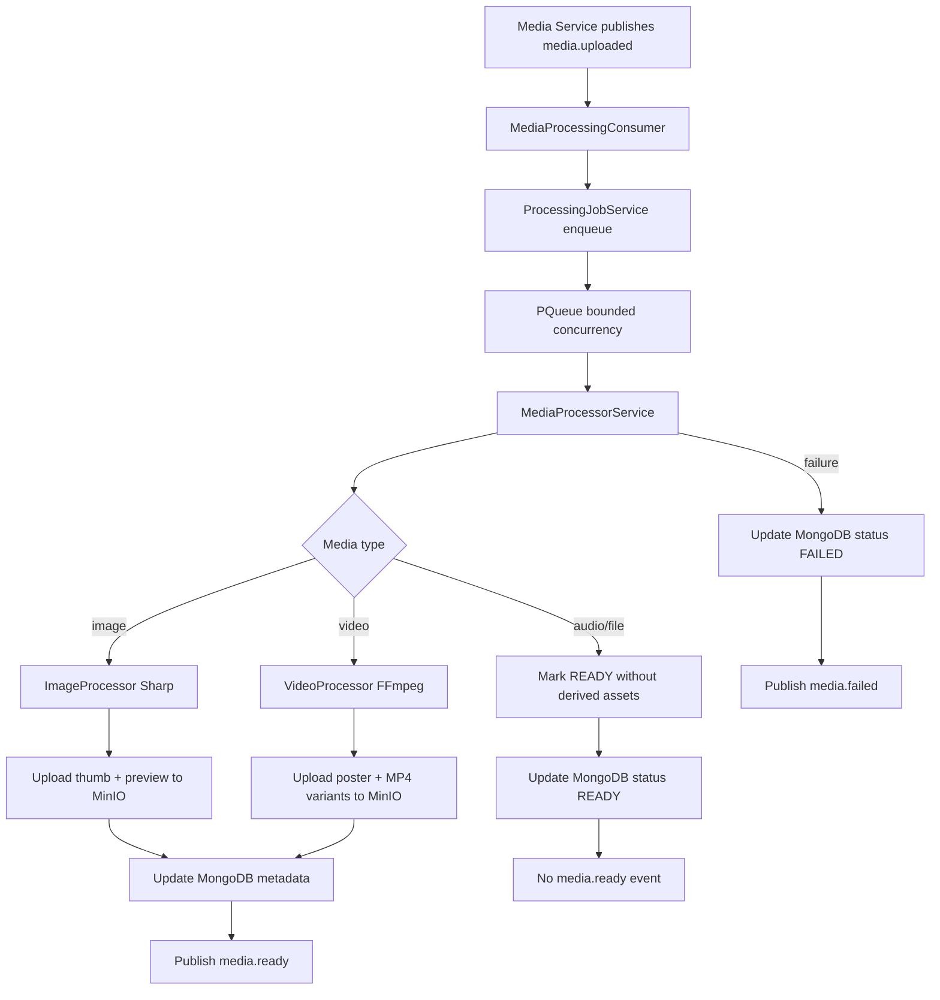
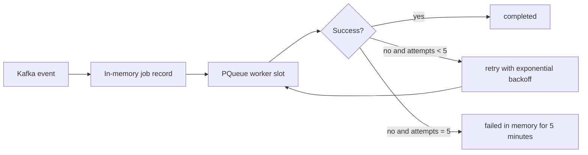
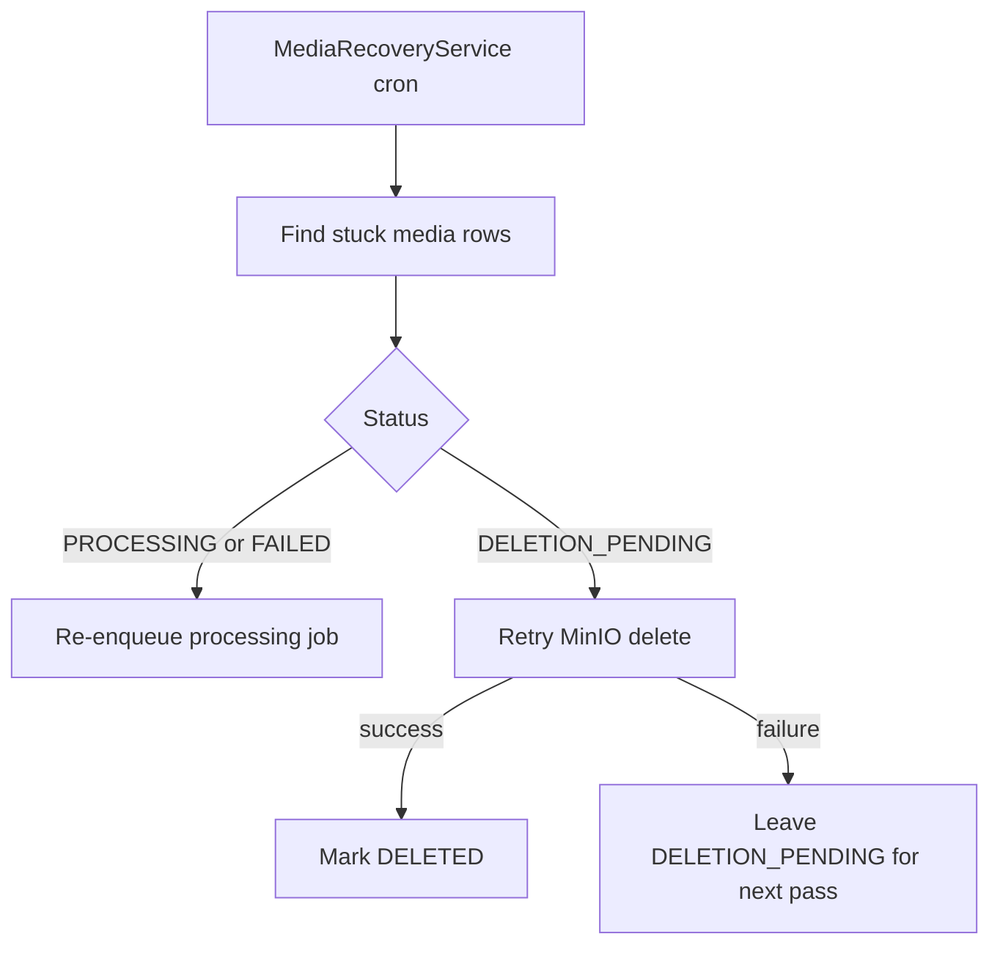

# Media Worker Architecture

## Overview

The Media Worker implementation is a two-tier pipeline:

1. Kafka consumer tier for fast acknowledgement
2. In-memory bounded processing tier for CPU-heavy image/video work

It is intentionally not a REST service and not a Redis/Bull queue worker.

---

## Flow Diagram

---

## Queue and Retry Model

Actual retry timings from code:

- attempt 1 retry: 2s
- attempt 2 retry: 4s
- attempt 3 retry: 8s
- attempt 4 retry: 16s
- attempt 5 retry: 32s

Job timeout is 10 minutes.

---

## Recovery Pass

A separate cron-driven recovery path runs every 5 minutes with a Redis leader lock.

---

## Type-Specific Behavior

### Image

- Normalize orientation
- Strip EXIF
- Generate `thumb` and `preview`
- Publish `media.ready`

### Video

- Extract metadata with ffprobe
- Generate poster at `min(1 second, 10% of duration)`
- Generate built-in MP4 variants: `mp4_720p`, `mp4_360p`
- Publish `media.ready`

### Audio and file

- No heavy processing
- Mark `READY`
- Do not publish `media.ready`

That last point is important: attachment refresh events are only produced for media that actually generated new derived assets.
