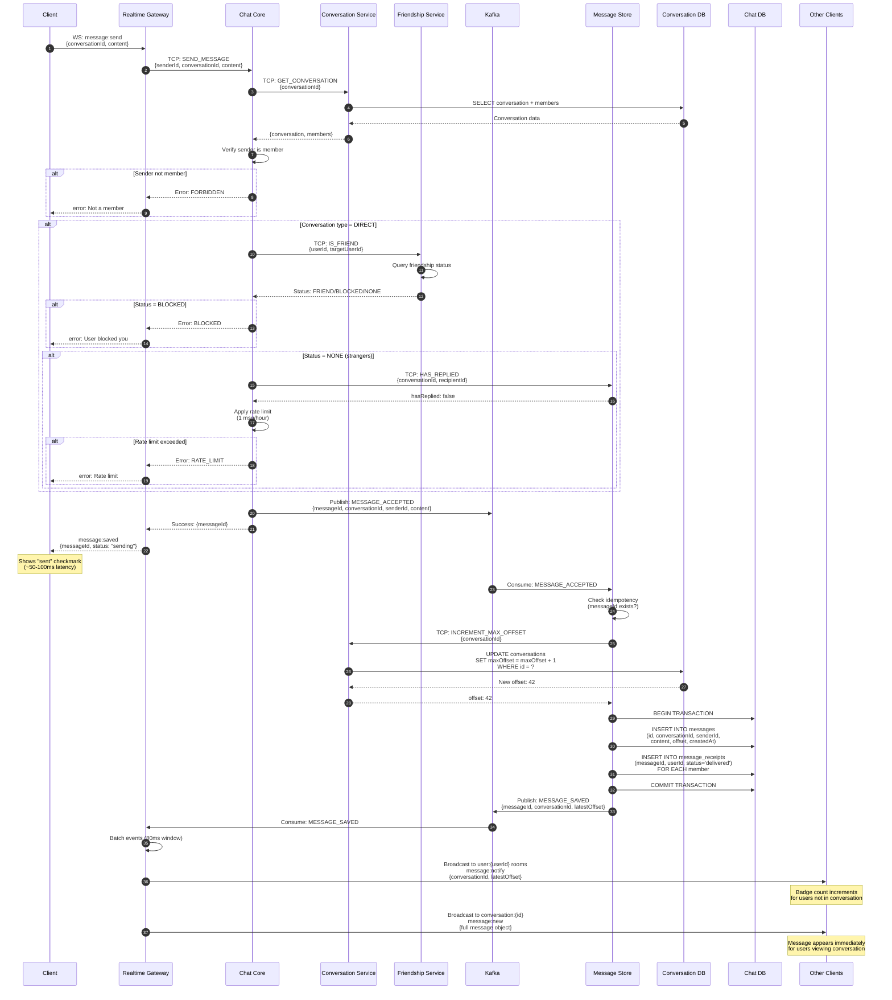
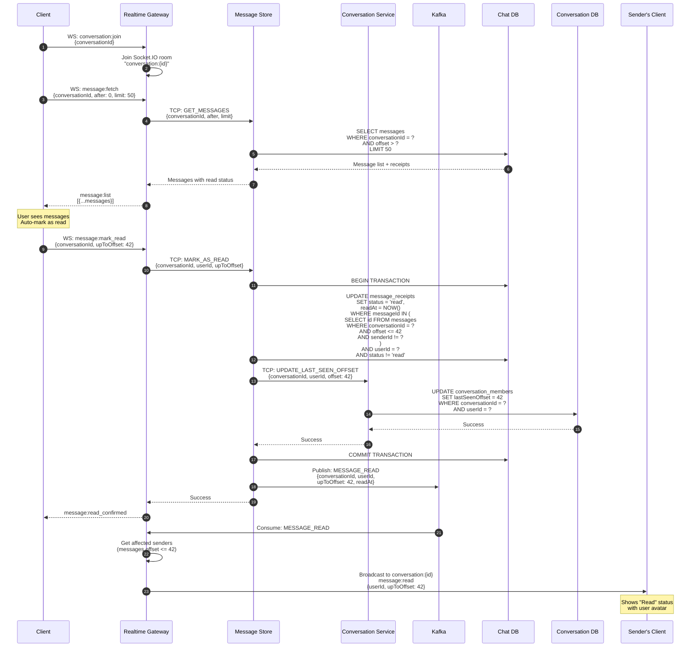
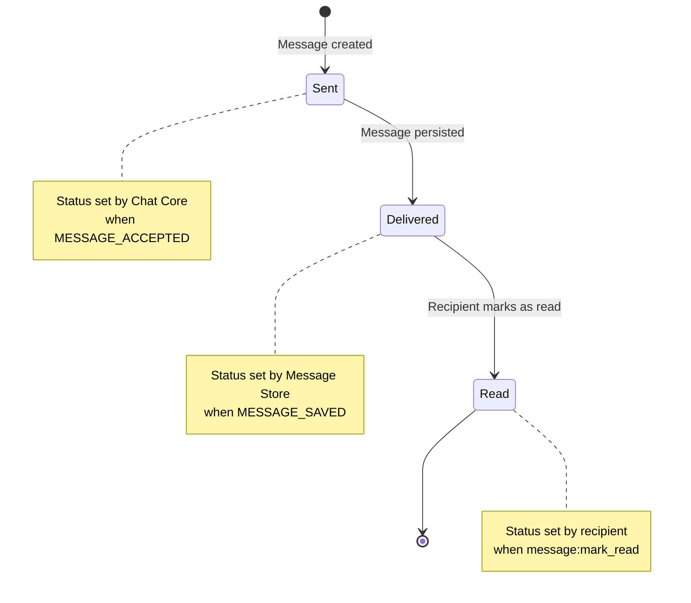
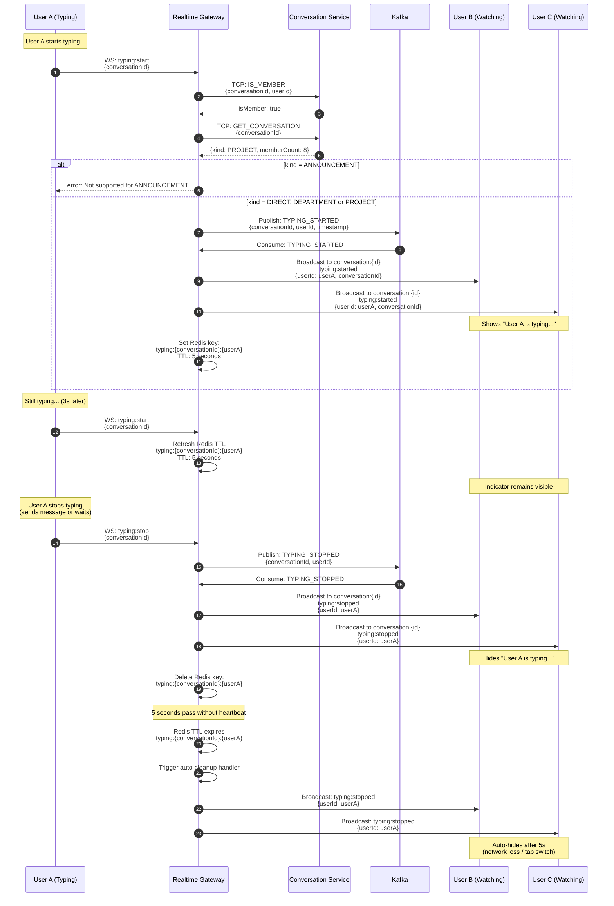
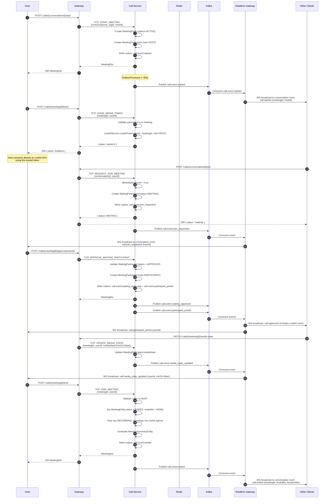

# Message Flows

## Overview

This document illustrates the key message flows in the chat system using sequence diagrams. These flows show how data moves through services, databases, and Kafka for common user interactions.

## Send Message Flow

### Description
Complete flow from when a user sends a message via WebSocket until all conversation members receive the notification.

### Flow Diagram



### Key Steps Explained

1. **Client Emits** - User sends message via WebSocket with conversationId and content
2. **TCP Forward** - Realtime Gateway forwards to Chat Core with authenticated senderId
3. **Validate Conversation** - Chat Core fetches conversation details and member list
4. **Check Membership** - Verifies sender is a member of the conversation
5. **Check Friendship** - For DIRECT conversations, validates friendship status
6. **Rate Limiting** - For non-friends, enforces 1 message/hour until recipient replies
7. **Publish Event** - Chat Core publishes MESSAGE_ACCEPTED to Kafka
8. **Quick Response** - Client receives success (~50-100ms) before persistence
9. **Consume Event** - Message Store picks up event from Kafka
10. **Idempotency Check** - Prevents duplicate messages if event replayed
11. **Get Sequential Offset** - Atomic increment of conversation's maxOffset
12. **Persist Message** - Insert message and delivery receipts in transaction
13. **Publish Saved** - Message Store publishes MESSAGE_SAVED to Kafka
14. **Batch Window** - Realtime Gateway batches events for 80ms to reduce broadcast storms
15. **Tier 1 Broadcast** - Notify all members in their personal rooms (badge updates)
16. **Tier 2 Broadcast** - Send full message to users currently viewing the conversation

### Error Scenarios

**Sender Not Member**
- Rejected at step 4 with FORBIDDEN error
- No Kafka event published
- Client shows "You are not a member"

**Recipient Blocked Sender**
- Rejected at step 7 with BLOCKED error
- No Kafka event published
- Client shows "Unable to send message"

**Rate Limit Exceeded**
- Rejected at step 8 with RATE_LIMIT error
- Applied only to non-friends
- Client shows "You can send 1 message per hour to non-friends until they reply"

**Kafka Unavailable**
- Chat Core fails to publish MESSAGE_ACCEPTED
- Returns error to client
- No persistence occurs (consistent failure)

**Database Write Failure**
- Message Store fails to persist
- MESSAGE_SAVED never published
- Recipients never receive message
- Sender's client shows "sending..." indefinitely

---

## Read Receipt Flow

### Description
Flow when a user opens a conversation and marks messages as read, updating read receipts and notifying the sender.

### Flow Diagram



### Key Steps Explained

1. **Join Conversation** - Client emits `conversation:join`, joins Socket.IO room
2. **Fetch Messages** - Client requests messages with pagination
3. **Query Database** - Message Store fetches messages with current receipt status
4. **Return Messages** - Client displays messages with read/delivered indicators
5. **Mark as Read** - User scrolls to bottom, client emits `message:mark_read`
6. **Update Receipts** - Batch update all receipts up to specified offset
7. **Update LastSeenOffset** - Update user's conversation membership record
8. **Commit Transaction** - Ensure atomicity of receipt and offset updates
9. **Publish Event** - Kafka receives MESSAGE_READ event
10. **Confirm to User** - Client receives confirmation
11. **Consume Event** - Realtime Gateway picks up MESSAGE_READ
12. **Notify Sender** - Broadcast to conversation room so sender sees "Read" status

### Receipt Status Lifecycle



### Batch Read Optimization

**Problem**: Updating receipts for 50 messages = 50 UPDATE queries

**Solution**: Single batch UPDATE query
```sql
UPDATE message_receipts
SET status = 'read', readAt = NOW()
WHERE messageId IN (
  SELECT id FROM messages
  WHERE conversationId = 'conv-123'
  AND offset <= 42
  AND senderId != 'current-user'
)
AND userId = 'current-user'
AND status != 'read';
```

**Result**: O(1) query regardless of message count

---

## Typing Indicator Flow

### Description
Real-time typing indicators for DIRECT, DEPARTMENT, and PROJECT conversations. Not supported for ANNOUNCEMENT channels (members cannot post, so typing is irrelevant).

### Flow Diagram



### Key Steps Explained

1. **Start Typing** - User A begins typing, client emits `typing:start`
2. **Validate Membership** - Ensure user is member of conversation
3. **Check Kind** - Verify conversation kind is DIRECT, DEPARTMENT, or PROJECT (not ANNOUNCEMENT)
4. **Publish to Kafka** - TYPING_STARTED event published
5. **Consume Event** - Realtime Gateway consumes event
6. **Broadcast to Room** - Notify all members in conversation room (except sender)
7. **Set TTL** - Redis key with 5-second expiration for auto-cleanup
8. **Heartbeat** - Client re-emits `typing:start` every 3 seconds to keep indicator alive
9. **Refresh TTL** - Redis key TTL refreshed on each heartbeat
10. **Stop Typing** - User stops typing, client emits `typing:stop`
11. **Publish Stop Event** - TYPING_STOPPED event to Kafka
12. **Broadcast Stop** - Hide typing indicator for all members
13. **Delete Key** - Remove Redis key
14. **Auto-Cleanup** - If TTL expires without heartbeat, auto-broadcast stop event

### Design Decisions

**Why Kafka for Typing?**
- Decouples Realtime Gateway instances
- Multiple Realtime Gateway replicas can broadcast consistently
- Event log for debugging (short retention)

**Why Not Kafka for Typing?**
- Adds latency (~10-50ms)
- Could use Redis Pub/Sub for lower latency
- **Trade-off**: Consistency vs. latency

**Why 5-Second TTL?**
- Balance between responsiveness and unnecessary broadcasts
- Handles tab switches, network hiccups
- Prevents "stuck" typing indicators

**Why Not ANNOUNCEMENT?**
- ANNOUNCEMENT channels are read-only for members
- Members cannot send messages, so typing indicators are irrelevant

### Client Implementation

**Throttling**:
```javascript
let typingTimeout;

textarea.addEventListener('input', () => {
  socket.emit('typing:start', { conversationId });

  clearTimeout(typingTimeout);
  typingTimeout = setTimeout(() => {
    socket.emit('typing:stop', { conversationId });
  }, 2000); // Stop if no input for 2s
});
```

**Heartbeat** (every 3s):
```javascript
setInterval(() => {
  if (isTyping) {
    socket.emit('typing:start', { conversationId });
  }
}, 3000);
```

### Performance Considerations

**DIRECT or PROJECT Conversation (10 members)**:
- 1 typing event -> 9 broadcasts (exclude sender)
- Kafka throughput: ~10,000 messages/sec
- Redis ops: ~100,000 ops/sec
- **Result**: No bottleneck

**Large PROJECT (100 members)**:
- 1 typing event -> 99 broadcasts
- Still within capacity

**ANNOUNCEMENT Channel (many members)**:
- Typing not supported; members are read-only
- **Result**: Disabled for ANNOUNCEMENT kind

---

## Call Lifecycle Flow

### Description
Complete flow from when a user starts a meeting until all participants are notified and the meeting ends. Covers waiting room, media state changes, and recording.

### Flow Diagram



### Key Steps Explained

1. **Start Meeting** - Host POSTs to Gateway; Call Service creates `MeetingEntity` + first participant with HOST role
2. **Publish Start Event** - Outbox publishes `call.event.started`; Realtime Gateway broadcasts to conversation room
3. **Issue Token** - Call Service generates signed LiveKit JWT; host uses it to connect directly to SFU (media bypasses the Call Service)
4. **Join Request** - Member requests join; if waiting room enabled, a `WaitingParticipantEntity` is created
5. **Host Notified** - `call.event.join_requested` consumed by Realtime Gateway; host sees join request in UI
6. **Approve/Reject** - Host approves or rejects via Gateway → Call Service; approval creates `MeetingParticipantEntity`
7. **Media State** - Each device state change (mute/unmute/screen) writes to DB and publishes `call.event.media_state_updated`
8. **End Meeting** - Host ends; outstanding recordings stopped, summary generated, `call.event.ended` published
9. **Members Notified** - Realtime Gateway broadcasts end event; all clients close the call UI

---

## References

- [DATA_FLOW_PATTERNS.md](../integration/DATA_FLOW_PATTERNS.md) - Complete end-to-end flows with detailed explanations
- [SERVICE_COMMUNICATION.md](../integration/SERVICE_COMMUNICATION.md) - Service-to-service communication patterns
- [system-architecture.md](./system-architecture.md) - Overall system architecture
- [kafka-topology.md](./kafka-topology.md) - Kafka topic and partition details
- [call-service.md](../services/call-service.md) - Call Service detailed documentation
