# Message Flows

## Overview

This document illustrates the key message flows in the chat system using sequence diagrams. These flows show how data moves through services, databases, and Kafka for common user interactions.

## Send Message Flow

### Description
Complete flow from when a user sends a message via WebSocket until all conversation members receive the notification.

### Flow Diagram

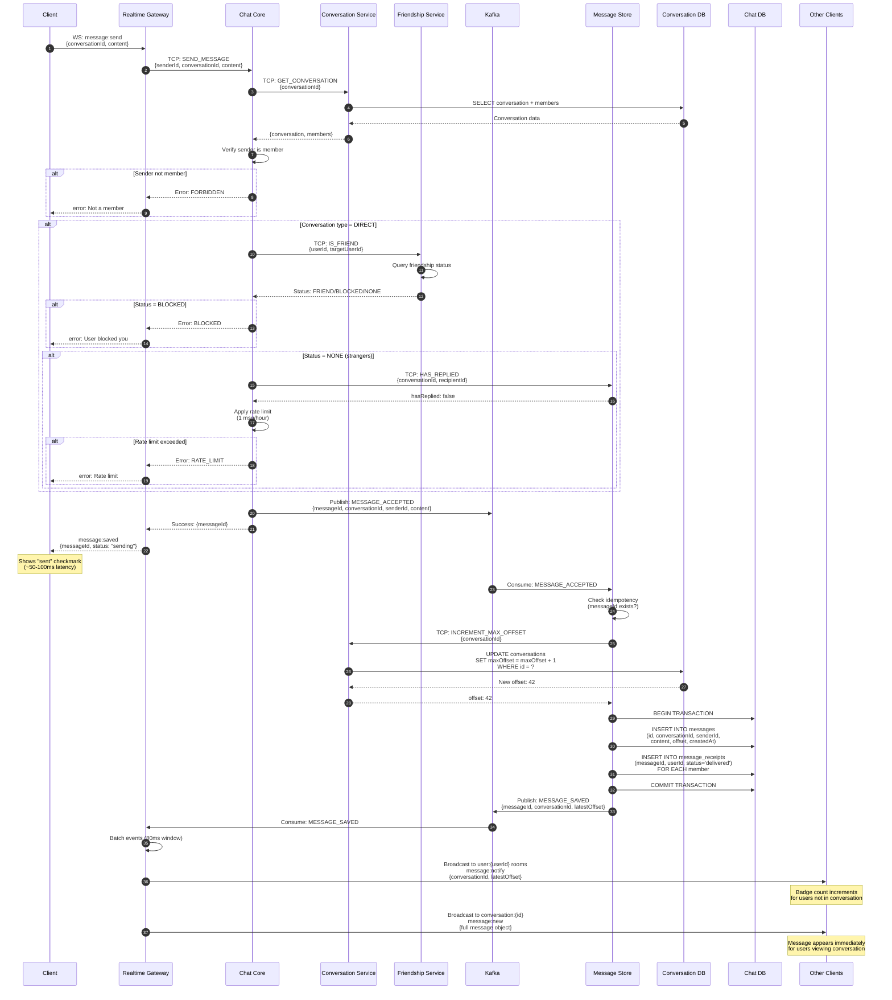

### Key Steps Explained

1. **Client Emits** - User sends message via WebSocket with conversationId and content
2. **TCP Forward** - Realtime Gateway forwards to Chat Core with authenticated senderId
3. **Validate Conversation** - Chat Core fetches conversation details and member list
4. **Check Membership** - Verifies sender is a member of the conversation
5. **Check Friendship** - For DIRECT conversations, validates friendship status
6. **Rate Limiting** - For non-friends, enforces 1 message/hour until recipient replies
7. **Publish Event** - Chat Core publishes MESSAGE_ACCEPTED to Kafka
8. **Quick Response** - Client receives success (~50-100ms) before persistence
9. **Consume Event** - Message Store picks up event from Kafka
10. **Idempotency Check** - Prevents duplicate messages if event replayed
11. **Get Sequential Offset** - Atomic increment of conversation's maxOffset
12. **Persist Message** - Insert message and delivery receipts in transaction
13. **Publish Saved** - Message Store publishes MESSAGE_SAVED to Kafka
14. **Batch Window** - Realtime Gateway batches events for 80ms to reduce broadcast storms
15. **Tier 1 Broadcast** - Notify all members in their personal rooms (badge updates)
16. **Tier 2 Broadcast** - Send full message to users currently viewing the conversation

### Error Scenarios

**Sender Not Member**
- Rejected at step 4 with FORBIDDEN error
- No Kafka event published
- Client shows "You are not a member"

**Recipient Blocked Sender**
- Rejected at step 7 with BLOCKED error
- No Kafka event published
- Client shows "Unable to send message"

**Rate Limit Exceeded**
- Rejected at step 8 with RATE_LIMIT error
- Applied only to non-friends
- Client shows "You can send 1 message per hour to non-friends until they reply"

**Kafka Unavailable**
- Chat Core fails to publish MESSAGE_ACCEPTED
- Returns error to client
- No persistence occurs (consistent failure)

**Database Write Failure**
- Message Store fails to persist
- MESSAGE_SAVED never published
- Recipients never receive message
- Sender's client shows "sending..." indefinitely

---

## Sticker Message Flow

### Description

End-to-end flow for sending a sticker. The key performance insight: a sticker message is **as fast as a text message** — the backend never touches any image file during the chat exchange. The sticker image URL was pre-loaded from `GET /stickers/packages` and the browser/app fetches it directly from storage.

### Phase 0: Pre-fetch (App Startup)

When the user opens the sticker keyboard, the client calls `GET /stickers/packages` (HTTP). The Gateway proxies to Message Store via TCP (`sticker.get_packages`), returning each package with a `thumbnailUrl` for its icon. The client then calls `GET /stickers/packages/:id/stickers` per package and caches all sticker URLs in memory.

### Flow Diagram

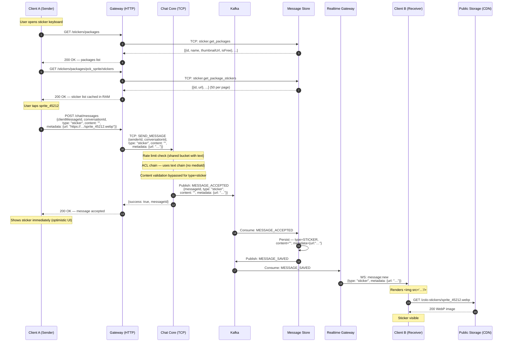

### Key Design Decisions

**Why no server-side URL validation when sending?**
Sticker URLs are static public assets on a CDN — no ownership or access-control concern. Validating the URL against the DB on every send would add a DB round-trip for zero security benefit. The client only has valid URLs because they came from `GET /stickers/packages/:id/stickers` in the first place.

**Why use the text ACL chain for stickers?**
Stickers have no `mediaId`; they reference pre-uploaded static files that the server never processes. The text chain checks membership, account status, and conversation permissions — exactly what is needed. The `MediaValidationRule` fires only when `context.media` is present, so it naturally skips for stickers.

**Why is `content` empty for stickers?**
`content` is the searchable/indexable text body of a message. Stickers carry no textual content; the sticker identity and display URL live in `metadata.url`. This keeps the message model consistent and avoids storing redundant data.

---

## Typing Indicator Flow

### Description
Real-time typing indicators for DIRECT and GROUP conversations. Not supported for COMMUNITY channels (members cannot post, so typing is irrelevant).

### Flow Diagram

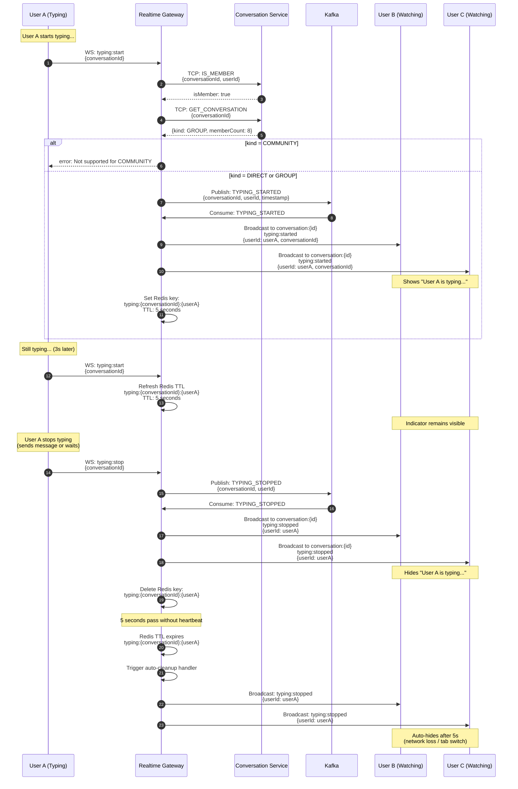

### Key Steps Explained

1. **Start Typing** - User A begins typing, client emits `typing:start`
2. **Validate Membership** - Ensure user is member of conversation
3. **Check Kind** - Verify conversation kind is DIRECT or GROUP (not COMMUNITY)
4. **Publish to Kafka** - TYPING_STARTED event published
5. **Consume Event** - Realtime Gateway consumes event
6. **Broadcast to Room** - Notify all members in conversation room (except sender)
7. **Set TTL** - Redis key with 5-second expiration for auto-cleanup
8. **Heartbeat** - Client re-emits `typing:start` every 3 seconds to keep indicator alive
9. **Refresh TTL** - Redis key TTL refreshed on each heartbeat
10. **Stop Typing** - User stops typing, client emits `typing:stop`
11. **Publish Stop Event** - TYPING_STOPPED event to Kafka
12. **Broadcast Stop** - Hide typing indicator for all members
13. **Delete Key** - Remove Redis key
14. **Auto-Cleanup** - If TTL expires without heartbeat, auto-broadcast stop event

### Design Decisions

**Why Kafka for Typing?**
- Decouples Realtime Gateway instances
- Multiple Realtime Gateway replicas can broadcast consistently
- Event log for debugging (short retention)

**Why Not Kafka for Typing?**
- Adds latency (~10-50ms)
- Could use Redis Pub/Sub for lower latency
- **Trade-off**: Consistency vs. latency

**Why 5-Second TTL?**
- Balance between responsiveness and unnecessary broadcasts
- Handles tab switches, network hiccups
- Prevents "stuck" typing indicators

**Why Not COMMUNITY?**
- COMMUNITY channels are read-only for members
- Members cannot send messages, so typing indicators are irrelevant

### Client Implementation

**Throttling**:
```javascript
let typingTimeout;

textarea.addEventListener('input', () => {
  socket.emit('typing:start', { conversationId });

  clearTimeout(typingTimeout);
  typingTimeout = setTimeout(() => {
    socket.emit('typing:stop', { conversationId });
  }, 2000); // Stop if no input for 2s
});
```

**Heartbeat** (every 3s):
```javascript
setInterval(() => {
  if (isTyping) {
    socket.emit('typing:start', { conversationId });
  }
}, 3000);
```

### Performance Considerations

**DIRECT or GROUP Conversation (10 members)**:
- 1 typing event -> 9 broadcasts (exclude sender)
- Kafka throughput: ~10,000 messages/sec
- Redis ops: ~100,000 ops/sec
- **Result**: No bottleneck

**Large GROUP (100 members)**:
- 1 typing event -> 99 broadcasts
- Still within capacity

**COMMUNITY Channel (many members)**:
- Typing not supported; members are read-only
- **Result**: Disabled for COMMUNITY kind

---

## Call Lifecycle Flow

### Description
Complete flow from when a user starts a meeting until all participants are notified and the meeting ends. Covers waiting room, media state changes, and recording.

### Flow Diagram

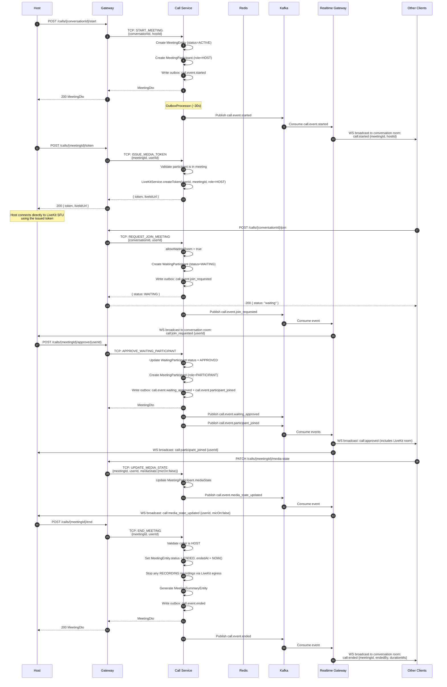

### Key Steps Explained

1. **Start Meeting** - Host POSTs to Gateway; Call Service creates `MeetingEntity` + first participant with HOST role
2. **Publish Start Event** - Outbox publishes `call.event.started`; Realtime Gateway broadcasts to conversation room
3. **Issue Token** - Call Service generates signed LiveKit JWT; host uses it to connect directly to SFU (media bypasses the Call Service)
4. **Join Request** - Member requests join; if waiting room enabled, a `WaitingParticipantEntity` is created
5. **Host Notified** - `call.event.join_requested` consumed by Realtime Gateway; host sees join request in UI
6. **Approve/Reject** - Host approves or rejects via Gateway → Call Service; approval creates `MeetingParticipantEntity`
7. **Media State** - Each device state change (mute/unmute/screen) writes to DB and publishes `call.event.media_state_updated`
8. **End Meeting** - Host ends; outstanding recordings stopped, summary generated, `call.event.ended` published
9. **Members Notified** - Realtime Gateway broadcasts end event; all clients close the call UI

---

## Authentication & WebSocket Connection Flow

### Description
How a client authenticates with Keycloak, obtains a JWT, and establishes an authenticated WebSocket connection to receive real-time events.

### Flow Diagram

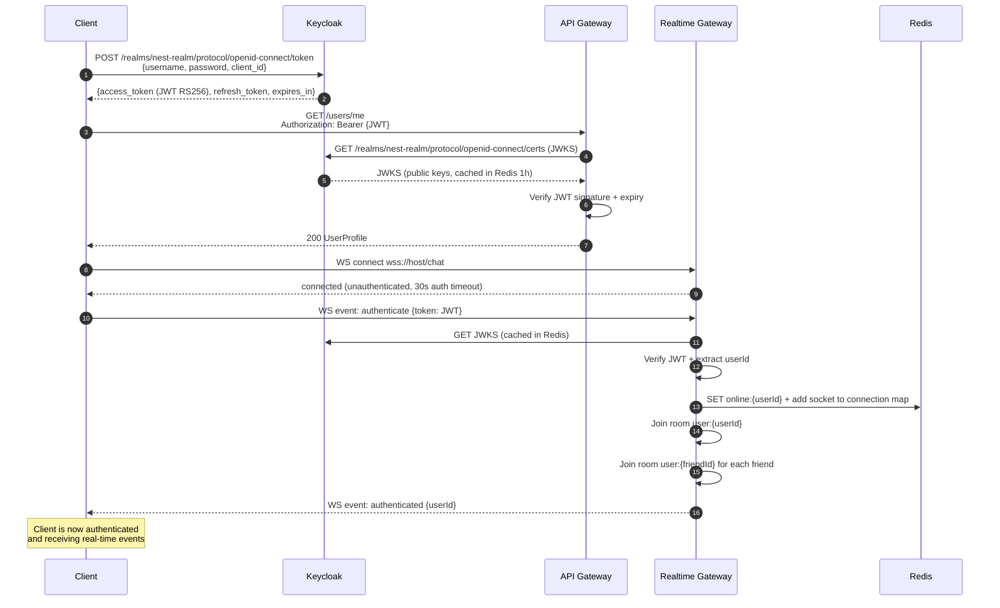

---

## Edit Message Flow

### Description
Flow when a user edits a previously sent message. Chat Core enforces the 1-hour edit window and saves an audit trail.

### Flow Diagram

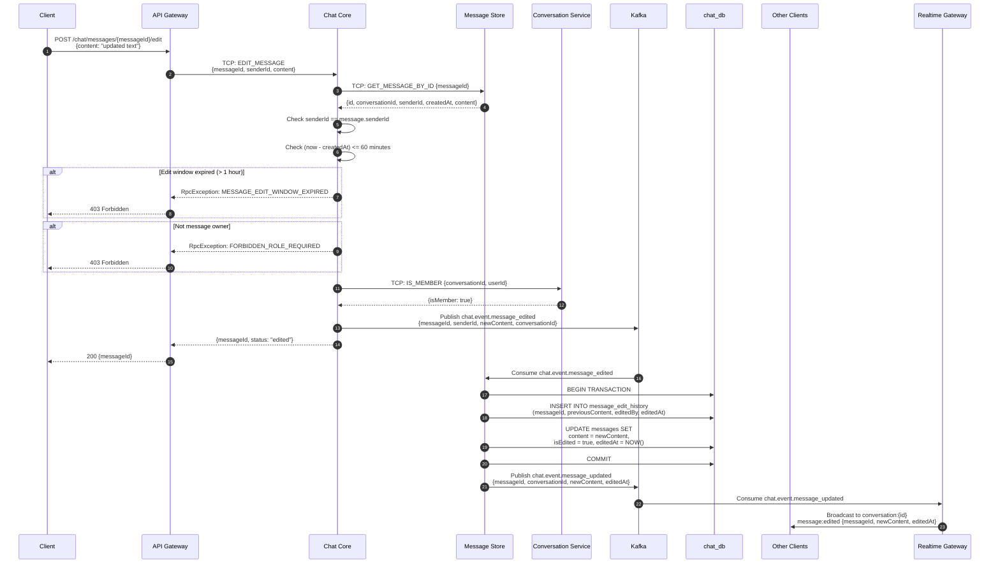

### Key Rules

- **Edit window**: 1 hour from `createdAt` (enforced by Chat Core using `MESSAGE_LIMITS.EDIT_WINDOW_MS`)
- **Ownership**: Only the original sender can edit (no ADMIN override for edit)
- **Audit trail**: Previous content always saved to `message_edit_history` before updating
- **`isEdited` flag**: Message row shows edit indicator in UI

---

## Delete Message Flow

### Description
Soft-delete flow. Own messages within 24 h, ADMIN can delete any within 24 h (plus audit log).

### Flow Diagram

```mermaid
sequenceDiagram
    autonumber
    participant Client
    participant Gateway as API Gateway
    participant ChatCore as Chat Core
    participant MsgStore as Message Store
    participant ConvSvc as Conversation Service
    participant Kafka
    participant ChatDB as chat_db
    participant Recipients as Other Clients
    participant RealtimeGW as Realtime Gateway

    Client->>Gateway: DELETE /chat/messages/{messageId}
    Gateway->>ChatCore: TCP: DELETE_MESSAGE {messageId, deletedBy}

    ChatCore->>MsgStore: TCP: GET_MESSAGE_BY_ID {messageId}
    MsgStore-->>ChatCore: {id, conversationId, senderId, createdAt}

    ChatCore->>ConvSvc: TCP: GET_MEMBERS_WITH_ROLES {conversationId}
    ConvSvc-->>ChatCore: [{userId, role}]

    ChatCore->>ChatCore: Resolve actor role from membership list

    alt Own message AND within 24 h (MSG.DELETE_OWN)
        ChatCore->>ChatCore: OK - proceed
    else ADMIN/OWNER AND within 24 h (MSG.DELETE_ANY)
        ChatCore->>ChatCore: OK - audit log required
    else Violation
        ChatCore-->>Gateway: RpcException: FORBIDDEN_TIME_WINDOW or FORBIDDEN_ROLE_REQUIRED
        Gateway-->>Client: 403 Forbidden
    end

    ChatCore->>Kafka: Publish chat.event.deleted<br/>{messageId, conversationId, deletedBy, isAdminDelete}
    ChatCore-->>Gateway: {messageId, deleted: true}
    Gateway-->>Client: 200

    Kafka->>MsgStore: Consume chat.event.deleted
    MsgStore->>ChatDB: UPDATE messages<br/>SET isDeleted = true, deletedAt = NOW()
    MsgStore->>Kafka: Publish chat.event.message_updated (isDeleted: true)

    Kafka->>RealtimeGW: Consume chat.event.message_updated
    RealtimeGW->>Recipients: Broadcast conversation:{id}<br/>message:deleted {messageId}

    Note over Recipients: "This message was deleted"<br/>shown in UI; content hidden
```

### Key Rules

- **Soft delete only**: `isDeleted = true`, `deletedAt = NOW()` — row is never removed
- **Own delete**: `MSG.DELETE_OWN` — sender only, within 24 h
- **Admin delete**: `MSG.DELETE_ANY` — OWNER/ADMIN only, within 24 h, all actions are logged
- **Content hidden**: Deleted messages return `{isDeleted: true, content: null}` from API

---

## Pin / Unpin Message Flow

### Description
Pin/unpin messages in a conversation. Max 3 pinned messages per conversation, OWNER/ADMIN/MODERATOR only.

### Flow Diagram

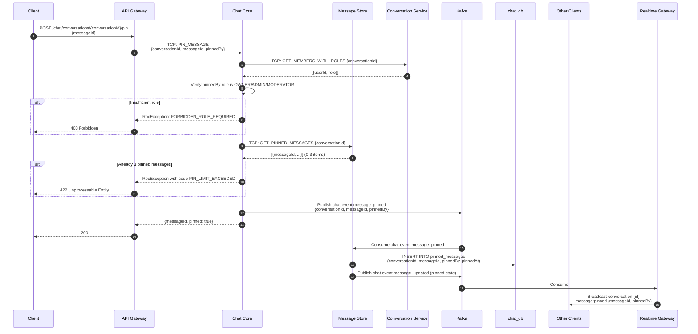

### Unpin Flow

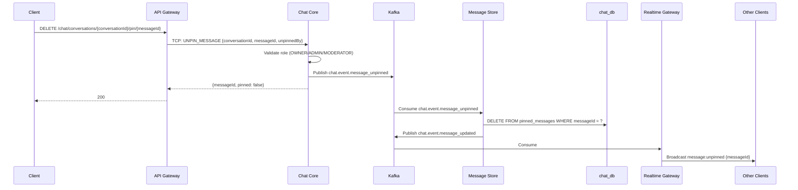

---

## Media Upload Flow (2-Phase Pre-signed URL)

### Description
Two-phase upload: pre-check before upload, then finalize after direct MinIO upload. Prevents uploading media that will be rejected.

### Flow Diagram

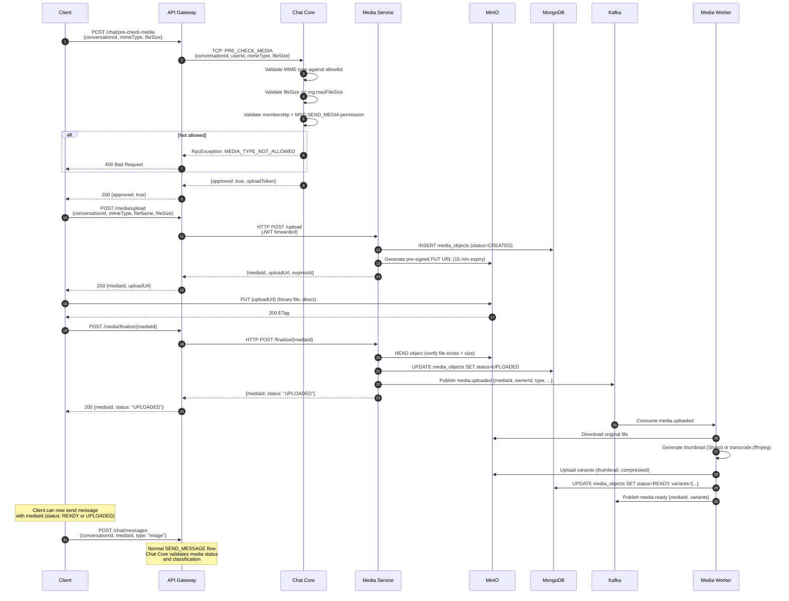

### Media States

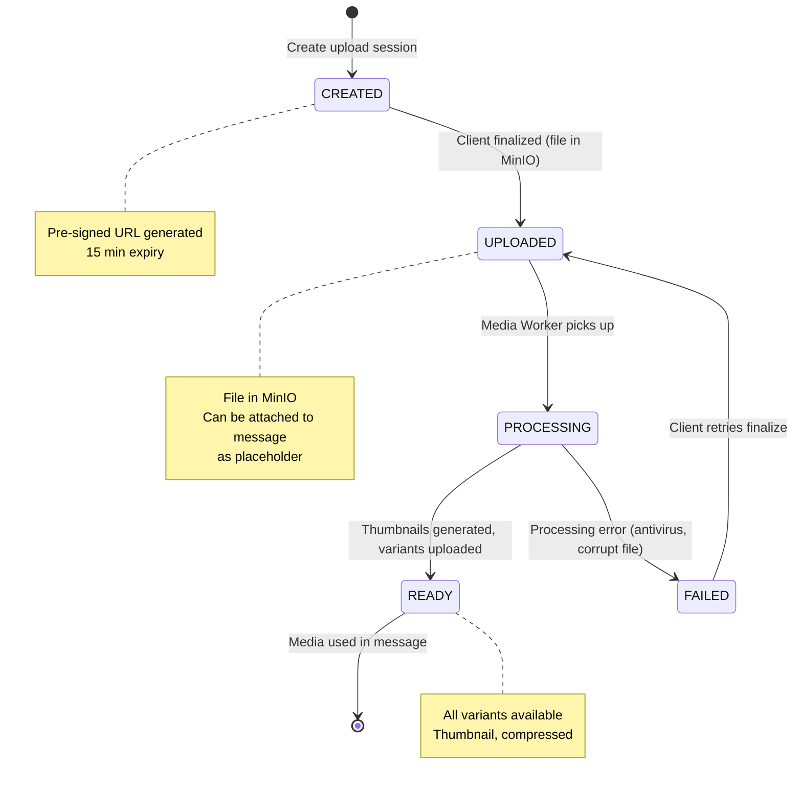

---

## Friend Request Flow (with Auto-create DIRECT Conversation)

### Description
Complete friendship lifecycle from friend request to auto-created DIRECT conversation, using transactional outbox and Kafka events.

### Flow Diagram

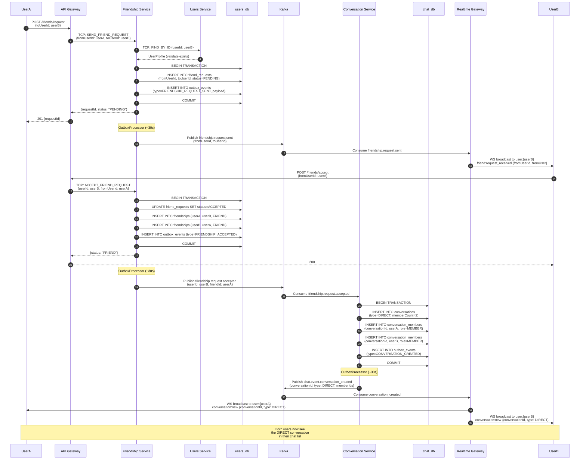

---

## Member Add / Remove Flow

### Description
Adding or removing a member from a GROUP or COMMUNITY conversation, with cache invalidation and real-time notifications.

### Flow Diagram

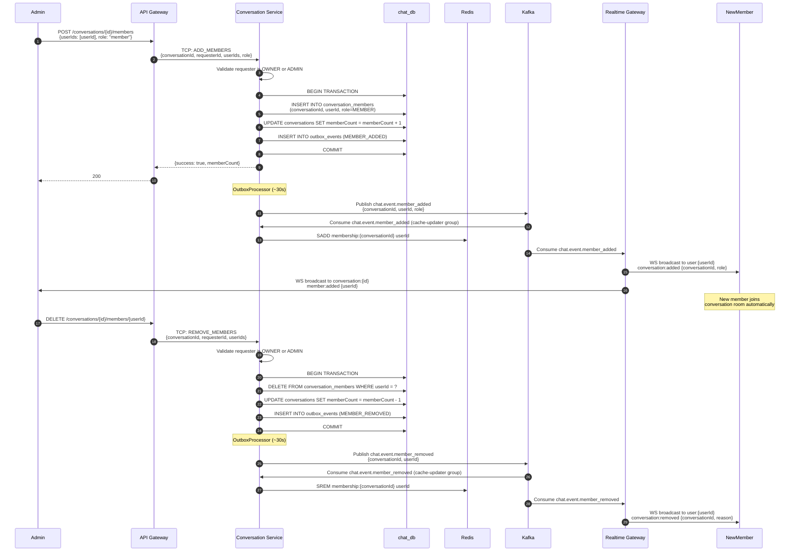

---

## Read Receipt / Mark as Read Flow

### Description
How the client marks a conversation as read, updating the cursor-based read tracking without a separate receipts table.

### Flow Diagram

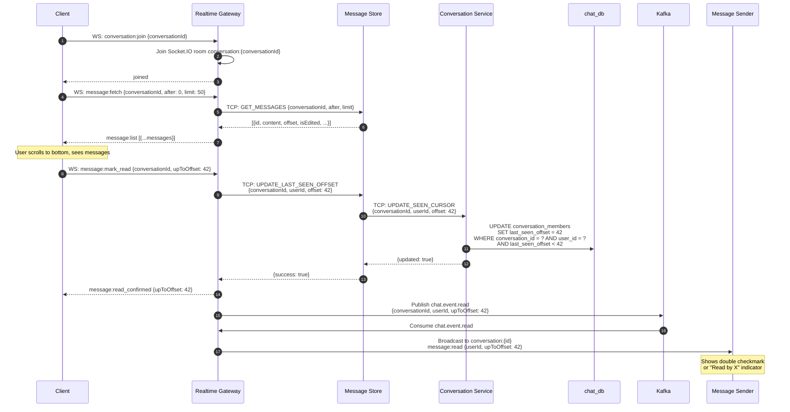

---

## References

- [DATA_FLOW_PATTERNS.md](../integration/DATA_FLOW_PATTERNS.md) - Additional end-to-end flows
- [SERVICE_COMMUNICATION.md](../integration/SERVICE_COMMUNICATION.md) - Service-to-service communication patterns
- [system-architecture.md](./system-architecture.md) - Overall system architecture
- [kafka-topology.md](./kafka-topology.md) - Kafka topic and partition details
- [call-service.md](../services/call-service.md) - Call Service detailed documentation
- [database-relations.md](./database-relations.md) - Database schemas and entity relationships
