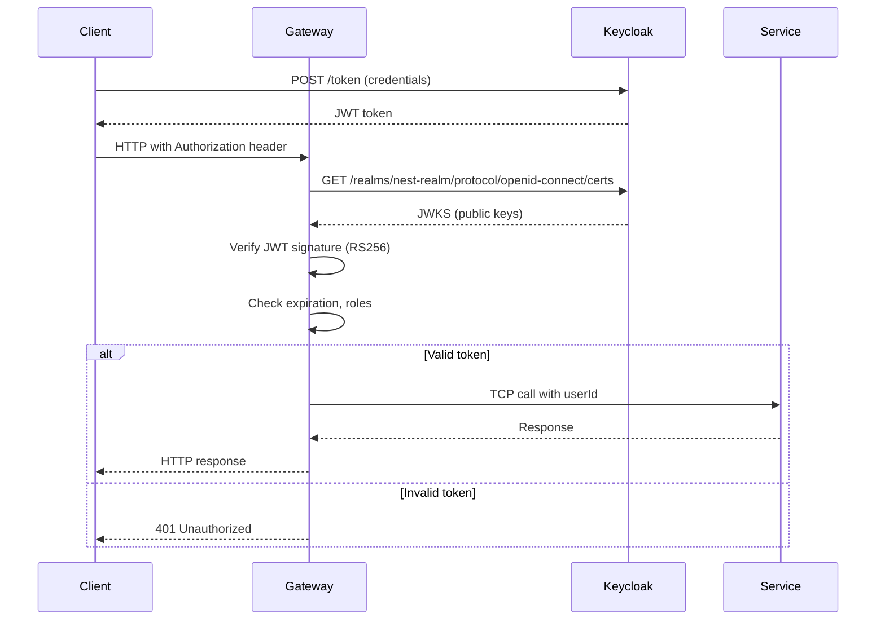

# System Architecture

## Overview

This document provides a comprehensive view of the NestJS microservices-based chat system architecture, showing all services, infrastructure components, and their interconnections.

## High-Level Architecture Diagram

```mermaid
C4Context
    title System Context Diagram - NestJS Chat Platform

    Person(client, "Client", "Web/Mobile Application")
    
    System_Boundary(api, "API Layer") {
        Container(gateway, "Gateway", "NestJS", "HTTP REST API, JWT verification, TCP routing")
        Container(realtime, "Realtime Gateway", "NestJS + Socket.IO", "WebSocket connections, real-time events")
    }
    
    System_Boundary(services, "Microservices") {
        Container(users, "Users Service", "NestJS TCP", "User profile management")
        Container(friendship, "Friendship Service", "NestJS TCP", "Social relationships, friend requests")
        Container(conversation, "Conversation Service", "NestJS TCP", "Conversation lifecycle")
        Container(chatcore, "Chat Core", "NestJS TCP", "Message validation, rate limiting")
        Container(msgstore, "Message Store", "NestJS TCP", "Message persistence")
        Container(presence, "Presence Service", "NestJS TCP", "Online/offline status")
        Container(media, "Media Service", "NestJS HTTP", "File uploads, MinIO storage")
        Container(mediaworker, "Media Worker", "NestJS Worker", "Background media processing")
        Container(callsvc, "Call Service", "NestJS TCP", "Meeting lifecycle, LiveKit token issuance, recording")
    }
    
    System_Ext(keycloak, "Keycloak", "Authentication & authorization server")
    System_Ext(livekit, "LiveKit SFU", "WebRTC media plane, ports 7880-7882")
    System_Ext(coturn, "coturn TURN", "TURN relay for NAT traversal, port 3478")
    
    System_Boundary(infrastructure, "Infrastructure") {
        ContainerDb(postgres, "PostgreSQL", "Relational DB", "3 databases (keycloak, users+friendship, chat+conversation)")
        ContainerDb(mongodb, "MongoDB", "Document DB", "Media metadata")
        ContainerDb(minio, "MinIO", "Object Storage", "S3-compatible file storage")
        ContainerQueue(kafka, "Kafka Cluster", "Event streaming", "1 active broker (kafka-1)")
        ContainerDb(redis, "Redis", "In-memory cache", "Presence, caching")
    }
    
    Rel(client, gateway, "HTTP/REST", "HTTPS")
    Rel(client, realtime, "WebSocket", "Socket.IO")
    Rel(client, keycloak, "OAuth 2.0", "Get JWT token")
    Rel(client, media, "HTTP", "File upload/download")
    
    Rel(gateway, users, "RPC", "TCP")
    Rel(gateway, friendship, "RPC", "TCP")
    Rel(gateway, conversation, "RPC", "TCP")
    Rel(gateway, chatcore, "RPC", "TCP")
    Rel(gateway, msgstore, "RPC", "TCP")
    Rel(gateway, presence, "RPC", "TCP")
    Rel(gateway, media, "HTTP", "Proxy")
    Rel(gateway, callsvc, "RPC", "TCP")
    
    Rel(realtime, chatcore, "RPC", "TCP")
    Rel(realtime, conversation, "RPC", "TCP")
    Rel(realtime, presence, "RPC", "TCP")
    
    Rel(chatcore, conversation, "RPC", "TCP")
    Rel(chatcore, friendship, "RPC", "TCP")
    Rel(chatcore, media, "HTTP", "Validate media")
    Rel(msgstore, conversation, "RPC", "TCP")
    
    Rel(gateway, keycloak, "Verify JWT", "JWKS endpoint")
    Rel(realtime, keycloak, "Verify JWT", "JWKS endpoint")
    Rel(media, keycloak, "Verify JWT", "JWKS endpoint")
    
    Rel(chatcore, kafka, "Publish", "MESSAGE_ACCEPTED")
    Rel(friendship, kafka, "Publish", "FRIENDSHIP events")
    Rel(msgstore, kafka, "Consume/Publish", "MESSAGE_SAVED")
    Rel(conversation, kafka, "Consume/Publish", "CONVERSATION events")
    Rel(media, kafka, "Publish", "MEDIA_UPLOADED")
    Rel(mediaworker, kafka, "Consume/Publish", "MEDIA_UPLOADED/READY/FAILED")
    Rel(realtime, kafka, "Consume", "Broadcast events")
    Rel(callsvc, kafka, "Publish", "CALL events")
    Rel(realtime, kafka, "Consume", "CALL events")
    Rel(callsvc, livekit, "REST/gRPC", "Token issuance, egress control")
    Rel(callsvc, postgres, "Read/Write", "chat_db (meeting tables)")
    
    Rel(users, postgres, "Read/Write", "users_db")
    Rel(friendship, postgres, "Read/Write", "users_db (friendship tables)")
    Rel(conversation, postgres, "Read/Write", "chat_db (conversation tables)")
    Rel(msgstore, postgres, "Read/Write", "chat_db (message tables)")
    
    Rel(media, mongodb, "Read/Write", "Media metadata")
    Rel(media, minio, "Read/Write", "File storage")
    Rel(mediaworker, mongodb, "Update", "Processing status")
    Rel(mediaworker, minio, "Read/Write", "Process & upload variants")
    
    Rel(presence, redis, "Read/Write", "DB 0: presence")
    Rel(friendship, redis, "Cache", "DB 1: friend lists")
    Rel(gateway, redis, "Cache", "DB 0: general cache")

    UpdateLayoutConfig($c4ShapeInRow="3", $c4BoundaryInRow="2")
```



## Detailed Component Architecture

```mermaid
graph TB
    subgraph "External Layer"
        Client[Web/Mobile Client]
        Keycloak[Keycloak Server<br/>Port 8080]
    end
    
    subgraph "API Gateway Layer"
        Gateway[Gateway Service<br/>Port 3000 HTTP]
        RealtimeGW[Realtime Gateway<br/>Port 3002 WS]
    end
    
    subgraph "Microservices Layer"
        Users[Users Service<br/>TCP Port 3001]
        Friendship[Friendship Service<br/>TCP Port 3008]
        Conversation[Conversation Service<br/>TCP Port 3007]
        ChatCore[Chat Core Service<br/>TCP Port 3004]
        MsgStore[Message Store<br/>TCP Port 3005]
        Presence[Presence Service<br/>TCP Port 3003]
        Media[Media Service<br/>HTTP Port 3009]
        CallSvc[Call Service<br/>TCP Port 3011]
    end

    subgraph "External Media Plane"
        LiveKit[LiveKit SFU<br/>Ports 7880-7882]
        TURN[coturn TURN<br/>Port 3478]
    end
    
    subgraph "Event Streaming"
        Kafka1[Kafka Broker 1<br/>Port 9092]
        ZK[ZooKeeper<br/>Port 2181]

        ZK -.->|Coordinates| Kafka1
    subgraph "Data Layer"
        PG_Keycloak[(PostgreSQL<br/>keycloak DB)]
        PG_Users[(PostgreSQL<br/>users+friendship DB)]
        PG_Chat[(PostgreSQL<br/>chat+conversation DB)]
        MongoDB[(MongoDB<br/>media_db)]
        MinIO[(MinIO<br/>Object Storage)]
        Redis[(Redis<br/>DB 0: Cache/Presence<br/>DB 1: Friendship Cache)]
    end
    
    %% External connections
    Client -->|HTTPS REST| Gateway
    Client -->|WebSocket| RealtimeGW
    Client -->|OAuth 2.0| Keycloak
    Client -->|HTTP Upload/Download| Media
    
    %% Gateway to Services (TCP)
    Gateway -->|TCP| Users
    Gateway -->|TCP| Friendship
    Gateway -->|TCP| Conversation
    Gateway -->|TCP| ChatCore
    Gateway -->|TCP| MsgStore
    Gateway -->|TCP| Presence
    Gateway -->|HTTP Proxy| Media
    Gateway -->|TCP| CallSvc
    
    %% Realtime Gateway connections
    RealtimeGW -->|TCP| ChatCore
    RealtimeGW -->|TCP| Conversation
    RealtimeGW -->|TCP| Presence
    
    %% Inter-service communication (TCP)
    ChatCore -->|Validate| Conversation
    ChatCore -->|Check Friendship| Friendship
    ChatCore -->|Validate Media| Media
    MsgStore -->|Get Offset| Conversation
    CallSvc -->|Issue Token| LiveKit
    CallSvc -->|Own| PG_Chat
    
    %% Auth verification
    Gateway -.->|Verify JWT<br/>JWKS| Keycloak
    RealtimeGW -.->|Verify JWT<br/>JWKS| Keycloak
    Media -.->|Verify JWT<br/>JWKS| Keycloak
    
    %% Kafka producers/consumers
    ChatCore ==>|Publish| Kafka1
    Friendship ==>|Publish| Kafka1
    MsgStore ==>|Consume/Publish| Kafka1
    Conversation ==>|Consume/Publish| Kafka1
    Media ==>|Consume| Kafka1
    RealtimeGW ==>|Consume| Kafka1
    CallSvc ==>|Consume/Publish| Kafka1
    
    %% Database connections
    Users -->|Own| PG_Users
    Friendship -->|Own| PG_Users
    Conversation -->|Own| PG_Chat
    MsgStore -->|Own| PG_Chat
    Media -->|Metadata| MongoDB
    Media -->|Files| MinIO
    Keycloak -->|Own| PG_Keycloak
    
    %% Redis connections
    Presence -->|Presence Data| Redis
    Friendship -->|Friend Lists| Redis
    Gateway -->|General Cache| Redis
    
    classDef gateway fill:#4A90E2,stroke:#2E5C8A,color:#fff
    classDef service fill:#7CB342,stroke:#558B2F,color:#fff
    classDef kafka fill:#FF6F00,stroke:#E65100,color:#fff
    classDef database fill:#9C27B0,stroke:#6A1B9A,color:#fff
    classDef external fill:#607D8B,stroke:#455A64,color:#fff
    
    class Gateway,RealtimeGW gateway
    class Users,Friendship,Conversation,ChatCore,MsgStore,Presence,Media,CallSvc service
    class LiveKit,TURN external
    class Kafka1,ZK kafka
    class PG_Keycloak,PG_Users,PG_Chat,MongoDB,MinIO,Redis database
    class Client,Keycloak external
```

## Service Communication Matrix

| Caller ↓ / Callee → | Gateway | Realtime GW | Users | Friendship | Conversation | Chat Core | Message Store | Presence | Media | Call Service | Kafka | Keycloak |
|---------------------|---------|-------------|-------|------------|--------------|-----------|---------------|----------|-------|--------------|-------|----------|
| **Client** | HTTP | WS | - | - | - | - | - | - | HTTP | - | - | OAuth |
| **Gateway** | - | - | TCP | TCP | TCP | TCP | TCP | TCP | HTTP | TCP | - | JWKS |
| **Realtime GW** | - | - | - | - | TCP | TCP | - | TCP | - | - | Consume | JWKS |
| **Chat Core** | - | - | - | TCP | TCP | - | TCP | - | HTTP | - | Publish | - |
| **Message Store** | - | - | - | - | TCP | - | - | - | - | - | Consume/Publish | - |
| **Friendship** | - | - | - | - | - | - | - | - | - | - | Publish | - |
| **Conversation** | - | - | - | - | - | - | - | - | - | - | Consume/Publish | - |
| **Media** | - | - | - | - | - | - | - | - | - | - | Consume | JWKS |
| **Call Service** | - | - | - | - | - | - | - | - | - | - | Consume/Publish | - |

## Port Allocation

### External Ports (Exposed to Host)
| Service | Port | Protocol | Purpose |
|---------|------|----------|---------|
| Gateway | 3000 | HTTP | External REST API |
| Realtime Gateway | 3002 | WebSocket | Socket.IO connections |
| Media Service | 3009 | HTTP | Internal only (expose, no host port mapping) |
| Keycloak | 8080 | HTTP | Authentication server |
| Kafka Broker 1 | 9092 | TCP | Kafka client connections |
| Redis | 6380 | TCP | Redis (mapped from container 6379) || LiveKit SFU | 7880 | HTTP/WebRTC | LiveKit API and WebRTC signaling |
| LiveKit TURN | 7881 | TCP | LiveKit TURN relay |
| LiveKit RTC | 7882 | UDP | LiveKit RTC media traffic |
| coturn TURN | 3478 | UDP/TCP | TURN relay for WebRTC || Kafdrop | 9000 | HTTP | Kafka UI monitoring |
| MinIO API | 9010 | HTTP | S3-compatible API |
| MinIO Console | 9011 | HTTP | Basic console |
| MinIO Admin Console | 9012 | HTTP | Full-featured admin UI |
| Redis Commander | 8081 | HTTP | Redis GUI |

### Internal Ports (Docker Network Only)
| Service | Port | Protocol | Purpose |
|---------|------|----------|---------|
| Users Service | 3001 | TCP | NestJS microservice |
| Presence Service | 3003 | TCP | NestJS microservice |
| Chat Core | 3004 | TCP | NestJS microservice |
| Message Store | 3005 | TCP | NestJS microservice |
| Conversation Service | 3007 | TCP | NestJS microservice |
| Friendship Service | 3008 | TCP | NestJS microservice |
| Call Service | 3011 | TCP | NestJS microservice |
| ZooKeeper | 2181 | TCP | Kafka coordination |
| PostgreSQL (Keycloak) | 5432 | TCP | Keycloak database (internal only) |
| PostgreSQL (Users + Friendship) | 5434 | TCP | users_db — users and friendship tables |
| PostgreSQL (Chat) | 5433 | TCP | chat_db — conversations, messages, policy_rules |
| MongoDB | 27017 | TCP | Media metadata database |
| MinIO Internal | 9000 | HTTP | Internal S3 API |
| Redis | 6379 | TCP | Cache + Presence |

## Infrastructure Components

### Keycloak Authentication
- **Purpose**: Centralized authentication and authorization
- **Realm**: `nest-realm`
- **Flow**: OAuth 2.0 / OpenID Connect
- **Token Type**: RS256 JWT
- **Services verify tokens via JWKS endpoint** (no auth microservice needed)

### Kafka Cluster
- **Purpose**: Event streaming, asynchronous messaging
- **Current**: 1 broker (`kafka-1`, port 9092); `kafka-2` and `kafka-3` are defined but commented out in docker-compose
- **Replication Factor**: 1 (dev); recommended 3 for production
- **Topics**: 30+ topics (messages, conversations, friendships, presence, typing, call events, media)
- **Partitioning Strategy**: By `conversationId` for message ordering

### Redis (2 Databases)
- **DB 0**: General cache, presence data
  - User online status
  - Presence TTL keys
  - API response cache
- **DB 1**: Friendship cache
  - Friend lists (for fast lookups)
  - Block lists

### PostgreSQL (3 Containers)
- **keycloak_db**: Owned by Keycloak
- **users_db**: Owned by Users Service + Friendship Service
  - User profiles, settings, friendships, friend requests, blocks
- **chat_db**: Owned by Conversation Service, Message Store, Call Service (Chat Core reads `policy_rules`)
  - Conversations, members, offsets, messages, policy_rules
  - Meetings, participants, waiting_participants, recordings, meeting_summaries

### LiveKit SFU (External media plane)
- **Purpose**: WebRTC media routing (SFU), recording egress
- **Ports**: 7880 (API/signaling), 7881 (TURN/TCP), 7882 (RTC/UDP)
- **Integration**: Call Service issues access tokens via LiveKit server SDK; Realtime Gateway consumes `call.event.*` Kafka events to broadcast state changes to clients

### coturn TURN Server
- **Purpose**: TURN relay for WebRTC clients behind restrictive NAT
- **Port**: 3478 (UDP/TCP)
- **Usage**: LiveKit references coturn for clients that cannot reach SFU directly

## Communication Patterns

### Synchronous Communication (TCP)
- **Use Case**: Request/response operations requiring immediate feedback
- **Protocol**: NestJS TCP transport with message patterns
- **Timeout**: 5000ms default
- **Examples**:
  - Gateway → Users: Get user profile
  - Chat Core → Friendship: Check if users are friends
  - Message Store → Conversation: Increment message offset

### Asynchronous Communication (Kafka)
- **Use Case**: Event notifications, eventual consistency
- **Delivery**: At-least-once semantics
- **Ordering**: Guaranteed per partition (by conversationId)
- **Examples**:
  - Chat Core → Message Store: MESSAGE_ACCEPTED event
  - Message Store → Realtime Gateway: MESSAGE_SAVED event
  - Friendship → Conversation: FRIENDSHIP_REQUEST_ACCEPTED event

## Architecture Principles

### 1. Gateway as Facade
- All external HTTP requests enter through Gateway
- Gateway translates HTTP → TCP calls to microservices
- Realtime Gateway handles WebSocket connections
- Services never expose HTTP endpoints directly

### 2. No Cross-Service Database Access
- Each service owns its database(s)
- No service queries another service's database
- Data sharing happens via TCP calls or Kafka events
- Strong domain boundaries

### 3. Keycloak for Authentication
- No custom authentication service
- Keycloak handles login, registration, password management
- Services only verify JWT tokens via JWKS
- `KeycloakGuard` in Gateway for protected routes

### 4. Event-Driven Architecture
- State changes publish events to Kafka
- Services react to events asynchronously
- Decoupled, scalable architecture
- Example: Message saved → Notify clients

### 5. Stateless Microservices
- No in-memory state (except Realtime Gateway socket connections)
- Presence state stored in Redis
- Conversation state in PostgreSQL
- Horizontally scalable

## Scalability Considerations

### Horizontal Scaling
- **Stateless Services**: Can scale to multiple instances
  - Gateway: Load balancer distributes HTTP traffic
  - Users, Friendship, Conversation: Multiple TCP instances
  - Message Store: Kafka consumer group parallelism
  
- **Stateful Services**: Require special handling
  - Realtime Gateway: Sticky sessions or Redis adapter for Socket.IO
  - Kafka consumers: Partitions limit parallelism

### Database Sharding (Future)
- Users: Shard by userId (consistent hashing)
- Messages: Shard by conversationId
- Conversations: Shard by conversationId
- Friendships: Shard by userId

### Caching Strategy
- Friend lists cached in Redis (DB 1)
- User profiles cached in Redis (DB 0)
- Conversation membership cached in Redis
- Cache invalidation on write events from Kafka

## Monitoring & Observability

### Distributed Tracing
- **Headers**: `x-trace-id`, `x-request-id`, `x-correlation-id`
- **Flow**: Client → Gateway → Services → Kafka
- All logs include trace IDs for end-to-end tracking

### Logging
- **Library**: `nestjs-pino` with JSON output
- **Levels**: error, warn, log, debug, verbose
- **Context**: Service name, trace ID, user ID

### Health Checks
- Every service exposes `/health` endpoint
- Docker healthcheck monitors service availability
- Kubernetes liveness/readiness probes (future)

## Security Architecture

### JWT Verification Flow


### Role-Based Access Control (RBAC)
- Roles defined in Keycloak: `user`, `admin`, `moderator`
- `@Roles('admin')` decorator in controllers
- Gateway enforces role checks before forwarding to services
- Services trust Gateway's userId (no double verification)

## Deployment Architecture

### Docker Compose (Development)
```
docker compose up -d
```
- All services start together
- Services communicate via `nest-network` bridge
- Data persisted in named volumes

### Production Deployment (Future)
- **Kubernetes**: Each service as a Deployment
- **Kafka**: Managed service (Confluent Cloud, MSK)
- **PostgreSQL**: Managed RDS or Cloud SQL
- **Redis**: ElastiCache or Cloud Memorystore
- **Keycloak**: Clustered deployment with PostgreSQL HA

## References

- [SERVICE_COMMUNICATION.md](../integration/SERVICE_COMMUNICATION.md) - Detailed communication patterns
- [DATA_FLOW_PATTERNS.md](../integration/DATA_FLOW_PATTERNS.md) - End-to-end data flows
- [kafka-topology.md](./kafka-topology.md) - Kafka architecture details
- [database-relations.md](./database-relations.md) - Database ownership and schemas
