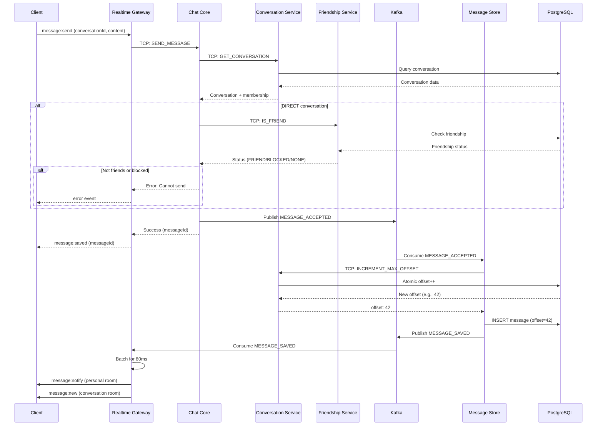
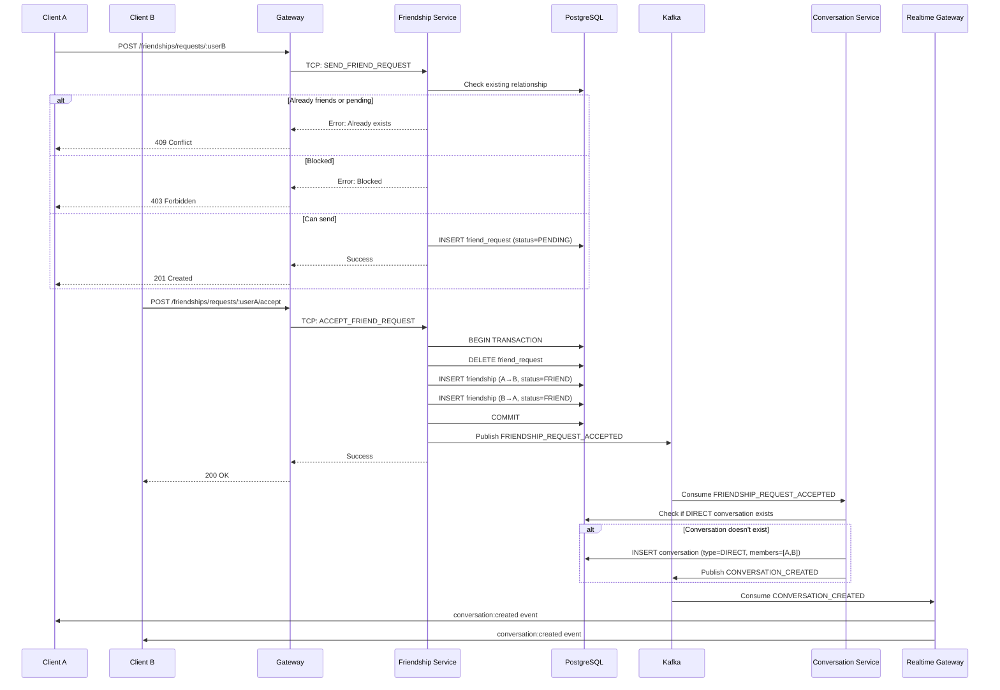
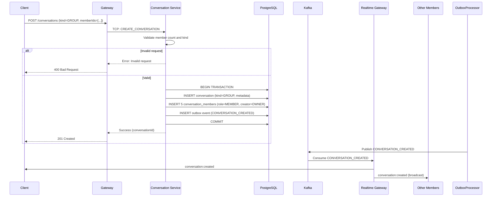
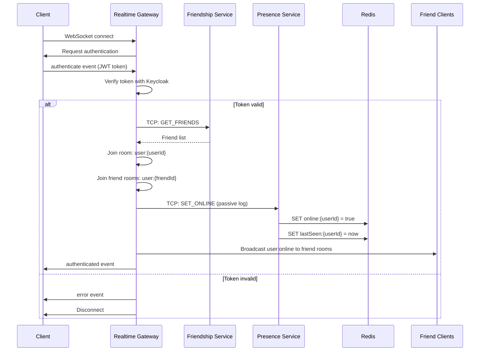
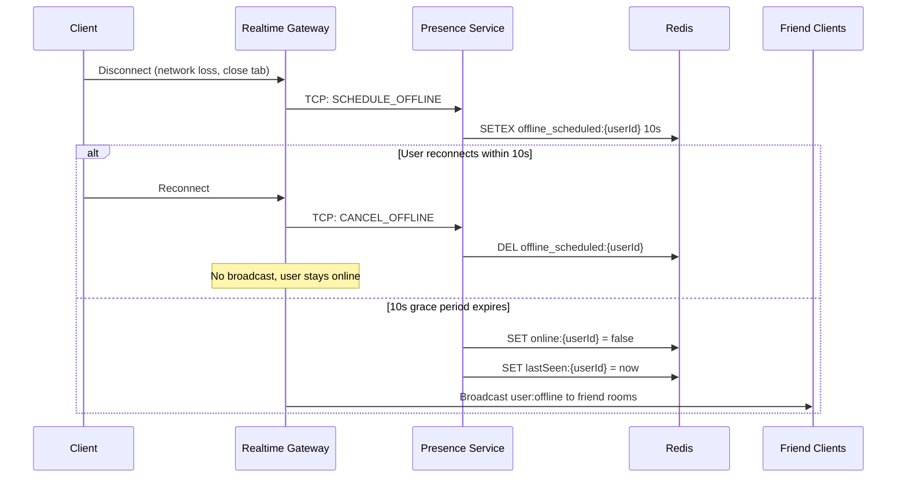
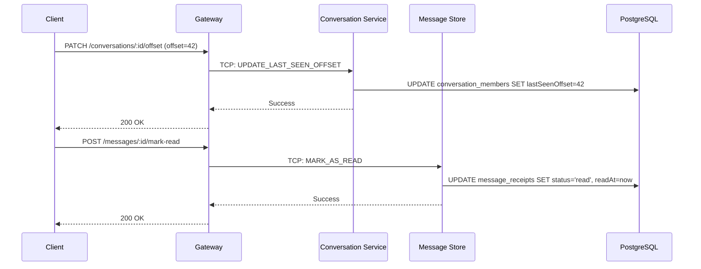
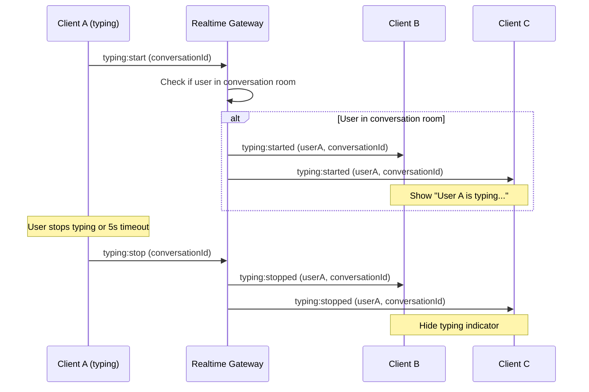
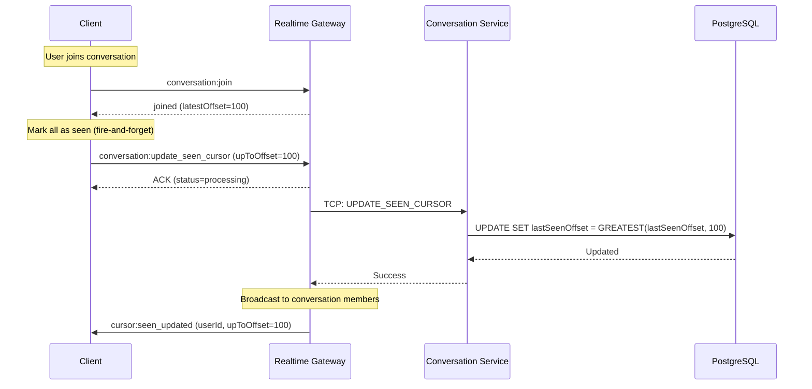
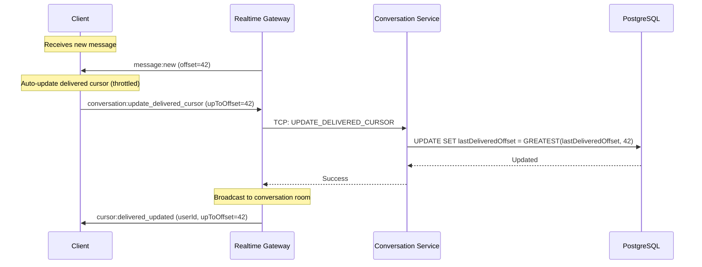

# Data Flow Patterns

## Overview

This document describes end-to-end data flows for key user scenarios in the chat application. Each flow shows how data moves through the system from initial trigger to final state, including all service interactions, database updates, and event notifications.

## Send Message Flow

### Scenario
User sends a message in a conversation via WebSocket connection.

### Complete Flow



### Step-by-Step Explanation

**1. Client Initiates Send (WebSocket)**
- Client emits `message:send` event with conversationId and content
- Realtime Gateway receives and validates format
- Generates unique messageId (UUID)

**2. Realtime Gateway Forwards to Chat Core (TCP)**
- Forwards via TCP: SEND_MESSAGE pattern
- Includes senderId from authenticated socket
- Timeout: 5000ms

**3. Chat Core Validates**

**3a. Check Conversation Exists**
- Calls Conversation Service: GET_CONVERSATION
- Verifies conversation exists
- Verifies sender is a member
- If not member → reject with FORBIDDEN error

**3b. Check Friendship (DIRECT only)**
- For DIRECT conversations, calls Friendship Service: IS_FRIEND
- Checks friendship status between sender and recipient
- If BLOCKED → reject with "User has blocked you"
- If NOT_FRIEND → classify as "message request" (inbox vs primary)
- Rate limits for strangers: 1 message per hour until replied

**3c. Rate Limit Check (Strangers)**
- For non-friends, calls Message Store: HAS_REPLIED
- If recipient never replied → enforce strict limit
- If limit exceeded → reject with "Rate limit exceeded"

**4. Chat Core Publishes EVENT (Kafka)**
- If all validations pass, publishes MESSAGE_ACCEPTED event
- Event payload:
  ```
  {
    messageId: UUID,
    conversationId: UUID,
    senderId: UUID,
    content: string,
    type: 'TEXT' | 'IMAGE' | 'FILE',
    metadata: object,
    timestamp: ISO string
  }
  ```
- Returns success immediately to Realtime Gateway
- Does NOT wait for persistence

**5. Realtime Gateway Confirms to Client**
- Sends `message:saved` event with messageId
- Client shows "sending..." → "sent" checkmark
- This happens ~50-100ms after send

**6. Message Store Consumes Event**
- Message Store consumer picks up MESSAGE_ACCEPTED
- Checks idempotency: if messageId already exists, skip
- Calls Conversation Service: INCREMENT_MAX_OFFSET
- Receives sequential offset (atomic counter)

**7. Message Store Persists**
- Inserts message into messages table with offset
- Creates delivery receipts for all conversation members:
  - Status: delivered
  - Timestamp: now
- Transaction ensures atomicity

**8. Message Store Publishes MESSAGE_SAVED**
- Publishes to Kafka with lightweight payload:
  ```
  {
    messageId: UUID,
    conversationId: UUID,
    latestOffset: number,
    timestamp: ISO string
  }
  ```

**9. Realtime Gateway Broadcasts**

**Batching (80ms window):**
- Collects multiple MESSAGE_SAVED events
- Batches notifications for same conversation
- Reduces broadcast storms

**Tier 1 - Personal Rooms:**
- Gets member list from cache (or Conversation Service)
- Broadcasts to each member's personal room: `user:{userId}`
- Event: `message:notify { conversationId, latestOffset }`
- All conversation members receive notification

**Tier 2 - Conversation Rooms:**
- Broadcasts full message to conversation room: `conversation:{conversationId}`
- Only members currently viewing the conversation receive this
- Event: `message:new { full message object }`

**10. Clients React**
- Client in personal room: Shows badge count increment
- Client in conversation room: Displays message immediately
- Client fetches messages if needed: GET /conversations/:id/messages?after=40

### Error Scenarios

**Sender Not Member:**
- Chat Core rejects at validation step 3a
- Returns FORBIDDEN error
- Client shows "You are not a member of this conversation"

**Recipient Blocked Sender:**
- Chat Core rejects at validation step 3b
- Returns BLOCKED error
- Client shows "Unable to send message"

**Rate Limit Exceeded:**
- Chat Core rejects at validation step 3c
- Returns RATE_LIMIT error
- Client shows "You can send 1 message per hour to non-friends until they reply"

**Kafka Unavailable:**
- Chat Core fails to publish MESSAGE_ACCEPTED
- Returns error to Realtime Gateway
- Client shows "Failed to send, please retry"
- No persistence occurs (consistent)

**Database Write Failure:**
- Message Store fails to persist
- Does NOT publish MESSAGE_SAVED
- Message never delivered to recipients
- Sender's client keeps showing "sending..." (timeout)

## Friend Request Lifecycle

### Scenario
User A sends friend request to User B, User B accepts, system creates DIRECT conversation.

### Complete Flow



### Step-by-Step Explanation

**Phase 1: Send Friend Request**

**1. User A Sends Request**
- HTTP POST /friendships/requests/:userB
- Gateway extracts userA from JWT token
- Forwards to Friendship Service via TCP

**2. Friendship Service Validates**
- Checks if users are already friends → reject 409
- Checks if pending request exists → reject 409
- Checks if User B blocked User A → reject 403
- Checks if User A blocked User B → auto-unblock and continue

**3. Create Pending Request**
- Inserts friend_request record:
  ```
  {
    fromUserId: userA,
    toUserId: userB,
    status: PENDING,
    createdAt: now
  }
  ```
- Returns success to User A

**4. User B Sees Pending Request**
- User B calls GET /friendships/requests
- Sees request from User A
- Can accept or reject

**Phase 2: Accept Friend Request**

**5. User B Accepts**
- HTTP POST /friendships/requests/:userA/accept
- Gateway forwards to Friendship Service

**6. Create Bidirectional Friendship**
- Database transaction:
  - DELETE friend_request (userA → userB)
  - INSERT friendship (userA → userB, status=FRIEND)
  - INSERT friendship (userB → userA, status=FRIEND)
- Commit transaction

**7. Publish Kafka Event**
- Publishes FRIENDSHIP_REQUEST_ACCEPTED:
  ```
  {
    userId: userA,
    targetUserId: userB,
    timestamp: ISO string
  }
  ```

**Phase 3: Auto-Create Conversation**

**8. Conversation Service Consumes Event**
- Receives FRIENDSHIP_REQUEST_ACCEPTED
- Checks if DIRECT conversation already exists between userA and userB
- If exists → skip (idempotent)

**9. Create DIRECT Conversation**
- Inserts conversation:
  ```
  {
    type: DIRECT,
    memberCount: 2,
    maxOffset: 0,
    createdAt: now
  }
  ```
- Inserts conversation_members:
  - (conversationId, userA, lastSeenOffset=0)
  - (conversationId, userB, lastSeenOffset=0)

**10. Publish Conversation Created Event**
- Publishes CONVERSATION_CREATED to Kafka

**Phase 4: Notify Clients**

**11. Realtime Gateway Broadcasts**
- Consumes CONVERSATION_CREATED
- Broadcasts to personal rooms:
  - `user:{userA}` → conversation:created event
  - `user:{userB}` → conversation:created event
- Clients add new conversation to list
- Both users can now start chatting

### Error Scenarios

**User B Doesn't Exist:**
- Friendship Service queries Users Service
- Returns 404 Not Found
- Client shows "User not found"

**User A Already Blocked User B:**
- Automatically unblocks before sending request
- Request proceeds normally
- User A can now send message if accepted

**Conversation Creation Fails:**
- Friendship still created (already committed)
- CONVERSATION_CREATED event never published
- Users are friends but no conversation exists
- Workaround: Users can manually create conversation later

**Duplicate Accept:**
- Idempotency check: friendship already exists
- Returns success (idempotent operation)
- No duplicate conversation created

## Conversation Creation Flow

### Scenario
User creates a new GROUP conversation with 5 members.

### Complete Flow



### Step-by-Step Explanation

**1. Client Initiates Creation**
- HTTP POST /conversations
- Payload:
  ```
  {
    kind: GROUP,
    memberIds: [user1, user2, user3, user4, user5],
    name: "Project Team",
    description: "Team coordination chat"
  }
  ```
- Creator is automatically included as OWNER role

**2. Gateway Forwards to Conversation Service**
- Extracts userId from JWT token
- Adds createdBy field
- Forwards via TCP: CREATE_CONVERSATION

**3. Conversation Service Validates**

**Kind Validation:**
- DIRECT: must have exactly 2 members (including creator); one-on-one only
- GROUP: manual member list; must have at least 2 members
- COMMUNITY: read-only for members; only OWNER/ADMIN/MODERATOR can post

**Member Validation:**
- All memberIds must be valid user IDs
- No duplicate members
- Creator not required in list (auto-added as OWNER)

**4. Create Conversation (Transaction + Outbox)**
- Generates conversationId (UUID)
- Inserts conversation record:
  ```
  {
    id: conversationId,
    kind: GROUP,
    name: "Project Team",
    description: "Team coordination chat",
    metadata: {},
    maxOffset: 0,
    createdBy: userId,
    createdAt: now
  }
  ```
- Saves outbox event (CONVERSATION_CREATED) in same transaction

**5. Create Memberships**
- Inserts conversation_members for each member:
  ```
  {
    conversationId: conversationId,
    userId: memberId,
    role: MEMBER,
    joinedAt: now
  }
  ```
- Creator is assigned OWNER role

**6. Commit Transaction**
- All inserts succeed (conversation + members + outbox) -> commit
- Any failure -> rollback, return error

**7. OutboxProcessor Publishes Kafka Event**
- Polls outbox table every 30 seconds
- Publishes CONVERSATION_CREATED:
  ```
  {
    conversationId: UUID,
    kind: GROUP,
    memberIds: [user1, user2, ...],
    createdBy: userId,
    timestamp: ISO string
  }
  ```

**8. Realtime Gateway Notifies Members**
- Consumes CONVERSATION_CREATED
- Broadcasts to all member personal rooms
- Event: `conversation:created { conversation object }`
- Members see new conversation in their list

### Error Scenarios

**Invalid Member Count:**
- DIRECT with 3 members -> Error: "DIRECT must have exactly 2 members"
- GROUP with 1 member -> Error: "GROUP must have at least 2 members"

**Member Doesn't Exist:**
- Conversation Service queries Users Service
- Invalid user ID found -> Error: "User not found: {userId}"
- Transaction rolled back

**Duplicate Conversation (DIRECT):**
- Check if DIRECT conversation already exists between these 2 users
- If exists -> Error: "Conversation already exists"
- Client navigates to existing conversation

## Online/Offline Presence Flow

### Scenario
User connects/disconnects from WebSocket, system tracks presence and notifies friends.

### Connect Flow



### Disconnect Flow



### Step-by-Step Explanation

**Connect Phase:**

**1. WebSocket Connection**
- Client connects to Realtime Gateway (Socket.IO)
- Connection accepted immediately (no auth yet)
- Client receives connection_id

**2. Authentication**
- Client emits `authenticate` event with JWT token
- Realtime Gateway verifies token with Keycloak JWKS
- Validates signature and expiration

**3. Get Friend List**
- Calls Friendship Service: GET_FRIENDS
- Receives list of friend user IDs
- Used to determine which rooms to join

**4. Join Rooms**
- Personal room: `user:{userId}` (for notifications)
- Friend rooms: `user:{friendId}` for each friend (for presence)
- Allows friends to receive online/offline events

**5. Update Presence (Passive)**
- Calls Presence Service: SET_ONLINE
- Presence Service logs to Redis:
  - `online:{userId}` = true
  - `lastSeen:{userId}` = now
  - `lastActivity:{userId}` = now
- This is for analytics, NOT source of truth

**6. Broadcast Online Status**
- Realtime Gateway broadcasts to all friend rooms
- Event: `user:online { userId, timestamp }`
- Friends see green dot next to user's name

**Disconnect Phase:**

**7. Detect Disconnection**
- Client closes connection (intentional or network loss)
- Realtime Gateway detects disconnect event
- Socket removed from internal map

**8. Schedule Offline (Grace Period)**
- Calls Presence Service: SCHEDULE_OFFLINE
- Presence Service creates TTL key in Redis:
  - `offline_scheduled:{userId}` with 10s TTL
- Does NOT immediately broadcast offline

**9. Grace Period Window**
- For next 10 seconds, waits for reconnection
- Common scenarios:
  - Mobile switching networks (WiFi → 4G)
  - Web browser switching tabs
  - Temporary network hiccup

**10a. Reconnection Within Grace Period**
- Client reconnects within 10s
- Realtime Gateway calls Presence Service: CANCEL_OFFLINE
- Presence Service deletes `offline_scheduled:{userId}`
- NO broadcast occurs (user never went offline)
- Prevents "flapping" (online → offline → online spam)

**10b. Grace Period Expires**
- After 10s, scheduled task executes
- Presence Service updates Redis:
  - `online:{userId}` = false
  - `lastSeen:{userId}` = now
- Realtime Gateway broadcasts to friend rooms
- Event: `user:offline { userId, lastSeen }`
- Friends see grey dot, "Last seen 2 minutes ago"

### Important Architectural Notes

**Realtime Gateway is Source of Truth:**
- Realtime Gateway knows which users have active WebSocket connections
- Presence Service is passive observer for analytics
- O(1) topology: No need to query Redis to determine who's online
- Broadcast decisions made from local socket state

**Why 10s Grace Period?**
- Mobile clients frequently disconnect/reconnect
- Web clients disconnect on tab switch (browser optimization)
- 10s is balance: enough time to reconnect, not too long to feel laggy
- Prevents UI flickering for friends

**Heartbeat Mechanism:**
- Clients send `heartbeat` event every 30s
- Realtime Gateway responds with `pong`
- If no heartbeat for 60s → disconnect socket
- Calls Presence Service: UPDATE_ACTIVITY

## Message Read Receipts Flow

### Scenario
User opens conversation and marks messages as read.

### Complete Flow



### Step-by-Step Explanation

**Update Last Seen Offset:**

**1. Client Opens Conversation**
- Scrolls to bottom of conversation
- Sees latest message (offset 42)
- Sends PATCH /conversations/:id/offset with offset=42

**2. Conversation Service Updates**
- Updates conversation_members table:
  ```
  UPDATE conversation_members
  SET lastSeenOffset = 42, lastSeenAt = NOW()
  WHERE conversationId = :id AND userId = :userId
  ```
- User's lastSeenOffset now equals conversation's maxOffset
- Unread count becomes 0

**3. Unread Count Calculation**
- Client calls GET /conversations/:id/unread
- Conversation Service calculates:
  ```
  unreadCount = conversation.maxOffset - member.lastSeenOffset
  ```
- Returns 0 if user has seen all messages

**Mark Individual Message as Read:**

**4. Client Marks Message Read**
- POST /messages/:messageId/mark-read
- Used for granular read receipts (blue checkmarks)

**5. Message Store Updates Receipt**
- Updates message_receipts table:
  ```
  UPDATE message_receipts
  SET status = 'read', readAt = NOW()
  WHERE messageId = :messageId AND userId = :userId
  ```
- Status progression: delivered → read

**6. Sender Sees Read Receipt**
- Sender's client periodically polls or receives WebSocket event
- Shows blue double-checkmark for message
- "Read by 3 people" indicator

### Delivery vs Read Status

**Delivered:**
- Created automatically when message is persisted
- All conversation members get delivery receipt
- Grey single checkmark for sender

**Read:**
- Updated when recipient explicitly marks as read
- Requires user to scroll to message
- Blue double checkmark for sender

## Typing Indicators Flow

### Scenario
User starts typing, other members see "User is typing..." indicator.

### Complete Flow



### Step-by-Step Explanation

**Start Typing:**

**1. Client Detects Typing**
- Input field `onChange` event
- Debounces for 300ms (avoid spam)
- Emits `typing:start` event to WebSocket

**2. Realtime Gateway Validates**
- Checks if user is member of conversation
- Checks if user has joined conversation room
- Only broadcasts if user actively viewing conversation

**3. Broadcast to Conversation Room**
- Broadcasts to `conversation:{conversationId}` room
- Event: `typing:started { userId, conversationId, username }`
- Only users currently in conversation room receive it
- Excludes the typing user (no need to show self)

**4. Clients Display Indicator**
- "User A is typing..."
- If multiple users: "User A, User B are typing..."
- Max 3 names shown: "User A, User B, and 2 others are typing..."

**Stop Typing:**

**5. Client Detects Stop**
- No input for 5 seconds → auto-stop
- User sends message → stop
- User leaves conversation → stop
- Emits `typing:stop` event

**6. Realtime Gateway Broadcasts Stop**
- Broadcasts to conversation room
- Event: `typing:stopped { userId, conversationId }`

**7. Clients Hide Indicator**
- Removes user from typing list
- If no one typing, hides indicator completely

### Important Notes

**Ephemeral Only:**
- Typing indicators are NOT persisted to database
- No history, no replay on reconnect
- Lightweight, fire-and-forget

**Rate Limiting:**
- Client-side debounce: 300ms
- Server-side throttle: max 1 typing event per second per user
- Prevents spam

**Room-Based:**
- Only users in conversation room receive typing events
- Users in personal room do NOT receive (no point if not viewing)
- Reduces unnecessary broadcasts

**Privacy:**
- Users can disable typing indicators in settings (future feature)
- Blocked users don't see each other's typing

## Cursor-Based Status Tracking

### Overview

Message delivery and read status is tracked using **cursor-based architecture** instead of per-message receipts. Each user has two cursors per conversation:

- **lastSeenOffset**: Messages up to this offset are marked as "seen/read"
- **lastDeliveredOffset**: Messages up to this offset are marked as "delivered"

### When Cursors Are Updated

**lastSeenOffset Updates:**
- User joins/opens a conversation (client emits `conversation:update_seen_cursor`)
- User explicitly marks messages as read
- Client-driven: requires explicit WebSocket event from client

**lastDeliveredOffset Updates:**
- User receives new message events via WebSocket (Realtime Gateway broadcasts `message:new`)
- Client emits `conversation:update_delivered_cursor` (throttled, max 1/second)
- Indicates message was delivered to client, but not necessarily seen/read
- Auto-updated by client on message receipt

### Cursor Update Flow (Seen)



### Cursor Update Flow (Delivered)



### Cursor Properties

**Monotonic Increase:**
```sql
UPDATE conversation_members
SET last_seen_offset = GREATEST(last_seen_offset, $upToOffset)
WHERE conversation_id = $convId AND user_id = $userId
```

- Cursors **only increase**, never decrease
- Idempotent: can safely retry
- Race-condition safe

**Invariant:**
```
lastSeenOffset ≤ lastDeliveredOffset ≤ conversations.maxOffset
```

**Status Computation (On-Demand):**
```typescript
if (message.offset <= user.lastSeenOffset) {
  status = 'seen'
} else if (message.offset <= user.lastDeliveredOffset) {
  status = 'delivered'  
} else {
  status = 'sent'
}
```

**Unread Count:**
```sql
unreadCount = maxOffset - lastSeenOffset
```

### WebSocket Events

**Update Seen Cursor:**
```typescript
// Client → Server
socket.emit('conversation:update_seen_cursor', {
  conversationId: string,
  upToOffset: number  // Usually latestOffset when joining
})

// Server → Client (broadcast)
socket.on('cursor:seen_changed', {
  conversationId: string,
  userId: string,
  lastSeenOffset: number
})
```

**Update Delivered Cursor:**
```typescript
// Client → Server (throttled)
socket.emit('conversation:update_delivered_cursor', {
  conversationId: string,
  upToOffset: number  // Latest message offset received
})

// Server → Client (broadcast)
socket.on('cursor:delivered_changed', {
  conversationId: string,
  userId: string,
  lastDeliveredOffset: number
})
```

**Get Message Status (On-Demand):**
```typescript
// Client → Server (when clicking message)
socket.emit('message:get_status', {
  messageId: string
})

// Server → Client
socket.on('message:status', {
  messageId: string,
  delivered: { count: 5, total: 10, percentage: 50 },
  seen: { count: 3, total: 10, percentage: 30 }
})
```

### Benefits

- **Performance**: O(1) status lookup vs O(n) receipts scan
- **Storage**: O(users) vs O(messages × users)
- **Simplicity**: Single source of truth, no sync issues
- **Scalability**: Constant storage per user (2 integers)
- **Cache-Friendly**: Hash structure in Redis

## Summary

All data flows follow these architectural patterns:

**Synchronous Validation:**
- HTTP/WebSocket → Gateway/Realtime Gateway → Microservices (TCP)
- Fast fail with clear error messages
- Timeouts and retries handled gracefully

**Asynchronous Persistence:**
- Chat Core validates → publishes to Kafka
- Message Store consumes → persists → publishes result
- Realtime Gateway consumes → broadcasts to clients
- Decouples validation from persistence

**Event-Driven Workflows:**
- Friendship accepted → Conversation created (async)
- Conversation upgraded → Members notified (async)
- Message saved → Clients notified (async)

**Eventual Consistency:**
- User online/offline with grace period
- Message delivery with slight delay (80ms batching)
- Acceptable for chat applications

**Error Handling:**
- Synchronous operations fail fast with retries
- Asynchronous operations use idempotency and DLQ
- Clients handle degraded states gracefully
