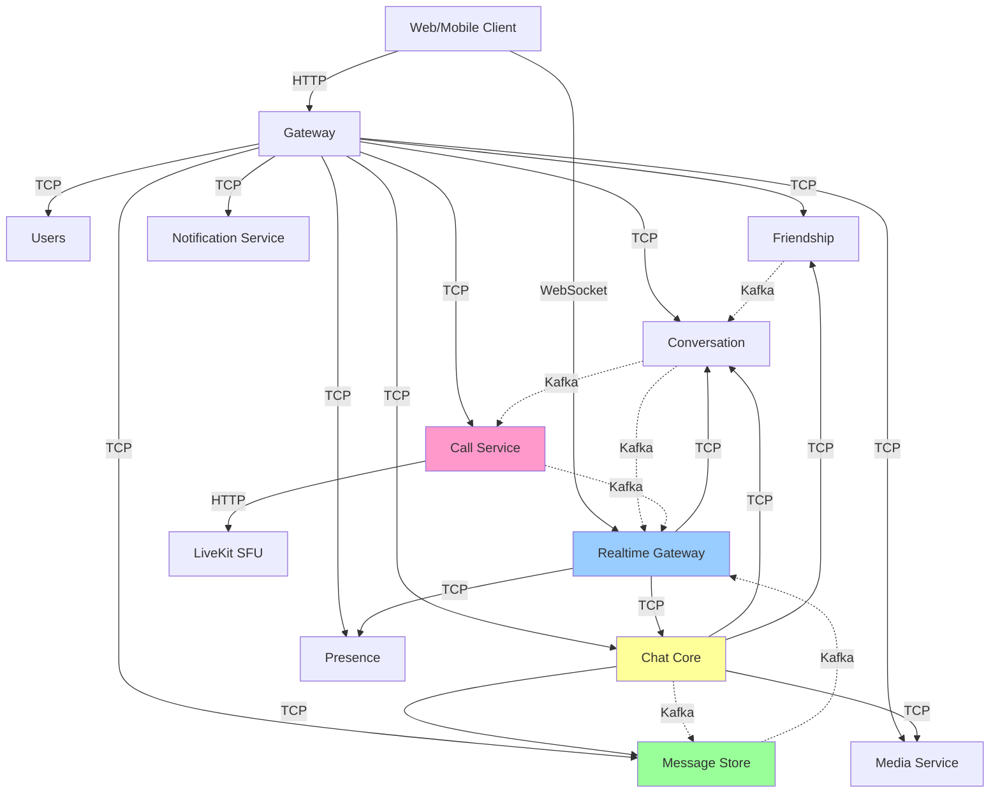

# Service Communication Patterns

## Overview

This document describes the service-to-service communication architecture in the NestJS microservices-based chat system. The system employs a hybrid communication pattern combining **synchronous TCP for request/response** operations and **asynchronous Kafka for event-driven** workflows.

## Architecture Principles

### Communication Modes

**Synchronous Communication (TCP)**
- Used for immediate request/response operations
- Gateway orchestrates HTTP → TCP translation
- Services expose message patterns, not HTTP endpoints
- Strong consistency guarantees
- Timeout-based failure handling

**Asynchronous Communication (Kafka)**
- Used for event notifications and reactive workflows
- Decoupled services via event streams
- At-least-once delivery semantics
- Eventual consistency model
- High throughput and scalability

### Design Philosophy

1. **Gateway as Facade**: All external HTTP traffic enters through Gateway, which translates to internal TCP calls
2. **No Direct Service-to-Service HTTP**: Services communicate via TCP (sync) or Kafka (async)
3. **Event Sourcing Pattern**: State changes publish events for reactive processing
4. **Domain Boundaries**: Services own their data and business logic
5. **Stateless Services**: Connection state managed in Redis, not in-memory

## Service Dependency Graph

### Service Roles

| Service | Type | Communication | Primary Responsibility |
|---------|------|---------------|----------------------|
| **Gateway** | HTTP Gateway | HTTP → TCP/HTTP | External API, JWT verification, routing |
| **Realtime Gateway** | WebSocket Gateway | WS ↔ TCP/Kafka | Real-time bidirectional communication |
| **Users** | Domain Service | TCP | User profile management |
| **Friendship** | Domain Service | TCP + Kafka Producer | Social relationships |
| **Conversation** | Domain Service | TCP + Kafka Consumer/Producer | Conversation lifecycle |
| **Chat Core** | Validation Service | TCP + Kafka Producer | Message validation, media verification |
| **Message Store** | Storage Service | Kafka Consumer + TCP | Message persistence |
| **Presence** | State Service | TCP + Redis | Online/offline status |
| **Media Service** | TCP Microservice | TCP + Kafka Consumer | Multimedia storage, processing, integrity |
| **Notification Service** | Consumer Service | TCP + Kafka Consumer | Push notifications, transactional email |
| **Call Service** | Domain Service | TCP + Kafka Consumer/Producer | Meeting lifecycle, participant management, recording |

### Dependency Flow (Who Calls Whom)



### Service Communication Matrix

| Caller ↓ / Callee → | Users | Friendship | Conversation | Chat Core | Message Store | Presence | Realtime GW | Call Service | Media Service | Notification |
|---------------------|-------|------------|--------------|-----------|---------------|----------|-------------|-------------|---------------|-------------|
| **Gateway** | TCP | TCP | TCP | TCP | TCP | TCP | - | TCP | TCP | TCP |
| **Realtime Gateway** | - | - | TCP (validate) | TCP (send) | - | TCP (status) | - | - | - | - |
| **Chat Core** | TCP (future) | TCP (validate) | TCP (validate) | - | TCP (query) | - | - | - | TCP (validate) | - |
| **Message Store** | - | - | TCP (offset) | - | - | - | Kafka event | - | - | - |
| **Friendship** | - | - | Kafka event | - | - | - | - | - | - | - |
| **Conversation** | - | - | - | - | - | - | Kafka event | Kafka event | - | - |
| **Call Service** | - | - | Kafka (consume) | - | - | - | Kafka event | - | - | - |

**Legend:**
- TCP: Synchronous request/response
- Kafka event: Asynchronous event notification
- `-`: No direct communication

## Synchronous Communication (TCP)

### Message Pattern Registry

#### Gateway → Services

**Gateway → Users**
```
USERS_PATTERNS.CREATE_USER
USERS_PATTERNS.GET_USER
USERS_PATTERNS.GET_USER_BY_KEYCLOAK_ID
USERS_PATTERNS.FIND_OR_CREATE_FROM_KEYCLOAK
USERS_PATTERNS.UPDATE_USER
USERS_PATTERNS.DELETE_USER
USERS_PATTERNS.LIST_USERS
USERS_PATTERNS.SEARCH_USERS
```

**Gateway → Friendship**
```
FRIENDSHIP_PATTERNS.SEND_FRIEND_REQUEST
FRIENDSHIP_PATTERNS.ACCEPT_FRIEND_REQUEST
FRIENDSHIP_PATTERNS.REJECT_FRIEND_REQUEST
FRIENDSHIP_PATTERNS.UNFRIEND
FRIENDSHIP_PATTERNS.BLOCK_USER
FRIENDSHIP_PATTERNS.UNBLOCK_USER
FRIENDSHIP_PATTERNS.GET_FRIENDS
FRIENDSHIP_PATTERNS.GET_PENDING_REQUESTS
FRIENDSHIP_PATTERNS.GET_FRIEND_STATUS
```

**Gateway → Conversation**
```
CONVERSATION_PATTERNS.CREATE_CONVERSATION
CONVERSATION_PATTERNS.GET_CONVERSATION
CONVERSATION_PATTERNS.FIND_BY_ID
CONVERSATION_PATTERNS.IS_MEMBER
CONVERSATION_PATTERNS.LIST_CONVERSATIONS
CONVERSATION_PATTERNS.ADD_MEMBERS
CONVERSATION_PATTERNS.REMOVE_MEMBERS
CONVERSATION_PATTERNS.GET_MEMBER_IDS
CONVERSATION_PATTERNS.UPDATE_LAST_SEEN_OFFSET
CONVERSATION_PATTERNS.GET_UNREAD_COUNT
```

**Gateway → Chat Core**
```
CHAT_CORE_PATTERNS.SEND_MESSAGE
```

**Gateway → Message Store**
```
MESSAGE_STORE_PATTERNS.GET_MESSAGES        # Returns paginated messages; Gateway enriches with sender info
MESSAGE_STORE_PATTERNS.HAS_REPLIED
MESSAGE_STORE_PATTERNS.MARK_AS_READ
```

> **Note**: `UPDATE_LAST_SEEN_OFFSET` and `GET_UNREAD_COUNT` are handled directly by **Gateway → Conversation Service**, not via Message Store. The Message Store no longer proxies these calls.

**Gateway → Presence**
```
PRESENCE_PATTERNS.SET_ONLINE
PRESENCE_PATTERNS.SET_OFFLINE
PRESENCE_PATTERNS.SCHEDULE_OFFLINE
PRESENCE_PATTERNS.CANCEL_OFFLINE
PRESENCE_PATTERNS.UPDATE_ACTIVITY
PRESENCE_PATTERNS.GET_STATUS
PRESENCE_PATTERNS.GET_BULK_STATUS
PRESENCE_PATTERNS.IS_ONLINE
PRESENCE_PATTERNS.GET_ONLINE_COUNT
```

**Gateway → Media Service (TCP)**
```
MEDIA_PATTERNS.CREATE_UPLOAD         # Create upload with pre-signed URL
MEDIA_PATTERNS.FINALIZE_UPLOAD       # Finalize upload with checksum
MEDIA_PATTERNS.GET_MEDIA_URL         # Get download URL(s)
MEDIA_PATTERNS.GET_ACCESS_URL        # Get pre-signed access URL for download
MEDIA_PATTERNS.VALIDATE_MEDIA        # Validate media metadata
MEDIA_PATTERNS.DELETE_MEDIA          # Soft delete media
MEDIA_PATTERNS.LIST_MEDIA            # List media for a conversation
MEDIA_PATTERNS.GET_AVATARS_BATCH     # Batch avatar URL resolution
MEDIA_PATTERNS.DELETE_AVATAR_SYSTEM  # System-level avatar deletion
MEDIA_PATTERNS.CROSS_SHARE           # Cross-conversation share
```

**Note**: Media Service is a TCP microservice (port 3009). Clients upload files via the Gateway, which proxies all media operations over TCP to the Media Service. JWT authentication is handled by the Gateway — Media Service trusts the internal TCP call.

**Gateway → Call Service**
```
CALL_PATTERNS.START_MEETING
CALL_PATTERNS.END_MEETING
CALL_PATTERNS.REQUEST_JOIN_MEETING
CALL_PATTERNS.LEAVE_MEETING
CALL_PATTERNS.GET_MEETING
CALL_PATTERNS.LIST_MEETINGS
CALL_PATTERNS.ISSUE_MEDIA_TOKEN
CALL_PATTERNS.KICK_PARTICIPANT
CALL_PATTERNS.LIST_PARTICIPANTS
CALL_PATTERNS.APPROVE_WAITING_PARTICIPANT
CALL_PATTERNS.REJECT_WAITING_PARTICIPANT
CALL_PATTERNS.LIST_WAITING_PARTICIPANTS
CALL_PATTERNS.UPDATE_MEDIA_STATE
CALL_PATTERNS.START_RECORDING
CALL_PATTERNS.STOP_RECORDING
CALL_PATTERNS.GET_RECORDING
CALL_PATTERNS.LIST_RECORDINGS
CALL_PATTERNS.GET_MEETING_SUMMARY
CALL_PATTERNS.GET_ACTIVE_MEETING_BY_CONVERSATION
CALL_PATTERNS.GET_HEALTH
```

#### Inter-Service TCP Calls

**Realtime Gateway → Chat Core**
```
CHAT_CORE_PATTERNS.SEND_MESSAGE (from WebSocket)
```

**Realtime Gateway → Conversation**
```
CONVERSATION_PATTERNS.IS_MEMBER (membership validation)
CONVERSATION_PATTERNS.GET_MEMBER_IDS (broadcast targeting)
```

**Realtime Gateway → Presence**
```
PRESENCE_PATTERNS.SET_ONLINE (on WebSocket connect)
PRESENCE_PATTERNS.SCHEDULE_OFFLINE (on WebSocket disconnect)
PRESENCE_PATTERNS.CANCEL_OFFLINE (on reconnect)
PRESENCE_PATTERNS.UPDATE_ACTIVITY (periodic heartbeat)
```

**Chat Core → Conversation**
```
CONVERSATION_PATTERNS.FIND_BY_ID (validate conversation)
CONVERSATION_PATTERNS.IS_MEMBER (validate sender membership)
CONVERSATION_PATTERNS.GET_MEMBER_IDS (get recipients)
```

**Chat Core → Friendship**
```
FRIENDSHIP_PATTERNS.GET_FRIEND_STATUS (DIRECT validation fallback only)
// Hot path uses one Redis MGET on 4 keys:
// {chat:rel:{lo}:{hi}}:block:A:B, {chat:rel:{lo}:{hi}}:block:B:A,
// {chat:rel:{lo}:{hi}}:friends, {chat:rel:{lo}:{hi}}:proof
```

**Chat Core → Message Store**
```
MESSAGE_STORE_PATTERNS.HAS_REPLIED (check first interaction for rate limiting)
```

**Chat Core → Media Service (TCP)**
```
MEDIA_PATTERNS.VALIDATE_FOR_SEND     # Validate media attachment for a message (ownerId, status, classification)
MEDIA_PATTERNS.BIND_TO_MESSAGE       # Bind media to message after MESSAGE_ACCEPTED
```

**Implementation**: `ServiceRegistry.resolve<IMediaService>(SERVICE_NAMES.MEDIA)` — `MediaServiceAdapter` wraps `ClientProxy.send()` with 3s timeout (circuit breaker pattern in Chat Core).

**Message Store → Conversation**
```
CONVERSATION_PATTERNS.INCREMENT_MAX_OFFSET (cold path only, seed Redis offset key when absent)
CONVERSATION_PATTERNS.UPDATE_LAST_SEEN_OFFSET (mark messages read)
```

### Request/Response Flow Example

**Example: Send Message via HTTP**

```mermaid
sequenceDiagram
    participant Client
    participant Gateway
    participant ChatCore as Chat Core
    participant Conversation
    participant Friendship
    
    Client->>Gateway: POST /chat/messages
    Gateway->>ChatCore: TCP SEND_MESSAGE
    
    ChatCore->>Conversation: TCP FIND_BY_ID
    Conversation-->>ChatCore: Conversation details
    
    ChatCore->>Conversation: TCP IS_MEMBER
    Conversation-->>ChatCore: true
    
    alt DIRECT conversation
        ChatCore->>ChatCore: Redis MGET 4 keys (block:A:B, block:B:A, friends, proof)
        alt cache miss only
          ChatCore->>Friendship: TCP GET_FRIEND_STATUS
          Friendship-->>ChatCore: Friend status
        end
    end
    
    ChatCore-->>Gateway: Success (messageId)
| Service Call | Timeout | Retry Strategy |
|--------------|---------|----------------|
| Gateway → Client (HTTP) | 10s | Client retry (HTTP 504) |
| Service → Service (TCP) | 5s | No auto-retry |
| Chat Core → Media Service (TCP) | 3s | No retry (fail fast — circuit breaker) |
### Timeout Configuration

| Service Call | Timeout | Retry Strategy |
|--------------|---------|----------------|
| Gateway → Services | 10s | Client retry (HTTP 504) |
| Service → Service | 5s | No auto-retry |
| Database queries | 30s | Connection pool retry |
| Redis operations | 1s | No retry (fail fast) |
| Kafka publish | 5s | Internal retry (3x) |

## Asynchronous Communication (Kafka)

### Event Topics

#### Message Lifecycle Events

**Topic: `chat.event.message_accepted`**
- **Producer**: Chat Core Service
- **Consumers**: Message Store Service
- **Partition Key**: `conversationId`
- **Retention**: 7 days
- **Purpose**: Notify that message passed validation
- **Payload**:
  ```typescript
  {
    messageId: string;
    conversationId: string;
    conversationType: 'DIRECT' | 'GROUP' | 'COMMUNITY';
    senderId: string;
    content: string;
    type: 'text' | 'image' | 'file';
    metadata: object;
    timestamp: string;
    traceId: string;
  }
  ```

**Topic: `chat.event.message_saved`**
- **Producer**: Message Store Service
- **Consumers**: Realtime Gateway
- **Partition Key**: `conversationId`
- **Retention**: 7 days
- **Purpose**: Notify that message is persisted (ready for broadcast)
- **Payload** (lightweight):
  ```typescript
  {
    messageId: string;
    conversationId: string;
    senderId: string;
    latestOffset: number; // For unread count calculation
    timestamp: string;
  }
  ```

#### Friendship Events

**Topic: `friendship.request.accepted`**
- **Producer**: Friendship Service
- **Consumers**: Conversation Service
- **Partition Key**: None (small volume)
- **Retention**: 7 days
- **Purpose**: Trigger automatic DIRECT conversation creation
- **Payload**:
  ```typescript
  {
    eventId: string;
    userA: string;
    userB: string;
    timestamp: string;
  }
  ```

**Topic: `friendship.blocked`**
- **Producer**: Friendship Service
- **Consumers**: Conversation Service
- **Purpose**: Archive/disable DIRECT conversation
- **Payload**:
  ```typescript
  {
    blocker: string;
    blocked: string;
    timestamp: string;
  }
  ```

**Topic: `friendship.removed`**
- **Producer**: Friendship Service
- **Consumers**: Conversation Service (passive listener)
- **Purpose**: Track friendship removal (conversation preserved)
- **Payload**:
  ```typescript
  {
    userA: string;
    userB: string;
    timestamp: string;
  }
  ```

#### Conversation Events

**Topic: `chat.event.conversation_created`**
- **Producer**: Conversation Service
- **Consumers**: Realtime Gateway
- **Purpose**: Notify when a new conversation is created
- **Payload**:
  ```typescript
  {
    conversationId: string;
    type: 'DIRECT' | 'GROUP' | 'COMMUNITY';
    createdBy: string;
    memberIds: string[];
    timestamp: string;
  }
  ```

**Topic: `chat.event.member_added`**
- **Producer**: Conversation Service
- **Consumers**: Realtime Gateway
- **Purpose**: Notify existing members of new member
- **Payload**:
  ```typescript
  {
    conversationId: string;
    addedUserId: string;
    addedBy: string;
    timestamp: string;
  }
  ```

**Topic: `chat.event.member_removed`**
- **Producer**: Conversation Service
- **Consumers**: Realtime Gateway, **Call Service**
- **Purpose**: Notify members of removal; Call Service auto-kicks removed users from active meetings
- **Payload**:
  ```typescript
  {
    conversationId: string;
    removedUserId: string;
    removedBy: string;
    timestamp: string;
  }
  ```

#### Call Events

**Topic: `call.event.started`**
- **Producer**: Call Service
- **Consumers**: Realtime Gateway
- **Partition Key**: `conversationId`
- **Retention**: 7 days
- **Purpose**: Notify conversation members that a meeting has started
- **Payload**:
  ```typescript
  { meetingId: string; conversationId: string; hostId: string; startedAt: string; }
  ```

**Topic: `call.event.ended`**
- **Producer**: Call Service
- **Consumers**: Realtime Gateway
- **Partition Key**: `conversationId`
- **Purpose**: Notify members that the meeting ended
- **Payload**:
  ```typescript
  { meetingId: string; conversationId: string; endedBy: string; durationMs: number; endedAt: string; }
  ```

**Topic: `call.event.participant_joined`**
- **Producer**: Call Service
- **Consumers**: Realtime Gateway
- **Partition Key**: `meetingId`
- **Purpose**: Broadcast participant join to all meeting members
- **Payload**:
  ```typescript
  { meetingId: string; conversationId: string; userId: string; participantRole: string; joinedAt: string; }
  ```

**Topic: `call.event.participant_left`**
- **Producer**: Call Service
- **Consumers**: Realtime Gateway
- **Partition Key**: `meetingId`
- **Purpose**: Broadcast participant departure
- **Payload**:
  ```typescript
  { meetingId: string; conversationId: string; userId: string; leftAt: string; reason?: string; }
  ```

**Topic: `call.event.join_requested`**
- **Producer**: Call Service
- **Consumers**: Realtime Gateway
- **Partition Key**: `meetingId`
- **Purpose**: Notify HOST of a new waiting room request
- **Payload**:
  ```typescript
  { meetingId: string; conversationId: string; userId: string; requestedAt: string; }
  ```

**Topic: `call.event.waiting_approved`**
- **Producer**: Call Service
- **Consumers**: Realtime Gateway
- **Partition Key**: `meetingId`
- **Purpose**: Notify approved participant they can connect to LiveKit
- **Payload**:
  ```typescript
  { meetingId: string; conversationId: string; userId: string; approvedBy: string; approvedAt: string; }
  ```

**Topic: `call.event.waiting_rejected`**
- **Producer**: Call Service
- **Consumers**: Realtime Gateway
- **Partition Key**: `meetingId`
- **Purpose**: Notify rejected participant
- **Payload**:
  ```typescript
  { meetingId: string; conversationId: string; userId: string; rejectedBy: string; rejectedAt: string; }
  ```

**Topic: `call.event.media_state_updated`**
- **Producer**: Call Service
- **Consumers**: Realtime Gateway
- **Partition Key**: `meetingId`
- **Purpose**: Broadcast mic/camera/screen state changes to all participants
- **Payload**:
  ```typescript
  { meetingId: string; userId: string; mediaState: { micOn: boolean; cameraOn: boolean; screenSharing: boolean }; updatedAt: string; }
  ```

**Topic: `call.event.recording_started`**
- **Producer**: Call Service
- **Consumers**: Realtime Gateway
- **Partition Key**: `meetingId`
- **Purpose**: Notify participants recording has begun
- **Payload**:
  ```typescript
  { meetingId: string; conversationId: string; recordingId: string; startedBy: string; startedAt: string; }
  ```

**Topic: `call.event.recording_stopped`**
- **Producer**: Call Service
- **Consumers**: Realtime Gateway
- **Partition Key**: `meetingId`
- **Purpose**: Notify participants recording has stopped; includes file reference
- **Payload**:
  ```typescript
  { meetingId: string; conversationId: string; recordingId: string; stoppedBy: string; stoppedAt: string; fileKey?: string; }
  ```

### Consumer Groups

| Consumer Group | Service | Topics |
|---------------|---------|--------|
| `nest-chat.message-store` | Message Store | `chat.event.message_accepted` |
| `nest-chat.realtime-gateway` | Realtime Gateway | `chat.event.message_saved`, `chat.event.message_updated`, `chat.event.message_edited`, `chat.event.member_added`, `chat.event.member_removed`, `call.event.*` |
| `nest-chat.conversation-service` | Conversation Service | `friendship.request.accepted`, `friendship.blocked`, `friendship.removed`, `chat.event.member_added`, `chat.event.member_removed` |
| `nest-chat.call-service` | Call Service | `chat.event.member_removed` |
| `nest-chat.media-worker` | Media Worker | `media.event.uploaded` |
| `nest-chat.media` | Media Service | `media.event.scan_complete`, `media.event.transcode_complete` |

### Event Processing Guarantees

- **At-Least-Once Delivery**: Messages may be processed multiple times on failure
- **Idempotency Required**: Consumers must handle duplicate events
- **Ordering**: Guaranteed per partition (same `conversationId` = same partition)
- **Retry Strategy**: Automatic retry with exponential backoff
- **Dead Letter Queue**: Failed messages after 3 retries → DLQ topics

## Communication Rules

### WHO CAN CALL WHOM

#### Gateway Service
 **CAN** call all services via TCP (orchestration layer)  
 **CANNOT** be called by other services (entry point only)

#### Realtime Gateway
 **CAN** call Chat Core, Conversation, Presence via TCP  
 **CAN** consume Kafka events from Message Store, Conversation  
 **CANNOT** call Users, Friendship directly (use Gateway)  
 **CANNOT** publish Kafka events (pure consumer + WebSocket broadcaster)

#### Chat Core Service
 **CAN** call Conversation, Friendship, Message Store via TCP  
 **CAN** publish MESSAGE_ACCEPTED to Kafka  
 **CANNOT** persist data directly (publish events instead)  
 **CANNOT** be called by other services except Gateway/Realtime Gateway

#### Message Store Service
 **CAN** consume MESSAGE_ACCEPTED from Kafka  
 **CAN** publish MESSAGE_SAVED to Kafka  
 **CAN** call Conversation for offset management  
 **CANNOT** validate business rules (trust Chat Core decisions)  
 **CANNOT** be called via TCP for writes (Kafka events only)

#### Conversation Service
 **CAN** consume Friendship events from Kafka  
 **CAN** publish Conversation events to Kafka  
 **CAN** be called by Gateway, Chat Core, Message Store, Realtime Gateway  
 **CANNOT** call Friendship or Users services (read-only validation via cache)

#### Friendship Service
 **CAN** publish Friendship events to Kafka  
 **CAN** be called by Gateway and Chat Core via TCP  
 **CANNOT** call Conversation or Users services  
 **CANNOT** consume Kafka events (pure producer)

#### Presence Service
 **CAN** be called by Gateway and Realtime Gateway via TCP  
 **CANNOT** call other services (isolated state manager)  
 **CANNOT** publish/consume Kafka events (synchronous only)  
 **CANNOT** be called by Chat Core or Message Store (not in message flow)

#### Users Service
 **CAN** be called by Gateway via TCP  
 **CANNOT** call other services (leaf node)  
 **CANNOT** publish/consume Kafka events  
 **CANNOT** be called by Chat Core yet (future implementation)

#### Call Service
 **CAN** be called by Gateway via TCP  
 **CAN** consume `chat.event.member_removed` from Kafka (auto-kick removed users)  
 **CAN** publish `call.event.*` topics to Kafka  
 **CAN** call LiveKit SFU via HTTP (token issuance, egress API for recording)  
 **CANNOT** be called by other services except Gateway  
 **CANNOT** call ChatCore, MessageStore, or Conversation Service directly  
 **CANNOT** handle chat messaging (call lifecycle only)

### Communication Anti-Patterns (FORBIDDEN)

 **Services calling Gateway**: Gateway is entry point, not callable  
 **Direct HTTP between services**: Use TCP or Kafka only  
 **Circular dependencies**: No bidirectional TCP calls  
 **Synchronous event processing**: Kafka is async-only  
 **Gateway calling Gateway**: Realtime Gateway is independent  
 **Business logic in Gateway**: Gateway is router, not processor

## Error Handling Patterns

### TCP Error Handling

**Client-Side (Caller)**
```typescript
try {
  const result = await firstValueFrom(
    this.client.send(PATTERN, payload).pipe(
      timeout(5000), // 5-second timeout
    )
  );
} catch (error) {
  if (error.name === 'TimeoutError') {
    throw new ServiceUnavailableException('Service timeout');
  }
  throw new InternalServerErrorException('Service error');
}
```

**Server-Side (Callee)**
```typescript
@MessagePattern(PATTERN)
async handler(@Payload() data: DTO) {
  try {
    return await this.service.process(data);
  } catch (error) {
    throw new RpcException({
      statusCode: HttpStatus.BAD_REQUEST,
      message: error.message,
    });
  }
}
```

### Kafka Error Handling

**Producer Error Handling**
```typescript
try {
  await this.kafkaProducer.publish(
    { topic: TOPIC, key: partitionKey },
    payload
  );
} catch (error) {
  this.logger.error('Failed to publish event', error);
  // Log but don't throw - fire-and-forget pattern
}
```

**Consumer Error Handling**
```typescript
async handleMessage(message) {
  try {
    await this.processEvent(message.value);
  } catch (error) {
    this.logger.error('Event processing failed', error);
    throw error; // Trigger retry
  }
}
```

**Retry Strategy (Consumer)**
- Retry 1: Immediate
- Retry 2: 1 second delay
- Retry 3: 5 seconds delay
- After 3 failures: Send to Dead Letter Queue

### Service Unavailability Handling

| Scenario | Gateway Behavior | Client Impact |
|----------|-----------------|---------------|
| Service timeout (10s) | Return 504 Gateway Timeout | Display error, allow retry |
| Service error | Return 500 Internal Server Error | Display generic error |
| Validation failure | Return 400 Bad Request | Display validation message |
| Auth failure | Return 401/403 | Redirect to login |
| Database down | Service returns error | 503 Service Unavailable |
| Kafka down | Log error, continue | Write operations may fail silently |

### Circuit Breaker Pattern (Future)

**Not currently implemented, but recommended:**
- Monitor service failure rates
- Open circuit after 50% failure threshold (5 requests)
- Half-open after 30-second cooldown
- Close circuit after 3 consecutive successes

## Timeout and Retry Strategies

### Service-Level Timeout Matrix

| Operation Type | Timeout | Rationale |
|---------------|---------|-----------|
| HTTP Gateway → TCP | 10s | Allow time for multi-service calls |
| TCP Service → Service | 5s | Fast fail for dependent services |
| Database query | 30s | Complex queries need time |
| Redis operation | 1s | Cache should be fast |
| Kafka publish | 5s | Network latency tolerance |
| WebSocket ping | 30s | Allow for network fluctuations |

### Retry Strategies by Operation

**Idempotent Read Operations** (Safe to retry)
- GET user, conversation, messages
- Check membership, friendship status
- Retry: Up to 3 times with 1s, 2s, 4s backoff

**Non-Idempotent Write Operations** (Retry carefully)
- Create user, friendship request, conversation
- No automatic retry at service level
- Client-side retry with user confirmation

**Kafka Event Consumption** (Guaranteed retry)
- Automatic retry by consumer group
- 3 attempts with exponential backoff
- Move to DLQ after failures

**WebSocket Operations** (No retry)
- Send typing indicator: Best-effort, no retry
- Broadcast message notification: Kafka handles reliability

### Backoff Algorithms

**Exponential Backoff** (Kafka, Database)
```
Delay = baseDelay * (2 ^ attemptNumber)
Example: 1s, 2s, 4s, 8s, 16s (max 30s)
```

**Linear Backoff** (TCP calls)
```
Delay = attemptNumber * 1000ms
Example: 1s, 2s, 3s
```

**No Backoff** (Real-time operations)
```
Fail fast for typing indicators, presence updates
```

## Performance Optimization

### Caching Strategy

**Redis Caching Layers**

| Cache Key Pattern | TTL | Purpose | Invalidation |
|------------------|-----|---------|--------------|
| `chat:conversation:{id}:members` | 7 days | Reduce IS_MEMBER calls | Write-through + Kafka consumer |
| `{chat:rel:{lo}:{hi}}:friends` | 30 days | Friend status LWW | FriendshipFriendsConsumer tombstone |
| `{chat:rel:{lo}:{hi}}:block:{A}:{B}` | 24h | Block status | FriendshipBlockConsumer DEL |
| `{chat:rel:{lo}:{hi}}:proof` | 30s | Race-condition bridge | TTL expiry |
| `chat:conv:{id}:max_offset` | permanent | Redis INCR offset counter | OffsetSyncJob write-behind |
| `user:{id}:profile` | 5 min | Reduce user lookups | On profile update |
| `presence:user:{id}` | 1 hour | Track online status | On status change |

**Cache Patterns**
- **Multi-layer (L1+L0+TCP)**: `MembershipValidatorService`, `UserValidatorService`, `MessageSendOrchestrator` — in-process Map → Redis → TCP singleflight
- **LWW Register**: `FriendshipFriendsConsumer` — broker timestamp CAS via Lua script
- **Write-Through**: `ConversationService` — pipeline-write to Redis immediately after DB commit
- **Write-Behind**: `OffsetSyncJob` — Redis INCR → batch UPDATE PostgreSQL every 5s
- **Singleflight**: `MessageSendOrchestrator`, `MembershipValidatorService` — N concurrent misses → 1 TCP call

### Connection Pooling

**`PooledTcpClientProxy` (Gateway)**
- Gateway uses `PooledTcpClientProxy` (round-robin) for `SERVICES.CHAT_CORE`, `SERVICES.CONVERSATION`, `SERVICES.FRIENDSHIP`.
- Constructor: `new PooledTcpClientProxy(host, port, poolSize)` where `poolSize` controls number of TCP connections.
- `send()` / `emit()` delegate to the next proxy in round-robin order.

**Database Connection Pools**
- PostgreSQL: 20 connections per service
- MongoDB: 10 connections per service

**Redis Connection Pools**
- Single IORedis instance per service (multiplexed)
- Cluster mode: 1 connection per node

### Deadline Propagation (`ProxyHelper`)

All TCP calls via `ProxyHelper.send()` carry a `_deadline` timestamp. Effective timeout = `Math.min(configured_timeout, remaining_deadline_budget)`. This prevents retries from running past the overall request deadline.

### Batching Strategies

**Message Notification Batching**
- Buffer period: 80ms
- Reduces WebSocket spam during rapid chat
- Client fetches all messages in one HTTP request

**Bulk Presence Queries**
- `GET_BULK_STATUS` for friend lists
- Redis pipeline reduces round trips
- Fetch 100 users in single call

**Database Batch Writes**
- Message Store: Batch insert read receipts
- Conversation: Batch update last-seen offsets

## Monitoring and Observability

### Distributed Tracing

**Trace ID Propagation**
- HTTP headers: `x-trace-id`, `x-request-id`, `x-correlation-id`
- Kafka message headers: Same trace ID
- TCP message metadata: Trace ID in payload

**Trace Scope**
```
Client Request → Gateway → Chat Core → Conversation/Friendship
                                    ↓ Kafka
                        Message Store → Realtime Gateway → Client
```

### Key Metrics to Monitor

**Service Health**
- TCP request rate and latency (p50, p95, p99)
- Kafka lag per consumer group
- Error rate by service and operation
- Circuit breaker open/close events

**Resource Utilization**
- CPU and memory per service
- Database connection pool usage
- Redis connection count and memory
- Kafka producer/consumer throughput

**Business Metrics**
- Messages validated per second (Chat Core)
- Messages persisted per second (Message Store)
- WebSocket connections (Realtime Gateway)
- Online users (Presence Service)

### Logging Standards

**Structured Logging Format** (nestjs-pino)
```json
{
  "level": "info",
  "time": "2025-01-03T10:00:00.000Z",
  "pid": 12345,
  "hostname": "chat-core-pod-1",
  "service": "chat-core",
  "traceId": "abc-123",
  "msg": "Message validation passed",
  "context": {
    "messageId": "msg-456",
    "conversationId": "conv-789"
  }
}
```

**Log Levels**
- `debug`: Detailed internal state (development only)
- `info`: Normal operations (service calls, events)
- `warn`: Recoverable errors (retry, fallback)
- `error`: Unrecoverable errors (exceptions, crashes)

## Security Considerations

### Service-to-Service Authentication

**Current State**: Trust network (internal Docker network)  
**Future**: Mutual TLS or service tokens

### Input Validation

- Gateway validates HTTP input (DTOs with class-validator)
- Services validate TCP message payloads
- No trust of downstream service data

### Rate Limiting

**Gateway Level**
- 100 requests/minute per user (general API)
- 10 requests/second per conversation (messaging)

**Service Level**
- Chat Core: Rate limits for non-friend DIRECT messages
- Message Store: No rate limiting (trusts Chat Core)

### Data Privacy

- JWT tokens contain minimal user info (userId, roles)
- Services fetch full user data on-demand
- No sensitive data in Kafka event payloads
- Keycloak is single source of truth for auth

## Scaling Considerations

### Horizontal Scaling

**Stateless Services** (Scale freely)
- Gateway, Chat Core, Message Store, Conversation, Friendship, Users
- Scale based on CPU/memory metrics

**Stateful Services** (Scale carefully)
- Realtime Gateway: Use Redis adapter for multi-instance WebSocket
- Presence: Redis shared state enables multi-instance

### Partitioning Strategy

**Kafka Partitions**
- 12 partitions per topic (standard)
- Partition key = `conversationId` (ensures ordering)
- Scale consumers up to partition count

**Database Sharding** (Future)
- Shard messages by `conversationId`
- Shard users by `userId`
- Co-locate related data

### Load Balancing

**L4 Load Balancing** (TCP)
- Round-robin for stateless services
- Least connections for database services

**L7 Load Balancing** (HTTP/WebSocket)
- Sticky sessions for WebSocket (IP-based)
- Round-robin for HTTP REST API

## References

- [Data Flow Patterns](DATA_FLOW_PATTERNS.md)
- [Service Documentation](../services/)
- [Keycloak Authentication Guide](../KEYCLOAK_COMPLETE_GUIDE.md)
- [Architecture Overview](../ARCHITECTURE.md)
