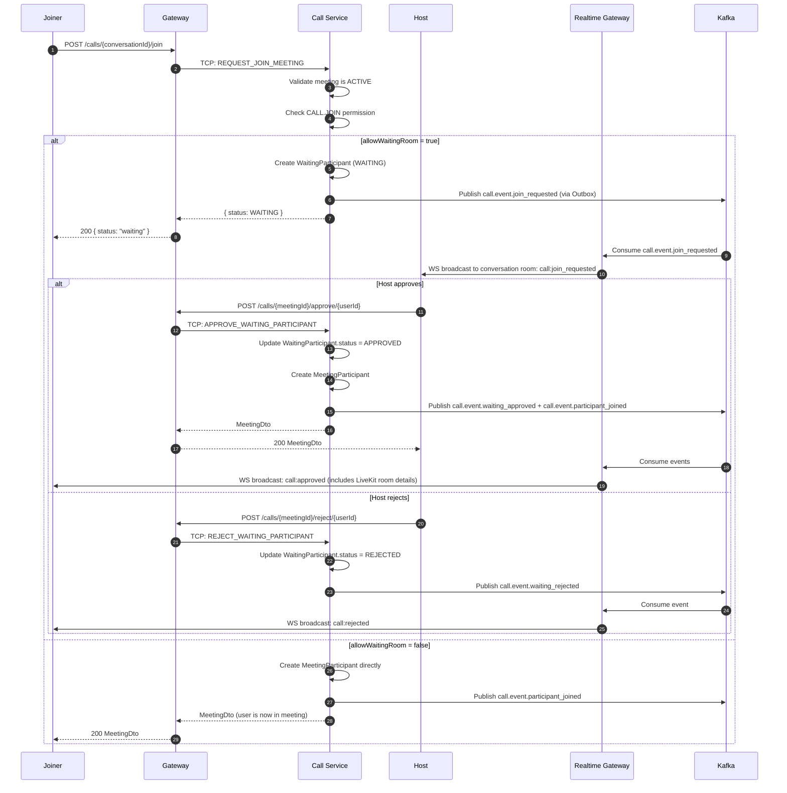
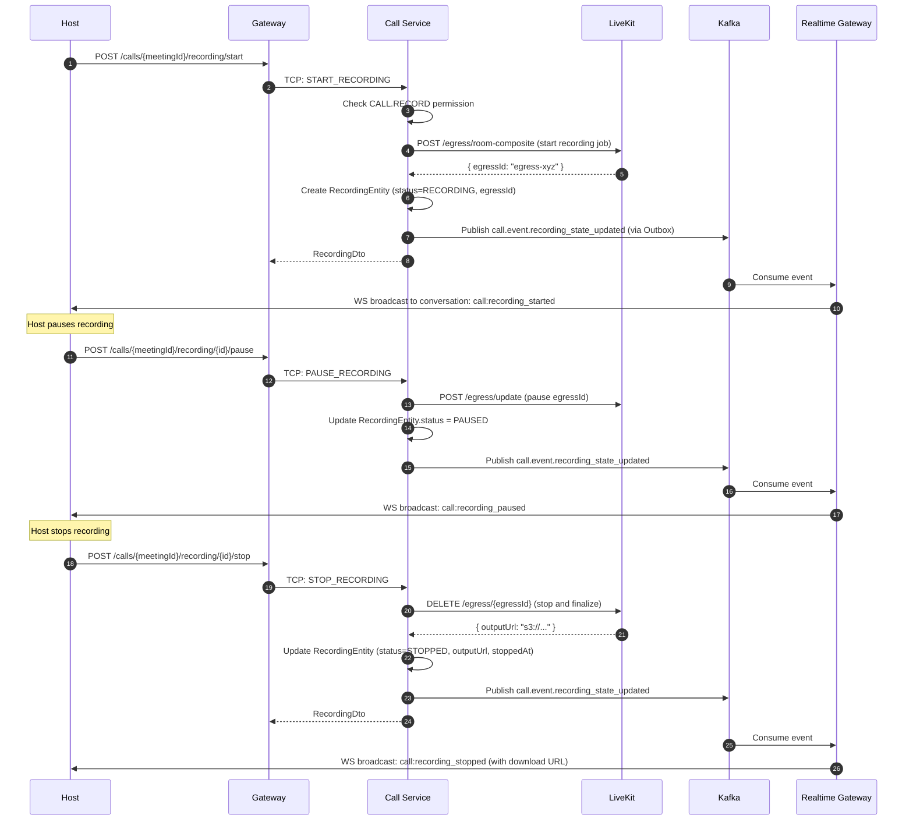
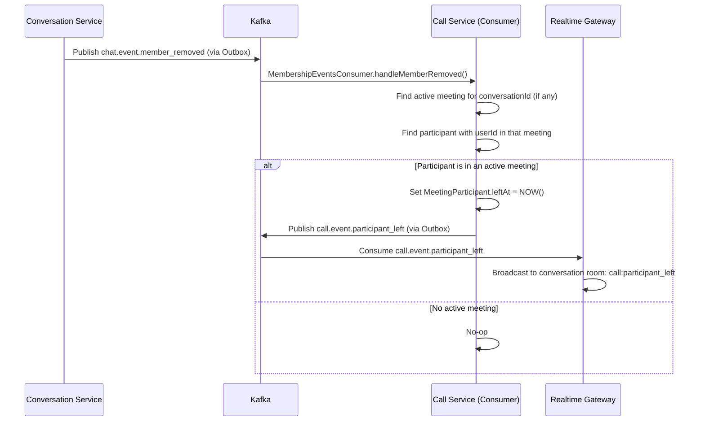

# Call Service

**Port**: 3011 (TCP Microservice)
**Technology**: NestJS + TCP Transport
**Database**: PostgreSQL (`chat_db` — meeting, participant, recording tables)
**Cache**: Redis (membership validation, meeting context cache)
**Message Queue**: Kafka (producer via Outbox, consumer for membership events)
**External**: LiveKit SFU (ports 7880-7882), coturn TURN relay (port 3478)

---

## Purpose

The Call Service manages the full lifecycle of in-conversation video/audio meetings. It handles meeting creation, participant join/leave, waiting room logic, host moderation, recording, and post-call summary generation. Media transport is delegated to LiveKit; the Call Service is responsible only for orchestration, access control, and state management.

---

## Responsibilities

### What This Service IS Responsible For

- Starting and ending meetings tied to a conversation
- Issuing LiveKit access tokens to authorized participants
- Managing a waiting room when `allowWaitingRoom = true`
- Host/co-host moderation (mute, unmute, kick participant)
- Starting, pausing, resuming, and stopping recordings via LiveKit egress
- Tracking participant media state (mic, camera, screen-sharing)
- Auto-kicking participants when they are removed from the conversation (reacts to `chat.event.member_removed`)
- Generating meeting summaries after the call ends
- Publishing call lifecycle events to Kafka via the Transactional Outbox pattern
- Caching active meeting context in Redis for fast lookup by Realtime Gateway

### What This Service IS NOT Responsible For

- WebRTC media transport (handled by LiveKit SFU)
- TURN relay (handled by coturn)
- Broadcasting call events to WebSocket clients (handled by Realtime Gateway consuming `call.event.*` Kafka topics)
- Validating conversation membership beyond the scope of the call (handled by Conversation Service)
- Chat message operations within a meeting (handled by Chat Core / Message Store)

---

## Architecture

### Internal Services

| Service | Responsibility |
|---------|---------------|
| `MeetingOrchestrationService` | Core meeting workflow: start, join, leave, end |
| `MediaTokenService` | LiveKit access token generation with role-based grants |
| `RecordingOrchestrationService` | LiveKit egress management: start/pause/resume/stop |
| `CallAccessService` | Permission checks (CALL.* permissions per MemberRole) |
| `CallLockService` | Redis-based distributed locks to prevent concurrent join races |
| `CallCleanupService` | Scheduled cleanup of orphaned meetings/participants on restart |
| `CallEventsService` | Kafka event publishing (wraps OutboxProcessor) |
| `CallHealthService` | Health checks for LiveKit connectivity and DB state |
| `CallMapperService` | Entity → DTO mapping |
| `CallPolicyService` | Determines required CALL.* permissions per operation |
| `LiveKitService` | LiveKit server SDK wrapper (token generation, egress API) |
| `MeetingSummaryService` | Generates `MeetingSummaryEntity` on meeting end |

### Infrastructure

| Component | File | Purpose |
|-----------|------|---------|
| `OutboxProcessor` | `outbox-processor.service.ts` | Polls `outbox` table, publishes pending `call.event.*` events to Kafka |
| `MeetingRepository` | `meeting.repository.ts` | TypeORM queries for `meetings` + eager-loaded participants |
| `MeetingSummaryRepository` | `meeting-summary.repository.ts` | TypeORM queries for `meeting_summaries` |
| `RecordingRepository` | `recording.repository.ts` | TypeORM queries for `meeting_recordings` |

### Kafka Consumer

| Consumer | File | Topic | Action |
|----------|------|-------|--------|
| `MembershipEventsConsumer` | `consumers/membership-events.consumer.ts` | `chat.event.member_removed` | Calls `handleMembershipRevoked(conversationId, userId)` to auto-kick the removed user from any active meeting |

---

## Data Model (PostgreSQL `chat_db`)

### `MeetingEntity` — `meetings`

| Column | Type | Notes |
|--------|------|-------|
| `id` | UUID | Primary key |
| `conversationId` | UUID | FK to conversations table (logical) |
| `hostId` | varchar(255) | UserId of the meeting creator / current host |
| `status` | varchar(20) | `ACTIVE` or `ENDED` (default `ACTIVE`) |
| `allowWaitingRoom` | boolean | Whether new joiners enter waiting room first (default `true`) |
| `startedAt` | timestamptz | Auto-set on creation |
| `endedAt` | timestamptz | Nullable, set when host ends meeting |
| `createdAt` | timestamptz | Auto-set |
| `participants` | OneToMany | Eager-loaded `MeetingParticipantEntity[]` |
| `waitingParticipants` | OneToMany | Eager-loaded `WaitingParticipantEntity[]` |

### `MeetingParticipantEntity` — `meeting_participants`

| Column | Type | Notes |
|--------|------|-------|
| `id` | UUID | Primary key |
| `meetingId` | UUID | FK to `meetings.id`, CASCADE DELETE |
| `userId` | varchar(255) | Participant user ID |
| `role` | varchar(20) | `HOST`, `CO_HOST`, or `PARTICIPANT` (default `PARTICIPANT`) |
| `joinedAt` | timestamptz | Auto-set on join |
| `leftAt` | timestamptz | Nullable; set when participant leaves or is kicked |
| `mediaState` | jsonb | `{ micOn: boolean, cameraOn: boolean, screenSharing: boolean }` — default mic on, camera off, no screen |
| `meeting` | ManyToOne | Reference to `MeetingEntity` |

### `WaitingParticipantEntity` — `meeting_waiting_participants`

| Column | Type | Notes |
|--------|------|-------|
| `id` | UUID | Primary key |
| `meetingId` | UUID | FK to `meetings.id`, CASCADE DELETE |
| `userId` | varchar(255) | User requesting to join |
| `requestedAt` | timestamptz | Auto-set on request |
| `status` | varchar(20) | `WAITING`, `APPROVED`, or `REJECTED` (default `WAITING`) |
| `decidedBy` | varchar(255) | Nullable; userId of host/co-host who acted |
| `decidedAt` | timestamptz | Nullable; timestamp of decision |
| `rejectionReason` | text | Nullable; optional rejection message |
| `meeting` | ManyToOne | Reference to `MeetingEntity` |

### `RecordingEntity` — `meeting_recordings`

| Column | Type | Notes |
|--------|------|-------|
| `id` | UUID | Primary key |
| `meetingId` | UUID | FK (logical) to `meetings.id` |
| `conversationId` | UUID | Denormalized for fast query without joining meetings |
| `status` | varchar(20) | `RECORDING`, `PAUSED`, `STOPPED`, or `FAILED` |
| `startedBy` | varchar(255) | UserId who initiated recording |
| `egressId` | varchar(255) | Nullable; LiveKit egress job ID for pause/resume/stop |
| `outputUrl` | text | Nullable; S3/MinIO download URL after recording stops |
| `errorMessage` | text | Nullable; set on `FAILED` status |
| `startedAt` | timestamptz | Auto-set on start |
| `stoppedAt` | timestamptz | Nullable; set when recording stops |
| `updatedAt` | timestamptz | Auto-updated |

### `MeetingSummaryEntity` — `meeting_summaries`

| Column | Type | Notes |
|--------|------|-------|
| `id` | UUID | Primary key |
| `meetingId` | UUID | Unique — one summary per meeting |
| `conversationId` | UUID | Fast query by conversation |
| `startedAt` | timestamptz | Meeting start time (copied from meeting) |
| `endedAt` | timestamptz | Meeting end time |
| `durationMs` | int | `endedAt - startedAt` in milliseconds |
| `endedBy` | varchar(255) | UserId who ended the meeting |
| `endReason` | varchar(100) | Reason string (e.g., `host_ended`, `auto_cleanup`) |
| `participantCount` | int | Total unique participants (default 0) |
| `recordingCount` | int | Total recordings created (default 0) |
| `generatedAt` | timestamptz | Auto-set |
| `updatedAt` | timestamptz | Auto-updated |

---

## TCP Message Patterns

All patterns are defined in `libs/common/src/constants/patterns/call.patterns.ts`.

Gateway forwards all call operations to this service via TCP using NestJS `ClientProxy`.

### Meeting Management

**`CALL_PATTERNS.START_MEETING`**
- Payload: `{ conversationId, hostId, allowWaitingRoom? }`
- Response: `MeetingDto`
- Requires: `CALL.START` permission
- Creates a new `MeetingEntity` (status `ACTIVE`), adds host as first participant with role `HOST`, publishes `call.event.started` via Outbox

**`CALL_PATTERNS.GET_ACTIVE_MEETING`**
- Payload: `{ conversationId }`
- Response: `MeetingDto | null`
- Returns the currently active meeting for a conversation, including all participants and waiting participants

**`CALL_PATTERNS.GET_MY_ACTIVE_MEETING`**
- Payload: `{ userId }`
- Response: `MeetingDto | null`
- Returns the active meeting that the user is currently participating in (across all conversations)

**`CALL_PATTERNS.REQUEST_JOIN_MEETING`**
- Payload: `{ conversationId, userId }`
- Response: `MeetingDto`
- Requires: `CALL.JOIN` permission
- If `allowWaitingRoom = true`: creates a `WaitingParticipantEntity` (status `WAITING`), publishes `call.event.join_requested`
- If `allowWaitingRoom = false`: adds participant directly, publishes `call.event.participant_joined`

**`CALL_PATTERNS.APPROVE_WAITING_PARTICIPANT`**
- Payload: `{ meetingId, userId, approvedBy }`
- Response: `MeetingDto`
- Requires: `CALL.APPROVE_JOIN` permission (HOST or CO_HOST role)
- Updates `WaitingParticipantEntity.status = APPROVED`, creates `MeetingParticipantEntity`, publishes `call.event.waiting_approved` and `call.event.participant_joined`

**`CALL_PATTERNS.REJECT_WAITING_PARTICIPANT`**
- Payload: `{ meetingId, userId, rejectedBy, reason? }`
- Response: `MeetingDto`
- Requires: `CALL.APPROVE_JOIN` permission (HOST or CO_HOST role)
- Updates `WaitingParticipantEntity.status = REJECTED`, publishes `call.event.waiting_rejected`

**`CALL_PATTERNS.LEAVE_MEETING`**
- Payload: `{ meetingId, userId }`
- Response: `MeetingDto`
- Sets `MeetingParticipantEntity.leftAt = NOW()`
- If the leaving participant is the HOST and other participants remain, auto-promotes the longest-present participant to HOST
- Publishes `call.event.participant_left`

**`CALL_PATTERNS.END_MEETING`**
- Payload: `{ meetingId, userId, reason? }`
- Response: `MeetingDto`
- Requires: HOST role in meeting
- Sets `MeetingEntity.status = ENDED`, sets `endedAt = NOW()`
- Generates `MeetingSummaryEntity`
- Stops any active recordings
- Publishes `call.event.ended`

### Media

**`CALL_PATTERNS.ISSUE_MEDIA_TOKEN`**
- Payload: `{ meetingId, userId }`
- Response: `{ token: string, livekitUrl: string }`
- Validates active meeting membership, calls `LiveKitService.createToken(userId, meetingId, role)`, returns signed JWT for LiveKit connection

**`CALL_PATTERNS.UPDATE_MEDIA_STATE`**
- Payload: `{ meetingId, userId, mediaState: { micOn, cameraOn, screenSharing } }`
- Response: `MeetingDto`
- Updates `MeetingParticipantEntity.mediaState` jsonb field
- Publishes `call.event.media_state_updated`

### Moderation

**`CALL_PATTERNS.MODERATE_PARTICIPANT`**
- Payload: `{ meetingId, moderatorId, targetUserId, action: 'MUTE_MIC' | 'MUTE_CAMERA' | 'KICK' }`
- Response: `ModerationResultDto`
- Requires: `CALL.MODERATE` permission (HOST or CO_HOST)
- `MUTE_MIC` / `MUTE_CAMERA`: updates `mediaState` in DB and publishes `call.event.media_state_updated`
- `KICK`: sets `leftAt = NOW()`, publishes `call.event.participant_moderated`

### Recording

**`CALL_PATTERNS.START_RECORDING`**
- Payload: `{ meetingId, userId }`
- Response: `RecordingDto`
- Requires: `CALL.RECORD` permission
- Calls LiveKit egress API to start room composite recording
- Creates `RecordingEntity` (status `RECORDING`), stores `egressId`
- Publishes `call.event.recording_state_updated`

**`CALL_PATTERNS.PAUSE_RECORDING`**
- Payload: `{ meetingId, recordingId, userId }`
- Response: `RecordingDto`
- Calls LiveKit egress API to pause the active recording
- Updates `RecordingEntity.status = PAUSED`
- Publishes `call.event.recording_state_updated`

**`CALL_PATTERNS.RESUME_RECORDING`**
- Payload: `{ meetingId, recordingId, userId }`
- Response: `RecordingDto`
- Calls LiveKit egress API to resume the paused recording
- Updates `RecordingEntity.status = RECORDING`
- Publishes `call.event.recording_state_updated`

**`CALL_PATTERNS.STOP_RECORDING`**
- Payload: `{ meetingId, recordingId, userId }`
- Response: `RecordingDto`
- Calls LiveKit egress API to stop recording
- Updates `RecordingEntity.status = STOPPED`, sets `outputUrl` and `stoppedAt`
- Publishes `call.event.recording_state_updated`

**`CALL_PATTERNS.LIST_RECORDINGS`**
- Payload: `{ conversationId, limit?, offset? }`
- Response: `RecordingDto[]`
- Returns recordings for a conversation, ordered by `startedAt DESC`

### History and Snapshots

**`CALL_PATTERNS.LIST_MEETING_HISTORY`**
- Payload: `{ conversationId, limit?, offset? }`
- Response: `MeetingDto[]`
- Returns past meetings (status `ENDED`) for a conversation, ordered by `startedAt DESC`

**`CALL_PATTERNS.GET_MEETING_SUMMARY`**
- Payload: `{ meetingId }`
- Response: `MeetingSummaryDto | null`
- Returns the post-call summary for a specific meeting (duration, participant count, recording count)

**`CALL_PATTERNS.GET_MEETING_SNAPSHOT`**
- Payload: `{ meetingId }`
- Response: `MeetingSnapshotDto`
- Returns a point-in-time snapshot: meeting state, all current participants with media state, waiting list, active recordings

### Health

**`CALL_PATTERNS.GET_HEALTH`**
- Payload: `{}`
- Response: `CallHealthDto`
- Returns LiveKit connectivity status, active meeting count, pending outbox events

---

## Kafka Integration

### Topics Published (via Transactional Outbox)

All events are written to the `outbox` table in the same PostgreSQL transaction as the domain change. The `OutboxProcessor` polls every 30 seconds and publishes pending rows.

| Topic | Trigger | Partition Key | Payload |
|-------|---------|---------------|---------|
| `call.event.started` | `startMeeting` | `conversationId` | `{ meetingId, conversationId, hostId, startedAt }` |
| `call.event.join_requested` | `requestJoinMeeting` (waiting room) | `conversationId` | `{ meetingId, conversationId, userId, requestedAt }` |
| `call.event.participant_joined` | `requestJoinMeeting` / `approveWaitingParticipant` | `conversationId` | `{ meetingId, conversationId, userId, role, joinedAt }` |
| `call.event.participant_left` | `leaveMeeting` | `conversationId` | `{ meetingId, conversationId, userId, leftAt, durationMs }` |
| `call.event.waiting_approved` | `approveWaitingParticipant` | `conversationId` | `{ meetingId, conversationId, userId, approvedBy }` |
| `call.event.waiting_rejected` | `rejectWaitingParticipant` | `conversationId` | `{ meetingId, conversationId, userId, rejectedBy, reason? }` |
| `call.event.media_state_updated` | `updateParticipantMediaState` / `moderateParticipant` | `conversationId` | `{ meetingId, conversationId, userId, mediaState }` |
| `call.event.recording_state_updated` | Start/Pause/Resume/Stop recording | `conversationId` | `{ meetingId, conversationId, recordingId, status, startedBy }` |
| `call.event.participant_moderated` | `moderateParticipant` (KICK) | `conversationId` | `{ meetingId, conversationId, targetUserId, moderatorId, action }` |
| `call.event.ended` | `endMeeting` | `conversationId` | `{ meetingId, conversationId, endedBy, endedAt, durationMs }` |

**Consumer**: Realtime Gateway subscribes to all `call.event.*` topics (consumer group `nest-chat.call-service.realtime`) and broadcasts state changes to the WebSocket room `conversation:{conversationId}`.

### Topics Consumed

| Topic | Consumer Group | Action |
|-------|---------------|--------|
| `chat.event.member_removed` | `nest-chat.call-service` | `MembershipEventsConsumer` calls `handleMembershipRevoked(conversationId, userId)` — if the removed user is currently in an active meeting for that conversation, they are force-kicked and `call.event.participant_left` is published |

---

## CALL Permissions

CALL permissions are defined in the `Permission` enum in `libs/common/src/constants/permissions.constants.ts`.

| Permission | Value | Description |
|------------|-------|-------------|
| `CALL_START` | `CALL.START` | Start a new meeting in a conversation |
| `CALL_JOIN` | `CALL.JOIN` | Request to join an existing meeting |
| `CALL_MODERATE` | `CALL.MODERATE` | Mute or kick other participants |
| `CALL_SHARE_SCREEN` | `CALL.SHARE_SCREEN` | Enable screen sharing |
| `CALL_RECORD` | `CALL.RECORD` | Start/stop meeting recordings |
| `CALL_APPROVE_JOIN` | `CALL.APPROVE_JOIN` | Approve or reject waiting room requests |
| `CALL_END_ANY` | `CALL.END_ANY` | End the meeting regardless of HOST role |

### Permission Matrix by ConversationKind

| Permission | OWNER | ADMIN | MODERATOR | MEMBER | GUEST | READONLY |
|-----------|-------|-------|-----------|--------|-------|----------|
| `CALL.START` | Yes | Yes | Yes | Yes | No | No |
| `CALL.JOIN` | Yes | Yes | Yes | Yes | No | No |
| `CALL.MODERATE` | Yes | Yes | No | No | No | No |
| `CALL.SHARE_SCREEN` | Yes | Yes | Yes | Yes | No | No |
| `CALL.RECORD` | Yes | Yes | No | No | No | No |
| `CALL.APPROVE_JOIN` | Yes | Yes | No | No | No | No |
| `CALL_END_ANY` | Yes | No | No | No | No | No |

> Note: `CALL.MODERATE` and `CALL.APPROVE_JOIN` additionally require the user to hold the `HOST` or `CO_HOST` role **within the meeting itself** (meeting-level role, not conversation-level role). Conversation-level role determines whether the user can start and join; meeting-level role determines in-meeting authority.

---

## Waiting Room Flow



---

## Recording Flow



---

## Auto-Kick Flow (Membership Revoked)

When a user is removed from a conversation, they must also be removed from any active meeting in that conversation.



---

## LiveKit Integration

### Token Issuance

The Call Service uses the LiveKit server SDK to create signed access tokens. Each token grants the participant permission to:

- Join the LiveKit room identified by `meetingId`
- Publish/subscribe audio and video
- Share screen (if `CALL.SHARE_SCREEN` is permitted)

```typescript
// MediaTokenService (simplified)
const token = new AccessToken(LIVEKIT_API_KEY, LIVEKIT_API_SECRET, {
  identity: userId,
  ttl: '4h', // token expires in 4 hours
});
token.addGrant({
  roomJoin: true,
  room: meetingId,
  canPublish: true,
  canSubscribe: true,
  canPublishSources: canShareScreen ? ['camera', 'microphone', 'screen_share'] : ['camera', 'microphone'],
});
return { token: token.toJwt(), livekitUrl: LIVEKIT_WS_URL };
```

Clients connect directly to the LiveKit SFU using the issued token; media bypasses the Call Service entirely.

### Recording (LiveKit Egress)

Recording is handled by LiveKit's Egress API, which captures the room composite and uploads the output file to the configured storage destination (MinIO or S3).

```
Start recording  → POST /egress/room-composite  → egressId stored in RecordingEntity
Pause recording  → PATCH /egress/{egressId}      → status = PAUSED
Resume recording → PATCH /egress/{egressId}      → status = RECORDING
Stop recording   → DELETE /egress/{egressId}     → outputUrl returned, status = STOPPED
```

### Docker Compose

```yaml
# LiveKit SFU
livekit:
  ports:
    - "7880:7880"   # HTTP API and signaling
    - "7881:7881"   # TURN/TCP
    - "7882:7882/udp" # RTC media

# coturn TURN relay
coturn:
  ports:
    - "3478:3478/udp"
    - "3478:3478/tcp"
```

---

## Error Codes

| Code | Condition |
|------|-----------|
| `CALL_NOT_FOUND` | No active meeting for the conversation |
| `CALL_ALREADY_ACTIVE` | Attempting to start a meeting when one is already ACTIVE |
| `CALL_NOT_PARTICIPANT` | User is not a participant in the meeting |
| `CALL_INSUFFICIENT_ROLE` | User's meeting role (not conversation role) does not allow the action |
| `CALL_RECORDING_ACTIVE` | Attempting to start a recording when one is already RECORDING |
| `CALL_RECORDING_NOT_FOUND` | Recording ID does not exist for this meeting |
| `CALL_WAITING_NOT_FOUND` | User not found in the waiting list |
| `FORBIDDEN_ROLE_REQUIRED` | User's conversation role does not include the required CALL.* permission |

---

## Health Endpoint

**`CALL_PATTERNS.GET_HEALTH`** returns:

```typescript
interface CallHealthDto {
  livekitConnected: boolean;    // Whether LiveKit REST API is reachable
  activeMeetings: number;       // Count of meetings with status = ACTIVE
  pendingOutboxEvents: number;  // Outbox rows not yet published
  lastOutboxPublishedAt: Date | null;
}
```
